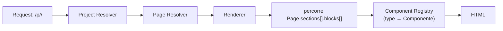
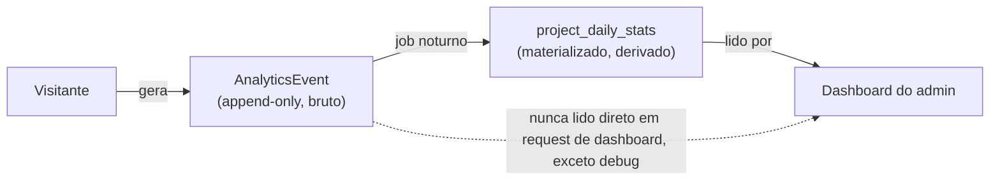
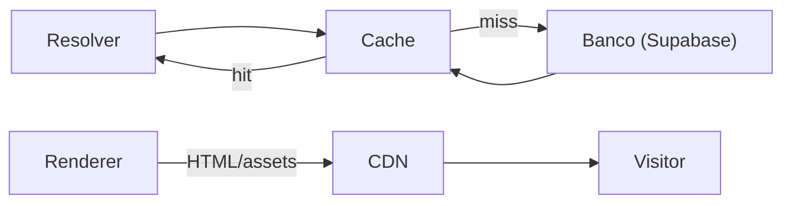
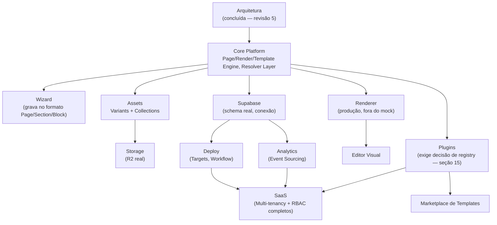

# Arquitetura da plataforma Procreating (Wizard → Draft → Preview → Deploy → Produção)

> **Revisão 5 — nível enterprise, última revisão antes da implementação definitiva do Wizard.**
> Puramente documental: nenhuma rota mudou, nenhum arquivo de código foi tocado, Pascoal/
> Galeria/Prospecção continuam 100% intocados. Revisão 1 propunha resolução de dados dentro do
> registry. Revisão 2 introduziu `ClientResolver`, Draft persistido, Versionamento, Assets
> aditivos. Revisão 3 separou Deployment de Version, formalizou Preview como tabela, analisou o
> acoplamento a `ClientConfig`. Revisão 4 consolidou tudo em código real — `ClientResolver`
> ligado, Assets unificados, `ProjectConfig`/`Block`, Themes/Tokens, Capabilities, Wizard de 11
> passos funcional (mock). **Esta revisão 5 muda a visão de fundo**: a plataforma deixa de ser
> pensada como "gerador de páginas de posicionamento" e passa a ser desenhada como o **sistema
> operacional interno da Procreating** — capaz de sustentar PosicionamentoPRO, Landing Pages,
> Eventos, Cursos, Áreas de Membros, Portais, Sites Institucionais, Microsites e produtos ainda
> não definidos, sem retrabalho estrutural em nenhum deles.
>
> Isso força a superação de decisões da revisão 4 que eram corretas para "um projeto = uma
> página" mas não escalam para "um projeto = N páginas independentes, cada uma com sua própria
> composição". A mudança mais profunda é a seção 1 (Page Engine): `ProjectConfig.blocks: Block[]`
> (lista plana, revisão 4) é **superada** por `ProjectConfig.pages: Page[]` (revisão 5). Como
> nenhum projeto real foi escrito nesse formato ainda (Wizard continua mock), a troca custa zero
> migração — mesmo raciocínio já usado na revisão 4 para justificar o modelo `Asset` unificado.

---

## Mapa de leitura — o que muda, o que fica

| Conceito | Revisão 4 | Revisão 5 |
|---|---|---|
| Composição de página | `Project → Block[]` (lista plana) | `Project → Page[] → Section[] → Block[] → Component` |
| Quem renderiza | Implícito, futuro "montador" | `Render Engine` formal: Project Resolver → Page Resolver → Renderer |
| Template | Define `blocks: string[]` | Define Pages, Blocks, Capabilities, Theme, Tokens, estrutura inicial |
| Capabilities | Só no Projeto | Template define padrão → Projeto só habilita/desabilita/sobrescreve |
| `ProjectConfig` | `{ metadata, theme, blocks }` | `{ metadata, theme, pages }` — `ClientConfig` congelado, só legado |
| Asset | Unificado, sem variantes | Unificado **+ Variants** (thumbnail/preview/webp/mobile/compressed/poster) |
| Agrupamento de mídia | `AssetManifest` a partir de `category` (string livre) | `AssetCollection` (entidade) — Manifest passa a ser **derivado** da Collection |
| Storage | `StorageProvider` (só R2 em mente) | `StorageDriver`, mesmo contrato, documentado como plugável (R2/S3/Supabase/Local) |
| Resolução de dados | Só `ClientResolver` | `Resolver Layer` — padrão generalizado pra Project/Template/Asset/Page/Analytics/Deployment |
| Analytics | Tabela de eventos direta | Event Sourcing — `AnalyticsEvent` bruto, rollups **derivados**, nunca autoritativos |
| Eventos | `Event` (audit) vs `Analytics` (comportamento) | 3 vias: Audit / System / Analytics, cada um com dono e retenção próprios |
| Deployment | Sem noção de destino | `DeploymentTarget` (production/preview/internal/client_review/staging/qa/sandbox) |
| Jobs | Lista de jobs isolados | `Workflow` — sequência nomeada de `Job`s com dependência entre passos |
| Theme | Tokens de cor + tipografia básica | Design System completo — spacing/typography/radius/elevation/motion/ícones |
| Extensibilidade | Nenhuma prevista | `Plugins` — módulos registram Pages/Blocks/Capabilities/Rotas/Assets sem tocar o núcleo |
| Tenancy | Implícito (1 processo, 1 admin) | Multi-tenancy documentada — isolamento por client_id em toda entidade |
| Cache | Não desenhado | Estratégia formal, vive dentro do Resolver Layer |
| Segurança | Preview token só | RBAC, auditoria, tokens temporários (preview/download/upload), rate limit, anti-enumeração |

---

## 1. Page Engine

### O problema que a revisão 4 não resolvia

`ProjectConfig.blocks: Block[]` (revisão 4) modela um projeto como **uma única página** composta
de blocos. Isso é exatamente PosicionamentoPRO (uma home só). Mas Downloads, Prospecção, uma
Área de Membros — qualquer produto com mais de uma tela — não cabe nesse formato sem um campo
`page` inventado ad-hoc em cada bloco, o que é exatamente o tipo de "inflar o formato pra cada
caso novo" que a revisão 4 já tinha identificado como o erro de `ClientConfig`.

### A hierarquia definitiva

```
Projeto
 └─ Página (N por projeto, independentes)
     └─ Seção (região nomeada da página — Hero, CTA, Downloads, Script...)
         └─ Bloco (unidade de conteúdo configurado dentro da seção)
             └─ Componente (implementação React que renderiza o bloco — não é dado, é código)
```

**Página** é a unidade de rota dentro do projeto — Home, Downloads, Prospecção são páginas
independentes, cada uma com seu próprio conjunto de seções, sem nenhuma dependência entre si.
**Seção** é uma região nomeada da página (`type: "hero" | "downloads" | "script" | ...`) —
generaliza o que a revisão 4 chamava de `Block` diretamente no nível do Projeto. **Bloco** é a
unidade configurável de conteúdo dentro de uma seção — é aqui que os `*BlockData` já desenhados
na revisão 4 (`HeroBlockData`, `CtaBlockData`, etc.) continuam existindo, só que aninhados um
nível mais fundo. **Componente** não é uma entidade de dado — é a implementação (`HeroSection`,
`CtaButton`) que o Render Engine (seção 2) escolhe pra desenhar um Bloco de um dado `type`.

```ts
// Documentação — não é lib/platform/blocks.ts ainda; ver "Migração" no fim desta seção.
type ProjectPage = {
  id: string;
  projectId: string;
  slug: string;              // "", "downloads", "prospeccao" — "" = home do projeto
  title: string;
  sections: PageSection[];   // ordem da lista = ordem de exibição
};

type PageSection = {
  id: string;
  pageId: string;
  type: string;               // "hero" | "downloads" | "script" | "checklist" | "crm" | ...
  order: number;
  blocks: Block[];             // 1+ blocos dentro da seção
};

// Block continua com a mesma forma desenhada na revisão 4 (BlockType, BlockDataByType),
// só que agora vive dentro de uma Seção, não direto no Projeto.
```

### Exemplos completos (os 3 do pedido, formalizados)

| Página | Seções (nesta ordem) | Blocos por seção |
|---|---|---|
| Home | Hero → Vídeos → Galeria | Hero: `[HeroBlock]`. Vídeos: `[VideosBlock]`. Galeria: `[GalleryBlock, CtaBlock]` |
| Downloads | Downloads | `[FilesBlock, CtaBlock]` |
| Prospecção | Script → Checklist → CRM | Script: `[ScriptBlock]`. Checklist: `[ChecklistBlock]`. CRM: `[CrmEmbedBlock]` |

O exemplo do pedido ("Página Inicial → Hero → CTA → Vídeos → Galeria") lista nomes de Seção e
Bloco misturados no mesmo nível — proposital na formulação do pedido, mas ambíguo pra
implementar sem uma regra clara. A regra formalizada acima (Seção = região nomeada; Bloco =
conteúdo configurável dentro dela, podendo haver mais de um bloco por seção) resolve essa
ambiguidade sem perder nenhum dos exemplos dados.

### Migração de `ProjectConfig.blocks[]` (revisão 4) para `pages[]` (revisão 5)

```ts
type ProjectConfig = {
  metadata: { title: string; description: string; ogImage?: string };
  theme: ProjectTheme;          // ver seção 14 — Design System completo, não só accentColor
  pages: ProjectPage[];          // substitui blocks: Block[] da revisão 4
};
```

Zero custo de migração: nenhum projeto real foi persistido no formato da revisão 4 (o Wizard
mock ainda não grava um `ProjectConfig` de verdade em lugar nenhum durável). `lib/platform/
blocks.ts` (código real, revisão 4) precisa ganhar `ProjectPage`/`PageSection` e mudar
`ProjectConfig.blocks` para `ProjectConfig.pages` — isso é trabalho de implementação, fora do
escopo desta rodada (documentação apenas), mas fica registrado aqui como pré-requisito antes do
Wizard gravar qualquer config de verdade.

---

## 2. Render Engine

### Princípio

Rotas públicas nunca devem importar `HeroSection`, `GalleryExperience` ou qualquer componente
específico por nome. Toda a inteligência de "qual componente renderiza qual bloco" vive numa
camada só — o Render Engine — nunca espalhada pela árvore de rotas.



- **Project Resolver**: dado um slug de cliente/projeto, devolve o `Project` (via `ClientResolver`
  generalizado — seção 9).
- **Page Resolver**: dado o `Project` + o segmento de rota restante, devolve a `ProjectPage`
  correspondente (ou `null` → 404). Contém a lógica de "que página serve `/`", "que página serve
  `/downloads`" — hoje isso é, na prática, o roteamento de arquivo do Next.js; no Render Engine
  vira dado (`ProjectPage.slug`), não estrutura de pastas.
- **Renderer**: puro — recebe uma `ProjectPage` já resolvida, percorre `sections[].blocks[]` e,
  pra cada `Block.type`, consulta um **Component Registry** (`Record<BlockType, ComponentType>`)
  pra saber qual componente React invocar, passando `Block.data` como props (com um adaptador
  fino por tipo, não uma tradução 1:1 ingênua — alguns componentes hoje esperam props derivadas,
  não o `data` bruto).
- A página pública em si (`app/p/[client]/**`, hoje) fica **fora** do Render Engine enquanto
  servir só a Pascoal — o Render Engine é o caminho que **projetos novos** (Supabase-backed)
  usam. Adotar o Render Engine pra Pascoal um dia é uma migração própria, não decidida aqui, e
  não necessária: o objetivo desta seção é que nenhum projeto **novo** precise repetir o padrão
  antigo de "página conhece campo fixo".

### Por que isso não é o mesmo que `buildAssetManifest`

`buildAssetManifest` (revisão 4) resolve **mídia**; o Renderer resolve **estrutura de página**.
São camadas irmãs, não uma dependendo da outra — um `Block` do tipo `gallery` recebe, entre seus
dados, referências de Asset que o Renderer repassa pro componente `GallerySection`; é o
componente (ou um hook que ele usa) que eventualmente consulta o Asset Resolver (seção 9) pra
montar a grade de fotos. O Renderer nunca precisa saber nada sobre R2, chave, ou Collection.

---

## 3. Template Engine

### O que um Template passa a definir

| Antes (revisão 4) | Agora (revisão 5) |
|---|---|
| `blocks: string[]` | `pages: ProjectPage[]` (estrutura inicial completa, com seções e blocos default) |
| — | `capabilities: TemplateCapability[]` (o que esse template suporta — seção 4) |
| — | `theme: ProjectTheme` (tema default) |
| — | `tokens: DesignTokens` (herdados do Design System — seção 14) |
| — | `defaultConfig: Record<string, unknown>` (valores-padrão pra novos campos que Blocks específicos definirem) |

```ts
type Template = {
  id: string; slug: string; name: string; description: string;
  pages: ProjectPage[];              // estrutura inicial — cada Projeto recebe uma CÓPIA disto
  capabilities: TemplateCapability[]; // seção 4
  theme: ProjectTheme;                // seção 14
  version: number;
  schemaVersion: number;
  createdAt: string; updatedAt: string;
};
```

### A regra que não muda, agora reafirmada em toda a profundidade nova

Instanciar um Projeto a partir de um Template é uma **cópia profunda** — páginas, seções,
blocos, capabilities, tema, tudo. A partir do instante em que a cópia acontece, o Template
**nunca mais controla o Projeto**, em nenhum nível da hierarquia nova. Subir `Template.version`
não move nem um pixel de nenhum projeto já criado — só afeta instanciações futuras. Essa regra
já valia na revisão 4 pro nível "Projeto"; agora vale explicitamente pros níveis Página/Seção/
Bloco também, porque são eles que passam a existir dentro do Template.

---

## 4. Capabilities — Template define, Projeto sobrescreve

```ts
type TemplateCapability = {
  templateId: string;
  key: CapabilityKey;         // mesmo catálogo de 11 chaves da revisão 4
  enabledByDefault: boolean;
  config: Record<string, unknown>;  // config-padrão (ex.: contagem de vídeos default)
};

type ProjectCapabilityOverride = {
  projectId: string;
  key: CapabilityKey;
  /** `null` = sem override, usa o valor do template. `true`/`false` = sobrescreve. */
  enabled: boolean | null;
  /** `null` = sem override de config, usa o default do template; senão, merge raso sobre ele. */
  configOverride: Record<string, unknown> | null;
};
```

**Resolução em tempo de leitura** (nunca gravada de novo em nenhuma tabela — é sempre calculada):

```ts
function effectiveCapability(template: TemplateCapability, override: ProjectCapabilityOverride | null): {
  enabled: boolean;
  config: Record<string, unknown>;
} {
  return {
    enabled: override?.enabled ?? template.enabledByDefault,
    config: { ...template.config, ...(override?.configOverride ?? {}) },
  };
}
```

Isso substitui `ProjectCapability` da revisão 4 (que só existia no nível do Projeto, sem noção
de "o que o template define") pelo par `TemplateCapability` + `ProjectCapabilityOverride` — o
Projeto deixa de ser a única fonte de verdade sobre quais capabilities existem; ele só guarda
**diferenças** em relação ao que o Template já habilita por padrão. Um projeto sem nenhum
override herda 100% do template — o caso mais comum, e o mais barato de armazenar.

---

## 5. Project Config — `ClientConfig` oficialmente congelado

```ts
type ProjectConfig = {
  metadata: { title: string; description: string; ogImage?: string };
  theme: ProjectTheme;
  pages: ProjectPage[];
};
// Cada ProjectPage → PageSection[] → Block[] → { type, data: Properties }
```

**`ClientConfig` (`lib/clients/types.ts`) passa de "formato legado que não usamos em projetos
novos" (posição da revisão 4) para "formato **congelado**, mantido apenas pra compatibilidade
com a Pascoal, nunca mais escrito por nenhum caminho novo"** — a diferença de linguagem é
proposital: "congelado" é uma garantia mais forte que "não usamos por enquanto". Nenhuma
implementação futura do Wizard, do Render Engine ou de qualquer Resolver deve, em nenhuma
circunstância, produzir ou ler um `ClientConfig`. O único consumidor de `ClientConfig` que
deveria existir, pra sempre, é `app/p/[client]/**` servindo a Pascoal.

---

## 6. Asset Engine — Variants

```ts
type AssetVariantKind = "original" | "thumbnail" | "preview" | "webp" | "mobile" | "compressed" | "poster";

type AssetVariant = {
  id: string;
  assetId: string;             // sempre aponta pro Asset "pai" — nunca um Asset novo
  kind: AssetVariantKind;
  key: string;
  url: string;
  width: number | null;
  height: number | null;
  sizeBytes: number | null;
  createdAt: string;
};
```

**Regra central: nunca duplicar `Asset`.** Um vídeo enviado uma vez é **um** `Asset`; o
thumbnail gerado, a versão comprimida, o poster — todos são `AssetVariant` apontando pro mesmo
`assetId`. Isso é o que faltava no modelo unificado da revisão 4 pra cobrir o pipeline de
processamento (`Background Jobs`, já documentado) sem cada etapa do processamento (thumbnail,
poster, WebP) precisar inventar sua própria linha de `Asset` com metadado duplicado (`project_id`,
`category`, `status` repetidos por variante seria a alternativa errada — motivo real de existir
`AssetVariant` como tabela própria em vez de "mais um `Asset`").

O ciclo de vida (`AssetStatus`, revisão 4) continua pertencendo ao `Asset`, não à `Variant` —
uma variante existe ou não existe (é gerada por um Job, seção 13); não tem seu próprio estado
`created → uploading → ...`. Se a geração de uma variante falhar, isso é um evento de Workflow
(seção 13), não uma mudança de status em `AssetVariant`.

---

## 7. Asset Collections — substituem a dependência de pastas físicas

```ts
type AssetCollection = {
  id: string;
  projectId: string;
  name: string;               // "Fotos Produzidas", "Vídeos Institucionais", "Logos", "Documentos"
  /** Ordem de exibição dos assets dentro da collection. */
  assetIds: string[];
  createdAt: string; updatedAt: string;
};
```

**Pastas deixam de representar organização lógica.** Hoje (revisão 4), `Asset.category` é uma
string livre (`"gallery:equipe"`, `"hero"`, `"social"`...) interpretada por `buildAssetManifest`
— já **flagado como risco** na revisão 4 ("um typo em `category` cai silenciosamente na
categoria errada"). `AssetCollection` resolve isso: é uma entidade de verdade, criada e nomeada
por uma pessoa no admin, sem depender de convenção de string.

### `AssetManifest` deixa de ler `category` — passa a ser derivado de Collections

```ts
// Revisão 4 (hoje): buildAssetManifest(assets: Asset[]) — agrupa por Asset.category (string livre)
// Revisão 5 (alvo): buildAssetManifest(collections: AssetCollection[], assets: Asset[])
//   — agrupa pelas Collections que uma pessoa organizou de fato, não por convenção de string.
```

Isso não invalida a função `buildAssetManifest` já escrita na revisão 4 — muda só a fonte que
ela consulta pra montar o agrupamento. O contrato de saída (`AssetManifest`) pode continuar
igual; quem muda é a lógica interna de agrupamento. Fica registrado como trabalho de
implementação futuro, não feito nesta rodada (documentação apenas).

---

## 8. Storage Driver

O contrato já existe — `StorageProvider` (`lib/storage/types.ts`, código real desde a Etapa 4) já
satisfaz exatamente o que este pedido descreve: nenhuma parte da plataforma fala com R2
diretamente, tudo passa por uma interface (`uploadFile`, `deleteFile`, `getFileUrl`, `listFiles`,
`generateClientStructure`). O que esta revisão formaliza é a **doutrina de nomenclatura e de
múltiplos drivers**, que antes era implícita:

```
StorageDriver (interface, já existe como StorageProvider)
 ├─ Cloudflare R2       (alvo real, Etapa 4 do roadmap — ainda mock)
 ├─ Amazon S3           (documentado como driver alternativo, não implementado)
 ├─ Supabase Storage     (documentado como driver alternativo, não implementado)
 ├─ Local (filesystem)   (útil pra desenvolvimento sem depender de rede)
 └─ Drivers futuros       (qualquer coisa que satisfaça a mesma interface)
```

**Nenhuma mudança de código é necessária** — `StorageProvider` já é o `StorageDriver` pedido.
Esta seção existe pra deixar registrado, por escrito, que a interface deve continuar sendo o
único ponto de contato (nenhum código futuro deve montar uma URL de R2 na mão fora de
`lib/storage/**`), e que trocar de provedor de storage no futuro é escrever uma nova
implementação de `StorageProvider`, nunca um refactor espalhado.

---

## 9. Resolver Layer

`ClientResolver` (revisão 2, ligado em código na revisão 4) foi a primeira instância de um
padrão — não um caso isolado. Esta revisão generaliza o padrão explicitamente pra toda camada de
dados da plataforma:

```
Resolver Layer
 ├─ Client Resolver     — já existe, código real (lib/clients/resolver.ts)
 ├─ Project Resolver     — mesmo padrão: resolve Project a partir de slug/id, várias fontes possíveis
 ├─ Template Resolver     — resolve Template por id/slug
 ├─ Asset Resolver         — resolve Asset[]/AssetVariant[] de um Projeto (+ Collections, seção 7)
 ├─ Page Resolver           — resolve ProjectPage por Project + segmento de rota (seção 2)
 ├─ Analytics Resolver       — resolve rollups já materializados (nunca soma bruto em request, seção 10)
 └─ Deployment Resolver       — resolve o Deployment corrente por Project + Target (seção 12)
```

### A regra que todo Resolver segue (documentada uma vez, vale pra todos)

```ts
interface Resolver<TQuery, TResult> {
  resolve(query: TQuery): Promise<TResult | null>;
}

class GenericResolver<TQuery, TResult> implements Resolver<TQuery, TResult> {
  constructor(private readonly sources: Resolver<TQuery, TResult>[]) {}
  async resolve(query: TQuery): Promise<TResult | null> {
    for (const source of this.sources) {
      const result = await source.resolve(query);
      if (result) return result;
    }
    return null;
  }
}
```

`ClientResolver` já implementa essa forma (com métodos nomeados em vez de um `resolve` genérico,
por clareza de call site — decisão que se mantém: interfaces explícitas por domínio, não um
resolver genérico único pra tudo, para preservar checagem de tipo forte por camada). Nenhuma
camada acima de um Resolver (Render Engine, Wizard, qualquer Server Action) deve importar a
origem de dados diretamente — sempre o Resolver correspondente.

---

## 10. Analytics — Event Sourcing

### O princípio

Analytics não é modelada como uma tabela de métricas escritas diretamente — é **derivada** de um
fluxo bruto de eventos, append-only, nunca editado depois de escrito.

```ts
type AnalyticsEventType =
  | "page_view" | "download" | "scroll" | "click"
  | "video_play" | "video_complete"
  | "gallery_open" | "gallery_close"
  | "password_success" | "password_fail"
  | "preview_open";

type AnalyticsEvent = {
  id: string;
  projectId: string;
  pageId: string | null;
  type: AnalyticsEventType;
  visitorId: string | null;      // hash anônimo, nunca PII
  path: string;
  metadata: Record<string, unknown>;  // ex.: { assetId } pra download, { scrollDepth } pra scroll
  createdAt: string;
};
```

Note que `deploy_started`, `deploy_finished`, `upload_started`, `upload_finished`,
`preview_approved` — listados no pedido original junto com os eventos acima — **não** entram
nesta tabela. Eles não são comportamento de visitante; são System Events ou Audit Events (seção
11). Essa separação é o próprio ponto da seção 11, e é aplicada aqui.

### Rollups são sempre derivados, nunca autoritativos

`project_daily_stats` (já esboçada na revisão 3/4) continua existindo, mas com uma garantia
explícita que antes era implícita: **é sempre recalculável a partir de `AnalyticsEvent`** — se a
tabela de rollup for apagada e reconstruída do zero varrendo o stream bruto, o resultado tem que
ser idêntico. Isso é o que "event sourcing" garante aqui: o stream bruto é a fonte de verdade; o
rollup é cache materializado, nunca escrito por um caminho que não seja "agregação do stream".



---

## 11. Event Engine — três fluxos, três donos

| | Audit Events | System Events | Analytics Events |
|---|---|---|---|
| **Quem gera** | Pessoa no admin (ação deliberada) | Processo interno (Job/Workflow/Deploy) | Visitante público |
| **Exemplos** | `project_created`, `password_changed`, `preview_approved`, `project_published` | `deploy_started`, `deploy_finished`, `upload_started`, `upload_finished`, job iniciado/concluído | `page_view`, `download`, `click`, `video_play`, `gallery_open`, `password_success/fail`, `preview_open` |
| **Ator** | `actor_id` sempre preenchido (uma pessoa) | `actor_id` sempre `null` | `visitor_id` (hash anônimo), nunca `actor_id` |
| **Volume** | Baixo | Médio (proporcional a jobs/deploys) | Alto |
| **Retenção** | Longa (auditoria/compliance) | Média (debug operacional) | Curta pro bruto, longa pro rollup |
| **Consultado por** | Tela de auditoria, suporte | Debug de pipeline, dashboards de operação | Dashboards de cliente, relatórios |

Isso é uma extensão direta do que a revisão 4 já tinha começado (separar `Event` de
`Analytics`). A mudança real é dividir o que era "System" escondido dentro de `Event` (ex.:
`deploy_performed`, que hoje mistura "alguém clicou em Publicar" com "o processo de deploy
terminou") em dois fatos distintos: **quem pediu** (Audit: `deploy_triggered`, com `actor_id`) e
**o que aconteceu de fato** (System: `deploy_started`/`deploy_finished`, sem ator, correlacionado
por `deployment_id`).

### Relação com `job_runs` (revisão 4) — não duplicar

`job_runs` (background jobs, já documentado) não vira uma quarta tabela de eventos — é o
**detalhe de execução** por trás de um `system_event`. Um `system_event` do tipo
`upload_started`/`upload_finished` pode carregar `metadata.relatedJobRunId` apontando pra
`job_runs.id`; `job_runs` guarda o "como" (tentativas, duração, worker), `system_events` guarda
o "o quê e quando" numa linha do tempo legível. Nunca duas fontes de verdade competindo pelo
mesmo fato — ver achado (j) na Revisão Final, seção 20.

---

## 12. Deployments — Targets

```ts
type DeploymentTarget = "production" | "preview" | "internal" | "client_review" | "staging" | "qa" | "sandbox";

type Deployment = {
  id: string; projectId: string; versionId: string;
  target: DeploymentTarget;         // novo campo desta revisão
  status: DeploymentStatus;          // já existia (revisão 3)
  triggeredBy: string | null;
  errorMessage: string | null;
  startedAt: string; finishedAt: string | null;
};
```

`projects.current_deployment_id` (revisão 3/4) passa a fazer sentido só por `target = 'production'`
— um projeto pode ter, ao mesmo tempo, um deployment corrente em `production` e outro em
`staging`, cada um com seu próprio histórico de tentativas. Isso é puramente aditivo sobre o
schema da revisão 3: um campo novo, sem quebrar nenhuma leitura existente (nenhuma ainda existe
de verdade).

**Importante, decidido nesta revisão (ver achado (a) na seção 20)**: `Preview` (seção 3 da
revisão 3/4, tabela `previews`) **não** é modelada como um `Deployment` com `target='preview'`.
São responsabilidades diferentes — `Deployment` é sobre infraestrutura (pôr uma versão pra
rodar em algum lugar); `Preview` é sobre um link compartilhável, com token e expiração, que pode
simplesmente pedir ao Render Engine (seção 2) pra renderizar uma versão específica sob demanda,
sem nenhum deploy de infraestrutura por trás. Ver a justificativa completa no achado (a).

---

## 13. Workflow Engine

```ts
type WorkflowStep = {
  id: string;
  workflowRunId: string;
  order: number;
  jobName: string;             // referencia o catálogo de Jobs já documentado (revisão 4, seção 16)
  status: "pending" | "running" | "succeeded" | "failed" | "skipped";
  relatedJobRunId: string | null;  // liga com job_runs (revisão 4)
  startedAt: string | null; finishedAt: string | null;
};

type WorkflowRun = {
  id: string;
  workflowName: string;         // ex.: "asset_upload_pipeline"
  triggeredBy: string | null;    // Asset.id, Deployment.id, etc. — o que iniciou este workflow
  status: "pending" | "running" | "succeeded" | "failed" | "partially_failed";
  steps: WorkflowStep[];
  startedAt: string; finishedAt: string | null;
};
```

### Exemplo do pedido, formalizado

```
asset_upload_pipeline:
  1. generate_thumbnail
  2. generate_poster
  3. convert_webp
  4. extract_metadata
  5. register_asset       (grava a linha Asset — ver ciclo de vida, revisão 4 seção 6)
  6. update_manifest       (invalida/recalcula o Asset Manifest do projeto — seção 7)
  7. trigger_deploy         (opcional — só se o projeto já estiver publicado e assets afetarem o build)
  8. emit_analytics_ready   (system_event — seção 11)
```

Cada passo é um `Job` já catalogado (revisão 4, Background Jobs). `Workflow` é a camada que
sequencia Jobs com dependência entre si — um passo só começa quando o anterior termina com
sucesso (ou, se marcado como `skipped`-tolerante, mesmo com falha não-crítica: ex.: se
`convert_webp` falhar, o workflow pode seguir pra `extract_metadata` mesmo assim, mas não pode
pular `register_asset`). Isso é o que faltava na revisão 4: `job_runs` registrava execuções
isoladas, sem modelar "isso só roda depois daquilo".

### Relação com Deployment (ver achado (i), seção 20)

Um `WorkflowStep` pode **disparar** um `Deployment` (chamando o fluxo já existente, criando uma
linha em `deployments` e observando seu status) — nunca reimplementa a máquina de estados de
Deployment dentro do Workflow. Uma coisa aciona a outra; nenhuma duplica a outra.

---

## 14. Design System

Estende `ProjectTheme`/`DesignTokens` (revisão 4, ainda código real e válido) com os grupos de
token que faltavam:

```ts
type DesignSystem = {
  tokens: DesignTokens;              // já existe (revisão 4) — primary/secondary/accent/...
  spacing: { scale: number[] };       // ex.: [0, 4, 8, 12, 16, 24, 32, 48, 64, 96]
  typography: {
    scale: { name: string; sizePx: number; lineHeight: number }[];
    fontDisplay: string; fontSans: string; fontMono: string;  // já existiam em ProjectTheme
  };
  radius: { scale: number[] };
  elevation: { levels: { name: string; boxShadow: string }[] };
  motion: {
    durations: Record<"fast" | "base" | "slow", number>;
    easings: Record<"standard" | "decelerate" | "accelerate", string>;
  };
  icons: { library: string };         // já existia como `icons.set` em ProjectTheme
};
```

**Todos os Templates consomem o mesmo Design System base** — a mesma escala de espaçamento,
tipografia, radius, elevação e motion, com apenas os `tokens` de cor variando por projeto
(accent, primary...). Isso evita que cada Template reinvente sua própria escala de espaçamento —
o tipo de inconsistência que, em uma plataforma com dezenas de templates, vira uma UI
inconsistente entre produtos diferentes da mesma Procreating.

---

## 15. Plugins

```ts
type PluginManifest = {
  name: string;                    // "curso", "evento", "membros", "crm", "blog", "landing"
  pages?: ProjectPage[];            // páginas que este plugin pode adicionar a um projeto
  blocks?: { type: string; component: string }[];  // novos BlockTypes que o plugin introduz
  capabilities?: CapabilityDefinition[];             // novas capabilities (mesmo shape da revisão 4)
  adminRoutes?: { path: string; label: string }[];    // rotas de ADMIN próprias do plugin (nunca públicas)
  assetTypes?: string[];                               // novos AssetType, se o plugin precisar
};
```

### A tensão real que este pedido cria (documentada, não resolvida em código nesta rodada)

`BlockType`, `CapabilityKey`, `AssetType`, `EventType` — todos desenhados na revisão 4 como
**unions fechadas do TypeScript** (`"hero" | "gallery" | "videos" | ...`). Um Plugin que precisa
registrar um `BlockType` novo (ex.: `"course_module"`) não consegue estender uma union fechada
sem editar o arquivo que a declara — o que viola diretamente "sem alterar o núcleo da
plataforma", pedido explicitamente nesta seção. **Esta é a descoberta mais importante desta
revisão** — ver achado (b)/(c) na seção 20 pra a decisão recomendada (mover de union fechada pra
um registry validado em runtime, com tipagem via lookup genérico). Fica marcado aqui como
dependência: nenhum Plugin real deveria ser construído antes dessa decisão ser tomada.

---

## 16. Multi-tenancy

| Recurso | Estratégia de isolamento |
|---|---|
| Clientes | `client_id` já é a chave de particionamento em todo o schema (revisão 2+) |
| Assets | `project_id` em toda linha; prefixo de chave no Storage Driver por cliente/projeto (`clients/<slug>/...`, já a convenção real) — nunca um bucket com listagem raiz compartilhada |
| Deploys | `project_id` + `target` (seção 12); cada projeto publica em seu próprio caminho/CDN, nunca um deploy compartilhado entre projetos |
| Analytics | `project_id` em `AnalyticsEvent` (seção 10) — rollups sempre particionados por projeto |
| Usuários | **Gap real, documentado aqui pela primeira vez** — `User.role` (revisão 3, `"admin" | "editor"`) não tem escopo de cliente/projeto. Um usuário hoje é implicitamente "vê tudo". Pra SaaS de verdade, precisa de uma tabela de associação (`user_client_roles` ou equivalente) — não desenhada em detalhe nesta rodada, só reservada como pré-requisito de qualquer RBAC real (seção 18) |
| Permissões | Depende do item acima — RBAC não tem onde se apoiar sem o escopo usuário↔cliente existir primeiro |

### Enforcement de verdade: Row Level Security

Quando o Supabase conectar, a estratégia recomendada é `client_id`/`project_id` +
`auth.uid()` aplicados via **RLS** do Postgres — não checagem manual espalhada em Server
Actions. Isso garante que mesmo um bug de aplicação não vaze dado entre tenants, porque a
garantia vive no banco, não em cada call site. Não implementado agora (Supabase não conectado),
documentado como a direção correta pra quando conectar.

---

## 17. Cache



### Onde usar cache

- **Dentro de cada Resolver** (seção 9), não como camada global separada. Um `ProjectResolver`
  cacheia o resultado de `resolve(slug)` com uma chave `project:<slug>`; um `PageResolver`
  cacheia `page:<projectId>:<pageSlug>`. **Regra explícita, pra prevenir um acoplamento novo**:
  nenhum componente ou Server Action deve chamar uma camada de cache diretamente — só o Resolver
  que já teria essa responsabilidade sabe o que cachear e por quanto tempo. Isso preserva o
  princípio da seção 2 (componentes nunca sabem a origem dos dados) — se cache fosse uma camada
  paralela chamada por fora do Resolver, isso seria exatamente o tipo de acoplamento oculto que a
  seção 20 existe pra caçar (ver achado (h)).
- **CDN** pra HTML renderizado e assets estáticos — natural dado que R2 (seção 8) já serve por
  trás de CDN; sem trabalho adicional além de cabeçalhos de cache corretos por tipo de conteúdo.

### Quando invalidar

| Evento | O que invalida |
|---|---|
| `deploy_finished` (succeeded, target=production) | Cache do Resolver pro `project_id` inteiro + CDN das páginas afetadas |
| Nova `AssetVariant` gerada | Só o cache/CDN daquele Asset específico, nunca o projeto inteiro |
| `project_updated` (Draft, sem deploy) | Nada em produção — o cache de produção só reflete o que foi de fato implantado |
| Preview gerado/revogado | Cache específico do `previewToken`, nunca o cache de produção |

### Como invalidar

Tag-based, não TTL cego — cada entrada de cache carrega uma tag (`project:<id>`,
`asset:<id>`), e o evento que a invalida (via Event Engine, seção 11) dispara a invalidação por
tag, não um "limpa tudo". TTL curto continua como rede de segurança, não como mecanismo
primário.

---

## 18. Segurança

| Área | Estratégia |
|---|---|
| **RBAC** | Depende do gap de `user_client_roles` (seção 16). Papéis propostos: `owner`, `admin`, `editor`, `viewer`, cada um escopado a um conjunto de clientes/projetos, não global |
| **Permissões** | Matriz ação × recurso × papel, avaliada no servidor (Server Actions), nunca só escondida na UI |
| **Auditoria** | Já coberta por Audit Events (seção 11) — toda ação administrativa vira uma linha, com ator, nunca editável depois |
| **Logs** | Separados de Audit — logs técnicos (erro de request, stack trace) não são eventos de domínio, ficam em observabilidade de infraestrutura (Vercel/provedor), não em tabela de negócio |
| **Preview Tokens** | Já desenhado (revisão 3/4) — 256 bits, comparação em tempo constante, nunca logado |
| **Download Tokens** | **Novo nesta revisão** — pra Assets que não devem ter URL pública permanente (ex.: material sob NDA), uma URL assinada de curta duração em vez do `Asset.url` direto |
| **Upload Tokens** | Já é, na prática, a presigned URL do pipeline de upload (revisão 4, seção 17) — só formalizado aqui como categoria de token temporário junto das outras duas |
| **Rate Limit** | Em tentativas de senha (galeria/prospecção — reforça a nota de segurança já existente em `lib/access-code.ts`) e em endpoints de admin sensíveis (criação de projeto, upload) |
| **Anti-enumeração de slugs** | Resposta genérica (404 uniforme) pra slug de projeto inexistente vs. existente-mas-sem-permissão — nunca diferenciar a mensagem. IDs internos usados em rotas de admin (`/admin/projetos/[id]`) devem ser opacos (uuid), nunca sequenciais nem derivados 1:1 do slug público |

---

## 19. Roadmap definitivo — por trilha, não só por fase linear

A lista linear de 10 fases (revisão 4) ainda descreve a ordem de entrega, mas esconde que várias
trilhas evoluem em paralelo e têm dependências reais entre si, não só sequenciais. Reorganizado:



| Trilha | Depende de | Bloqueia |
|---|---|---|
| Core Platform | Arquitetura (esta revisão) | Tudo abaixo |
| Wizard | Core Platform | Primeiro projeto real |
| Assets | Core Platform | Storage, Renderer completo |
| Supabase | Core Platform | Deploy, Analytics, SaaS |
| Storage | Assets | Upload real |
| Deploy | Supabase | SaaS |
| Analytics | Supabase | SaaS |
| Renderer | Core Platform | Editor Visual |
| Editor Visual | Renderer | — |
| Plugins | Core Platform + decisão de registry (seção 15) | Marketplace, parte de SaaS |
| Marketplace de Templates | Plugins | — |
| SaaS | Deploy + Analytics + Plugins + Multi-tenancy | — |

---

## 20. Revisão final — acoplamentos, duplicações e retrabalho

Achados desta rodada, cada um com causa e resolução proposta (nada implementado — só decidido):

**(a) Preview vs. Deployment(target=preview) — responsabilidades quase sobrepostas.**
A tentação óbvia, ao introduzir `DeploymentTarget` (seção 12), é modelar Preview como
"`Deployment` com `target='preview'`". Resolução: **não fazer isso**. `Deployment` é sobre pôr
uma versão pra rodar em algum lugar (infraestrutura); `Preview` é sobre um link compartilhável,
tokenizado, com expiração e aprovação, que pode simplesmente pedir ao Render Engine (seção 2)
pra renderizar uma versão específica sob demanda — sem nenhum deploy de infraestrutura por trás.
Manter os dois conceitos separados evita que "gerar um preview" fique artificialmente caro
(esperar um deploy terminar) quando poderia ser instantâneo (renderização direta).

**(b)/(c) Unions fechadas (`BlockType`, `CapabilityKey`, `AssetType`, `EventType`) são
incompatíveis com Plugins (seção 15) — é uma descoberta só, com quatro sintomas.** Um plugin não
consegue estender uma union do TypeScript sem editar o arquivo que a declara, o que contradiz
"sem alterar o núcleo". Resolução recomendada: migrar essas quatro chaves de union fechada pra
um **registry validado em runtime** (`type BlockType = string`, com um `BlockRegistry` que
valida contra os tipos conhecidos + os registrados por plugin, e tipagem de `data` via um mapa
genérico indexado, não um union literal). Essa é a decisão de maior impacto estrutural desta
revisão — precisa ser tomada **antes** de qualquer Plugin real ser construído, mas não bloqueia
o Wizard (que hoje só usa os tipos nativos da plataforma, não precisa de extensibilidade ainda).

**(d) Seção vs. Bloco — a fronteira dos exemplos do próprio pedido é inconsistente.** Os três
exemplos fornecidos misturam nomes de Seção e Bloco no mesmo nível de lista. Resolução: a regra
formalizada na seção 1 (Seção = região nomeada da página; Bloco = unidade configurável dentro da
seção, podendo haver mais de um bloco por seção) é a que deve valer daqui pra frente — registrada
aqui explicitamente porque, sem essa formalização, cada implementador tende a desenhar a fronteira
diferente com o tempo.

**(e) `AssetManifest` (revisão 4) e `AssetCollection` (esta revisão) têm responsabilidade
sobreposta se não forem ordenadas corretamente.** Resolução: `AssetCollection` é o dado de
autoria (uma pessoa organiza e nomeia); `AssetManifest` é a view computada em tempo de
renderização, **derivada** de Collections (seção 7) — nunca as duas mantidas independentemente.
Isso também resolve, de graça, o risco de `category` como string livre já flagado na revisão 4.

**(f) `ProjectConfig.blocks[]` (revisão 4, código real) precisa ser substituído, não
complementado, por `pages[]`.** Diferente de Assets na revisão 4 (que ganhou um modelo aditivo
por cautela), aqui a recomendação é substituição direta — motivo: zero projeto real foi escrito
no formato antigo (o Wizard ainda é mock), então manter os dois formatos coexistindo só
adicionaria uma decisão futura de qual usar, sem nenhum benefício de transição suave.

**(g) Multi-tenancy expõe uma lacuna real no modelo de usuário atual.** `User.role` (revisão 3)
não tem escopo de cliente/projeto — arquitetura mock de hoje (usuário único fixo) esconde isso,
mas um RBAC real (seção 18) não tem onde se apoiar sem uma tabela de associação usuário↔cliente
existir primeiro. Resolução: reservar esse design (não implementar) como pré-requisito de
qualquer trabalho de Segurança/RBAC, pra não exigir uma migração de schema disruptiva depois que
usuários reais existirem.

**(h) Cache não pode ser uma camada global chamada por fora do Resolver Layer.** Se um
componente ou Server Action chamasse cache diretamente, isso recriaria exatamente o tipo de
acoplamento que o Render Engine (seção 2) existe pra eliminar — "componente sabendo de onde o
dado vem". Resolução: cache vive dentro de cada Resolver, nunca ao lado dele. Já registrado como
regra explícita na seção 17.

**(i) Workflow (seção 13) e Deployment (seção 3/12) não podem ter duas máquinas de estado pro
mesmo fato.** Um Workflow pode ter um passo que **dispara** um Deployment (cria a linha, observa
o status), nunca deve reimplementar `pending → in_progress → succeeded/failed` dentro da própria
lógica de Workflow. Uma direção de dependência só: Workflow → aciona → Deployment.

**(j) `job_runs` (revisão 4) e System Events (seção 11) não podem virar duas fontes de verdade
pro mesmo fato.** Resolução: `job_runs` é o ledger de execução de baixo nível (tentativas,
duração, worker); System Events é a narrativa de mais alto nível, correlacionada via
`relatedJobRunId`. Nunca as duas mantidas de forma independente pro mesmo evento.

### Abstrações prematuras identificadas (o oposto do problema acima — coisas que NÃO devem ganhar entidade própria ainda)

- **`WorkflowStep` não precisa de tabela de definição própria (`workflow_definitions`) agora** —
  a sequência de passos de cada workflow pode ficar como constante no código (como já é
  `PROJECT_WIZARD_STEPS`) até existir demanda real de workflows configuráveis por usuário no
  admin. Modelar isso como dado editável agora seria trabalho sem consumidor.
- **`AssetVariant` não precisa de versionamento próprio** — uma variante é substituída
  (regenerada), nunca tem histórico; se um dia for necessário auditar "quando o thumbnail mudou",
  isso é um System Event (`variant_regenerated`), não uma tabela de versões de variante.
- **Plugins não precisam de um mecanismo de sandboxing/isolamento de execução agora** — o
  registry (achado b/c) resolve a extensibilidade de **tipos**; isolamento de **execução**
  (rodar código de plugin de terceiros com segurança) só importa no dia em que existir um
  Marketplace de verdade (trilha própria no roadmap, seção 19), não antes.

---

## Relatório final

### A arquitetura está pronta pra iniciar o desenvolvimento definitivo do Wizard?

**Sim, com uma condição**: o Wizard deve ser construído já mirando o formato `ProjectConfig.pages`
(seção 1), não o `ProjectConfig.blocks` plano da revisão 4. Isso é uma vantagem de timing, não um
atraso — nenhum projeto real foi persistido ainda em nenhum dos dois formatos, então não existe
custo de migração; existe só a escolha de em qual dos dois formatos escrever a primeira linha de
código real. Escrever no formato antigo agora criaria exatamente o retrabalho que esta revisão
inteira existe pra evitar.

O passo "Estrutura" do Wizard (hoje mock, exibindo `template.blocks` como lista plana) precisa
ser re-desenhado pra exibir a hierarquia Página → Seção → Bloco quando a implementação real
começar — não feito nesta rodada (documentação apenas), mas registrado aqui como consequência
direta e esperada da seção 1.

### Decisões que devem permanecer congeladas até a versão 1.0

1. **Hierarquia Página → Seção → Bloco → Componente** (seção 1) — é a fundação de tudo que se
   constrói em cima; mudar depois de projetos reais existirem é uma migração de dado real, não
   um ajuste de tipo.
2. **`ProjectConfig` usa `pages[]`, nunca `blocks[]` plano; `ClientConfig` é legado congelado,
   nunca escrito por código novo** (seções 1 e 5).
3. **Render Engine como único caminho de renderização pra projetos novos** — Project Resolver →
   Page Resolver → Renderer → Component Registry (seção 2). Nenhum componente público deve
   conhecer nome de bloco específico fora dessa cadeia.
4. **Capabilities: Template define, Projeto sobrescreve** (seção 4) — mudar a direção dessa
   relação depois de haver overrides reais gravados exige migração de dado, não só de tipo.
5. **Asset nunca duplica; variantes derivadas vivem em `AssetVariant`** (seção 6).
6. **Resolver Layer como padrão obrigatório pra toda nova fonte de dado** (seção 9) — nenhuma
   camada superior importa uma fonte de dado diretamente, sempre via um Resolver.
7. **Analytics é sempre event-sourced; rollups são sempre deriváveis do zero a partir do stream
   bruto** (seção 10) — se um rollup algum dia não puder ser recalculado do stream, o modelo
   quebrou.
8. **Três fluxos de evento (Audit/System/Analytics), nunca misturados numa tabela só** (seção 11).
9. **Preview nunca é implementado como um Deployment** (achado a, seção 20).
10. **Cache vive dentro do Resolver Layer, nunca é chamado diretamente por componente ou Server
    Action** (achado h, seção 20).
11. **Decisão de registry para `BlockType`/`CapabilityKey`/`AssetType`/`EventType` (achado b/c)
    precisa ser tomada — mesmo que a implementação de Plugins em si espere — porque a forma
    escolhida agora (union fechada vs. registry) afeta a assinatura de tipo de tudo que for
    escrito em cima antes de Plugins existirem.** Esta é a única decisão desta lista que ainda
    está genuinamente em aberto (as outras 10 já têm resolução definida); recomendo decidir
    explicitamente qual caminho seguir antes da primeira linha de código do Core Platform, não
    só antes de Plugins.

### O que explicitamente NÃO precisa ser decidido agora (evitar abstração prematura)

Definição de Workflow como dado editável, versionamento de `AssetVariant`, sandboxing de
execução de Plugins — todos documentados na seção 20 como prematuros; revisitar quando houver
consumidor real, não antes.
