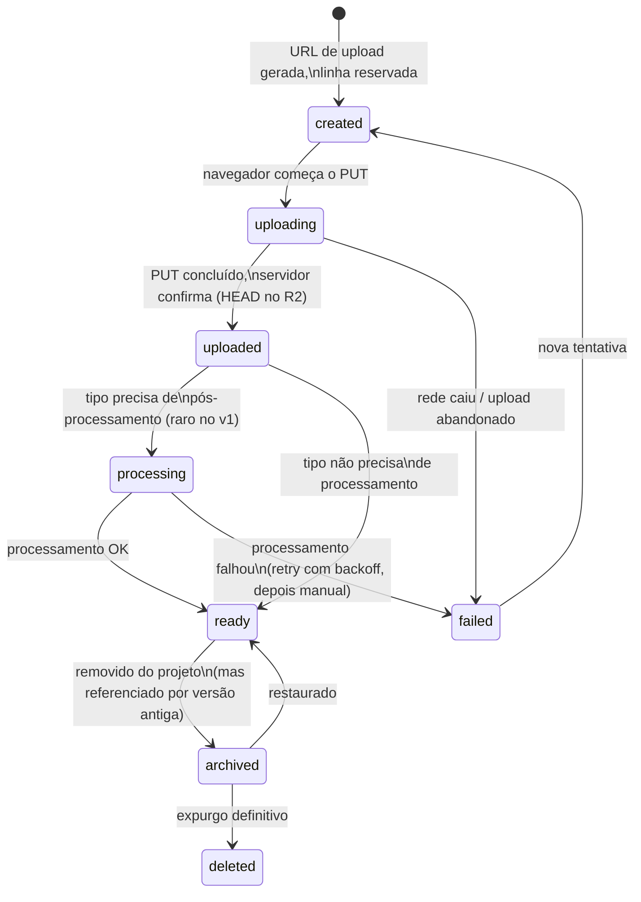

# Arquitetura da plataforma Procreating (Wizard → Draft → Preview → Deploy → Produção)

> Documento técnico apenas — nada aqui foi implementado, nenhuma rota mudou, Pascoal/Galeria/
> Prospecção continuam intocadas. **Revisão 3.** Revisão 1 propunha resolução de dados dentro
> do registry e um fluxo de 9 passos todo em memória do navegador. Revisão 2 corrigiu isso com
> `ClientResolver`, Draft persistido, Versionamento e Assets aditivos. Esta revisão 3
> introduz Draft Session (analisada e descartada, com justificativa), Deployment como entidade
> própria, Preview como tabela completa, Template versioning, ciclo de vida de Assets,
> paginação de galeria, pipeline de upload, background jobs, e — o ponto mais importante —
> uma reavaliação crítica de quanto da arquitetura está presa ao formato "PosicionamentoPRO".

---

## 1. Draft: Project cedo (A) vs. Draft Session separada (B)

### As duas arquiteturas

**A**: `Wizard → Project (nasce cedo, status=draft) → Autosave → Deploy → Publicado` — o que a
revisão 2 recomendou.

**B**: `Wizard → Draft Session (entidade efêmera, separada) → Project (promovido a partir da
sessão) → Deploy → Publicado`.

### Comparação

| Critério | A — Project cedo | B — Draft Session separada |
|---|---|---|
| **Concorrência** | `projects.slug` com `unique` pega a colisão atomicamente no `INSERT`. Uma verificação, um lugar. | Precisa de unicidade em dois níveis (na sessão E no projeto final) ou aceita reservar o slug só na promoção — nesse caso o usuário pode preencher o wizard inteiro e perder o slug no fim. Resolve o problema movendo-o, não eliminando. |
| **Reserva de slug** | Imediata e permanente desde o passo 2. Simples de explicar e de implementar. | Fraca, a menos que se duplique a constraint de unicidade — e aí você tem duas fontes de verdade pra "esse slug está livre?". |
| **Autosave** | `UPDATE projects SET config = ...` direto. | Mesmo custo, sem vantagem — autosave em uma tabela efêmera não é mais simples que numa tabela real. |
| **Abandono do Wizard** | Sobra uma linha `draft` na tabela principal. | Ponto forte de B — a sessão é isolada, sem FK de peso apontando pra ela, apagar é trivial. |
| **Limpeza automática** | Precisa filtrar `projects` no dia-a-dia (ver seção "Visibilidade" abaixo) e rodar expiração (ver estratégia proposta). | Mais simples e mais seguro — nada relevante referencia a sessão, `DELETE` sem medo de cascade. |
| **Consistência dos dados** | Risco real: qualquer feature nova que consulte `projects` sem filtrar status vê rascunhos abandonados como se fossem projetos de verdade. | `projects` fica sempre "limpo" — só chegam lá tentativas que avançaram o suficiente pra virar algo real. |
| **Simplicidade de implementação** | Mais simples agora — uma entidade, sem etapa de promoção. | Mais complexa agora — duas entidades, mapeamento entre elas, lógica de promoção. |
| **Escalabilidade** | Tabela principal cresce com todo mundo que só "brincou" no Wizard — ruído proporcional à taxa de abandono. | Tabela principal cresce só com tentativas reais — mais limpo em qualquer volume. |

### Por que a separação (B) quebra exatamente no ponto que a revisão 2 resolveu

A revisão 2 eliminou o mecanismo de `staging/<sessionId>/...` + cópia no R2 justamente
persistindo o projeto cedo — o upload do passo 6 do Wizard já mira a chave **final**
(`clients/<slug>/...`) porque o slug e o projeto já existem de verdade. Se o Draft Session for
uma entidade separada e efêmera, o upload de mídia (que precisa acontecer *durante* o wizard,
não só no fim — vídeo de 300MB não pode esperar) tem só duas saídas: (1) mirar uma chave
temporária ligada ao id da sessão, trazendo de volta o staging+cópia que a revisão 2 removeu de
propósito, ou (2) promover a sessão em `Project` de fato antes do upload acontecer — nesse caso
a "separação" já não é mais separação no momento que importa, é só um nome diferente pro mesmo
"criar cedo" da opção A, com uma tabela extra no meio sem função real.

### Recomendação: manter A, com expiração automática

Ganha-se quase todo o benefício de limpeza da opção B sem a complexidade de duas entidades e
sem reabrir o problema de upload que a revisão 2 já resolveu:

```sql
alter table projects add column expires_at timestamptz;
-- null pra published/archived (nunca expiram); populado só quando status = 'draft'
```

**Estratégia de expiração (dois níveis, pedida explicitamente)**:
- Ao criar (`status = 'draft'`, passo 2): `expires_at = now() + interval '7 days'`.
- A cada autosave (passos 3–7): `expires_at` é adiado pra `now() + interval '7 days'` de novo —
  só expira quem realmente parou de mexer.
- Ao gerar a primeira `project_versions` (passo 8, "Gerar Draft" — ver seção 3): `expires_at`
  estende pra `now() + interval '60 days'` — quem já investiu esforço a ponto de ter algo
  revisável ganha uma janela bem maior antes de qualquer limpeza.
- Ao publicar: `expires_at = null` (nunca mais expira).
- **Job de limpeza** (ver seção 9, Background Jobs): roda diariamente, `DELETE FROM projects
  WHERE status = 'draft' AND expires_at < now()`. Cascade cuida de `services`/`assets`/
  `project_versions`/`deployments` órfãos — que nesse ponto não têm valor de negócio real
  (nunca foram publicados). Vale notificar (e-mail/toast no admin, "seu rascunho X expira em 3
  dias") antes de apagar — nota de produto, não bloqueador de arquitetura.

**Visibilidade por status** (resolve o risco de "poluir toda consulta"): uma `VIEW`
`published_projects` (`WHERE status IN ('published', 'archived')`) é o que dashboards,
relatórios e qualquer contagem ("cliente tem N projetos") devem consultar por padrão — o mesmo
truque já usado pra Assets na revisão 2 (`project_media` como `UNION ALL`). A tabela `projects`
crua continua existindo pra quem precisa enxergar rascunhos de propósito (o próprio Wizard, a
lista "meus rascunhos" no admin).

---

## 2. Assets: entidades específicas vs. modelo genérico — visão de 5 anos

### Quando vale manter entidades específicas

Quando o tipo tem estrutura própria, real, consultada com frequência, e que se beneficia de
coluna dedicada + índice — não só metadado decorativo. `videos.format`
(horizontal/vertical) decide layout em `HowItWorksSection` hoje; `gallery_files.folder_id` é
uma relação hierárquica real (não um rótulo solto). Tabelas específicas são mais legíveis,
mais fáceis de indexar corretamente, e auto-documentam a intenção do schema.

### Quando vale migrar para uma entidade genérica

Quando o número de tipos cresce sem parar (hoje: vídeo/foto/documento; um Curso quer áudio,
apostila, certificado; um Evento quer crachá, mapa do local...) — uma tabela por tipo vira uma
tabela por *sempre que alguém pensar num tipo novo*, e toda a camada de upload/exclusão/
biblioteca de mídia precisa saber sobre N tabelas em vez de uma. Quando a maior parte das
operações (listar mídia de um projeto, checar espaço usado, aplicar controle de acesso, mostrar
uma grade "biblioteca de mídia") não se importa com o tipo específico, um modelo único reduz
duplicação de verdade. E quando existir infraestrutura de Background Jobs/ciclo de vida (seções
6, 8, 9) — que é inerentemente agnóstica a tipo e se beneficia de operar sobre uma tabela só.

### Recomendação para 5 anos — revisando a posição da revisão 2

Na rodada anterior recomendei **aditivo**: manter `videos`/`gallery_files` como estão, `assets`
só pra documento/PDF avulso. Mantenho essa recomendação **para o schema que já existe hoje**
(zero motivo pra desfazer o que foi aprovado sem necessidade). Mas a pergunta agora é outra —
onde a implementação REAL do Wizard deveria começar, sabendo que Cursos/Eventos/Áreas de
Membros estão no horizonte — e aí a resposta muda: **recomendo que a implementação real do
Wizard já nasça sobre um modelo `assets` unificado**, não sobre `videos`/`gallery_files`
separados. A diferença entre "manter o que existe" e "não criar mais do mesmo problema
amanhã" é que hoje **nenhum projeto real do Wizard existe ainda** — é o único momento em que
essa escolha não custa nada de migração.

```sql
create table assets (
  id uuid primary key default gen_random_uuid(),
  project_id uuid not null references projects(id) on delete cascade,
  kind text not null,                 -- 'video' | 'photo' | 'document' | 'audio' | 'folder' | ...
  role text,                           -- o "porquê": 'hero_background' | 'social_video' |
                                        -- 'gallery_photo' | 'logo' | 'og_image' | ...
  parent_asset_id uuid references assets(id),  -- generaliza gallery_folders: uma "pasta" é um
                                                -- asset kind='folder'; outros assets apontam
                                                -- pra ela via parent_asset_id — suporta
                                                -- aninhamento em N níveis se algum produto
                                                -- futuro precisar (módulos > aulas, por ex.)
  key text not null,
  url text not null,
  metadata jsonb not null default '{}',  -- campos específicos por kind (format/ready/duration
                                          -- pra vídeo; alt/width/height pra foto; etc.)
  sort_order int not null default 0,
  status text not null default 'created',  -- liga com o ciclo de vida, seção 6
  created_at timestamptz not null default now()
);
```

### Migração sem quebrar projetos existentes (o padrão, pra quando for necessário de verdade)

Técnica padrão de "expand → migrate → contract", caso um dia existam `videos`/`gallery_files`
reais demais pra vala a pena reescrever do zero:
1. **Expand**: criar `assets` do lado de `videos`/`gallery_files`, sem tocar nelas.
2. **Migrate**: script único, roda uma vez, copia cada linha de `videos`→`assets`
   (`kind='video'`, `role` derivado de `block`, resto em `metadata`), cada
   `gallery_folders`→`assets` (`kind='folder'`), cada `gallery_files`→`assets` (`kind='photo'`,
   `parent_asset_id` = a pasta migrada). Tabelas antigas renomeadas (`videos_legacy`), não
   apagadas — janela de rollback.
3. **Contract**: repositório (`StorageProvider`/o que vier a existir de camada de dados de
   mídia) passa a ler/escrever só `assets`; depois de um período de confiança, `videos_legacy`/
   `gallery_files_legacy` são removidas.

**O que garante que isso nunca precisa tocar componente público**: `HeroSection`,
`FeaturesSection`, `HowItWorksSection` etc. recebem props tipadas (`ClientVideos`,
`GalleryFolder[]`) — nunca leem tabela direto. Se um dia a fonte dessas props mudar de
`videos`/`gallery_files` pra `assets`, é a camada de repositório que faz esse mapeamento; os
componentes continuam recebendo exatamente a mesma forma de sempre. Isso só funciona porque a
arquitetura em camadas (Provider/Repository) já foi a decisão certa desde a primeira revisão —
vale registrar que ela está se pagando aqui.

**Pascoal nunca entra nessa conversa** — arquivo local, filesystem, fora do alcance de
qualquer migração de banco, pra sempre.

---

## 3. Preview — estrutura completa

```sql
create table previews (
  id uuid primary key default gen_random_uuid(),
  project_id uuid not null references projects(id) on delete cascade,
  version_id uuid references project_versions(id),  -- null = sempre a versão corrente do
                                                       -- projeto; preenchido = congelado numa
                                                       -- versão específica
  preview_token text not null unique,                 -- 256 bits de entropia, gerado no servidor
  status text not null default 'active'
    check (status in ('active', 'revoked', 'expired')),
  expires_at timestamptz not null,
  created_by uuid not null references auth.users(id),
  created_at timestamptz not null default now()
);
```

- **Geração**: `createPreviewAction(projectId, { versionId?, expiresInDays = 14 })` — token
  aleatório (ex.: 32 bytes, base64url — não sequencial, não adivinhável), insere a linha,
  devolve `/preview/<preview.id>?token=<preview_token>`. Usar o **id do preview** na URL (não o
  id do projeto) evita expor padrão de ids de projeto e permite múltiplos links distintos pro
  mesmo projeto.
- **Invalidação**: `revokePreviewAction(previewId)` → `status = 'revoked'`, checado em toda
  renderização (não só na geração) — mata o link imediatamente, útil se vazar ou for
  substituído por um mais novo.
- **Expiração**: checada em toda request (`status = 'active' AND expires_at > now()`); um job
  periódico (seção 9) varre e marca `status = 'expired'` pra manter uma tela "meus previews"
  precisa sem recalcular em toda listagem.
- **Segurança**: token de alta entropia (inviável por força bruta em qualquer taxa razoável de
  requests), comparação idealmente em tempo constante, nunca logado em analytics (se algum dia
  o preview for instrumentado, o query param `token` precisa ser removido antes de qualquer
  persistência de log). Rate-limit em tentativas com token errado é reforço opcional, não
  essencial dado o tamanho do espaço de tokens.
- **Múltiplos previews por projeto**: já é a forma natural da tabela — `project_id` se repete
  livremente. Dá pra ter um preview "interno" (expira em 1 dia, time revisa) e um "pro cliente"
  (expira em 14 dias) coexistindo, cada um com seu próprio token/expiração/status.
- **Renderização**: mantém a recomendação da revisão 2 — reaproveita os mesmos componentes de
  `/p/[client]`, mas com a montagem de página **duplicada** em `app/preview/[id]/page.tsx` em
  vez de extraída de `app/p/[client]/page.tsx`, precisamente pra não tocar o arquivo da rota
  pública nesta fase. Extração fica marcada como melhoria futura, com pedido próprio.

---

## 4. Deployment como entidade própria — sim, com justificativa

A revisão 2 conflava "criar uma versão" com "publicá-la" numa operação só. Analisando os
cenários pedidos (múltiplos deployments da mesma versão, reprocessamento, rollback com
histórico), a resposta é: **sim, Deployment merece tabela própria**, separada de
`project_versions`.

```sql
create table deployments (
  id uuid primary key default gen_random_uuid(),
  project_id uuid not null references projects(id) on delete cascade,
  version_id uuid not null references project_versions(id),
  status text not null default 'pending'
    check (status in ('pending', 'in_progress', 'succeeded', 'failed')),
  triggered_by uuid references auth.users(id),  -- null = sistema (ex.: retry automático)
  error_message text,
  started_at timestamptz not null default now(),
  finished_at timestamptz
);

alter table projects add column current_deployment_id uuid references deployments(id);
-- "versão corrente" passa a ser derivada via current_deployment_id → deployments.version_id,
-- em vez de projects.current_version_id direto (evita duas colunas que podem divergir).
```

### Responsabilidades

`project_versions` = **o quê** (snapshot imutável de conteúdo). `deployments` = **quando/se
funcionou** (uma tentativa de tornar uma versão específica a corrente). Um `INSERT` em
`project_versions` acontece quando o conteúdo muda; um `INSERT` em `deployments` acontece toda
vez que se tenta pôr algo no ar — podem ser a mesma hora (fluxo normal) ou não (redeploy, retry,
rollback).

### Histórico e auditoria

`deployments` é a linha do tempo definitiva de "o que esteve no ar, quando, e se deu certo" —
mais preciso que tentar reconstruir isso a partir de `created_at` de versões, que só diz quando
o conteúdo foi *escrito*, não quando foi *publicado*.

### Rollback

`INSERT INTO deployments (project_id, version_id, ...) VALUES ($project, $versão_antiga, ...)`
— reaproveita o mesmo fluxo de qualquer deploy, só que apontando pra uma versão já existente em
vez de uma nova. Zero lógica especial.

### Reprocessamento / múltiplos deployments da mesma versão

Sem essa separação, "tentar de novo" precisaria fingir uma versão nova mesmo sem o conteúdo ter
mudado (poluindo o histórico de versões com duplicatas), ou não deixava rastro nenhum da
tentativa. Com `deployments` própria: cada tentativa é uma linha, `version_id` pode repetir
livremente — o histórico mostra exatamente "essa versão foi implantada 3 vezes, 2 falharam."

### Falha (retomando a estratégia da revisão 2)

`status = 'in_progress'` visível na UI; se travar, um botão "Tentar novamente" cria um **novo**
`deployments` com o mesmo `version_id` (idempotente — checa o que já foi feito antes de repetir
trabalho). `projects.current_deployment_id` só é atualizado quando `status = 'succeeded'`.

---

## 5. Template versioning

```sql
alter table templates add column version int not null default 1;
alter table templates add column schema_version int not null default 1;
alter table templates add column updated_at timestamptz not null default now();
```

Dois eixos, propositalmente diferentes:
- **`version`**: conteúdo/blocos do template mudou (ex.: PosicionamentoPRO ganha um bloco de
  depoimentos). Incrementa sempre que os blocos-padrão ou textos-modelo mudam.
- **`schema_version`**: a **forma estrutural** do `config` que um projeto desse template produz
  mudou (um campo obrigatório novo, um campo renomeado). Muda raramente, é uma mudança mais
  séria que `version`.

### Por que uma versão nova de template não quebra projetos antigos

Já é uma propriedade do design desde a revisão 2, agora só explicitada: `projects.config` é uma
**cópia** feita no momento da instanciação, nunca uma referência viva ao template. Subir
`templates.version` não pode, estruturalmente, afetar nenhum `projects` já criado — eles
continuam com o config que tinham. `templates.version` só influencia **novas** instanciações.

`schema_version` importa pra outra coisa: se um dia o formato do `config` mudar de verdade (não
só o conteúdo-padrão, mas o *shape*), a camada de leitura precisa saber normalizar config antigo
pro que o código atual espera — uma função `normalizeConfig(config, schemaVersion)` por versão
de schema, não uma reescrita de dados em massa. Não implementado agora, só reservado.

**Capacidade futura opcional (não decidida, só possível com esse desenho)**: oferecer "atualizar
esta instância pro template v2", mesclando só os blocos NOVOS do template sem sobrescrever o
que o projeto já tem configurado — fica disponível de graça por causa de como o schema já está
desenhado, não precisa de mais nada agora.

---

## 6. Ciclo de vida dos Assets



- **`created`**: reservado no banco no instante em que a URL assinada é gerada — mesmo que o
  upload nunca aconteça, fica um rastro (útil pro job de limpeza de órfãos).
- **`uploading`**: transitório, majoritariamente informativo pra UI (barra de progresso via o
  próprio evento de progresso do XHR/fetch) — não precisa de robustez de persistência.
- **`uploaded`**: **nunca confiar só na palavra do navegador** — uma Server Action confirma via
  `HEAD` no objeto do R2 antes de marcar como `uploaded` de verdade.
- **`processing`**: só existe pra tipos que precisam (ex.: geração automática de thumbnail de
  vídeo, se algum dia for implementada — o v1 recomendado na revisão 2 pede upload manual de
  capa, então a maioria dos assets pula esse estado direto de `uploaded` pra `ready`).
- **`ready`**: único estado em que um asset pode ser referenciado por um projeto publicado.
- **`archived`** (não `deleted` direto): motivo real pra existir — `project_versions` guarda
  snapshots imutáveis que podem referenciar um asset "removido" da versão atual; apagar o
  arquivo de verdade quebraria a integridade de uma visualização de versão antiga (preview por
  versão, seção 3). Arquivar preserva bytes + linha; só sai da vista.
- **`deleted`**: expurgo de verdade (bytes apagados do R2). Recomendo manter a linha como
  tombstone (`deleted_at` preenchido, sem apagar a linha) em vez de `DELETE` — mantém a
  auditoria (`events`) coerente ("asset X foi apagado em Y por Z") mesmo depois do arquivo
  sumir.

**Falhas e recuperação**: um job periódico varre `created`/`uploading` mais velhos que ~1h sem
confirmação → `failed` (e tenta abortar upload multipart pendente no R2, se aplicável).
`processing` que falha tenta de novo com backoff (poucas tentativas), depois vira `failed` com
fallback manual (a pessoa sobe a capa/o que for na mão). Recuperação, em geral, é: reprocessar
(idempotente) ou intervenção manual — sem necessidade de infraestrutura de saga/compensação
pro volume que este produto tem.

---

## 7. Paginação da galeria — cursor definitivo

`GalleryFolder.photos: GalleryPhoto[]` (o tipo/comportamento atual, usado pela Pascoal) nunca
muda — ~20-30 fotos por pasta não precisa de paginação, e essa é a superfície que continua
proibida de alterar. A solução abaixo é **só pro caminho novo** (Supabase-backed), como uma
capacidade adicional, não uma reescrita do que existe.

### Cursor (keyset), não offset

```ts
async function getGalleryPage(
  folderId: string,
  cursor: string | null,
  limit = 50,
): Promise<{ photos: GalleryPhoto[]; nextCursor: string | null }> {
  // cursor decodifica pra (sort_order, id) do último item da página anterior
  // SQL: WHERE folder_id = $1 AND (sort_order, id) > ($cursorSortOrder, $cursorId)
  //      ORDER BY sort_order, id LIMIT $limit
}
```

Cursor (comparação por tupla `(sort_order, id)`) em vez de `OFFSET n`: não degrada com `n`
grande (Postgres não precisa pular n linhas), e é estável mesmo se fotos forem
adicionadas/reordenadas entre uma página e outra — `OFFSET` pode pular ou repetir itens nesse
cenário, cursor não.

### Lazy loading / infinite scroll

`IntersectionObserver` num elemento sentinela no fim da grade carregada, disparando a busca da
próxima página ao entrar em viewport — **o mesmo padrão que este projeto já usa** em
`hero-section.tsx`, `features-section.tsx` e `infrastructure-section.tsx` pra animação de
entrada. Não é uma técnica nova sendo introduzida, é a mesma já idiomática ao código existente.

### Cache

Cada página buscada (par `folderId+cursor` → resultado) é natural de cachear — client-side
(acumulada em estado React, nunca re-buscada uma vez carregada) e/ou server-side com TTL curto
(`fetch` cache do Next.js), já que conteúdo de galeria muda pouco depois de publicado.

### Carregamento progressivo

Primeira página carrega rápido (50 itens); demais sob demanda. Dentro de cada página, `next/
image` com `loading="lazy"` (já em uso no projeto) evita buscar imagem fora da viewport mesmo
dentro de uma página já carregada.

### Impacto no componente (quando implementado, não agora)

Mudança **aditiva**: o componente de galeria ganha um modo novo (paginado, pra dados vindos do
Supabase) ao lado do modo atual (array completo, pra dados vindos de arquivo) — não uma
reescrita. `GalleryFolder` como tipo não muda; quem muda é como a versão Supabase-backed do
provedor de dados entrega isso.

---

## 8. Pipeline de upload — quando fila, quando síncrono

### Quando usar fila/processamento assíncrono

Quando o trabalho pós-upload (a) demora mais que o razoável pra uma resposta HTTP síncrona
(segundos ou mais), (b) pode falhar e precisa de retry sem travar quem está usando a interface,
ou (c) é pesado demais pra rodar dentro de uma function serverless de request (transcodificação
de vídeo é o exemplo clássico).

### Quando síncrono é suficiente (e correto)

Operações rápidas e determinísticas: confirmar que o upload chegou (`HEAD` no R2, milissegundos),
gravar uma linha de metadado, validar um formulário. Resolver isso dentro da própria Server
Action é mais simples e não deveria virar fila só por "parecer mais robusto" — fila adiciona
latência de propagação e superfície operacional que não se paga pra trabalho que já é rápido.

### Evolução recomendada (maturidade em degraus, não uma decisão única)

- **v1 (Wizard inicial)**: tudo síncrono onde já é rápido; processamento pesado (thumbnail de
  vídeo) nem existe ainda — upload manual de capa, como já recomendado na revisão 2. Zero fila.
- **v2**: introduzir fila pra thumbnail/otimização de imagem. Caminho de menor fricção dado o
  que já está em uso: Cloudflare Queues (mesmo provedor do R2) ou, mais simples ainda, um cron
  do Vercel que varre `assets WHERE status = 'uploaded' AND kind = 'video'` periodicamente —
  aceitável em volume baixo/médio, sem exigir infra de fila de verdade.
- **v3 (volume alto)**: fila de verdade com workers dedicados, quando o volume de upload
  superar o que um cron periódico processa em tempo hábil.

---

## 9. Background Jobs

Processos que **nunca** devem acontecer dentro do ciclo de uma requisição HTTP normal:

- Geração de thumbnail de vídeo.
- Otimização/resize de imagem em lote.
- Compressão de vídeo.
- Geração de preview (se algum dia precisar de algo além de renderizar sob demanda).
- Limpeza de assets órfãos (`created`/`uploading` travados — seção 6).
- Agregação de analytics (`project_daily_stats`, já proposto na revisão 2 — passa de "se
  precisar" pra pré-requisito em volume alto, ver seção 11 desta revisão).
- Limpeza de drafts expirados (seção 1).
- Expiração de previews (seção 3).

### Como isso entra sem alterar a estrutura principal

Jobs são **consumidores** das tabelas já desenhadas (`assets.status`, `projects.expires_at`,
`analytics`, `previews.expires_at`) — não exigem mudança no schema central, só infraestrutura
de execução agregada por cima. Proposta mínima, opcional:

```sql
create table job_runs (
  id uuid primary key default gen_random_uuid(),
  job_name text not null,
  status text not null check (status in ('running', 'succeeded', 'failed')),
  started_at timestamptz not null default now(),
  finished_at timestamptz,
  error_message text,
  metadata jsonb not null default '{}'
);
```

Gatilho natural dado o hosting já em uso: **Vercel Cron** (`vercel.json` + Route Handler) — sem
introduzir um provedor de infra novo pra isso.

---

## 10. Generalização da plataforma — a análise mais importante desta revisão

### A pergunta

A plataforma continua servindo só a Pascoal/PosicionamentoPRO hoje. Se amanhã precisar de
Landing Pages, Áreas de Membros, Eventos, Cursos, Campanhas, Portais de Cliente, Sites
Institucionais — a arquitetura atual aguenta, ou é um refactor grande?

### O ponto de acoplamento real, e ele é mais urgente do que "daqui a 5 anos"

`ClientConfig` (`lib/clients/types.ts`) — o tipo que `app/p/[client]/**` e todos os componentes
de seção consomem — é um **formato fechado, de campos nomeados fixos**: `hero`, `features`,
`videosSection`, `footer`, `gallery`, `prospeccao`. Isso é o formato de UM produto
(site de posicionamento). Um Curso não tem "prospeccao", tem "módulos"/"aulas"/"matrícula" — o
tipo de hoje não tem onde colocar isso sem, ou (a) inflar `ClientConfig` com campos opcionais
de todo produto que existir, pra sempre, num tipo que já teria dezenas de campos em poucos anos,
ou (b) criar um mecanismo genérico agora.

**Isto já é uma inconsistência hoje, não só um risco futuro**: `AdminTemplate.blocks: string[]`
(revisão 2) já modela "um template é uma lista de blocos" — mas `ClientConfig`, o formato que
de fato é renderizado, ainda é campos fixos nomeados, não uma lista de blocos de verdade. As
duas coisas só "concordam" hoje porque existe exatamente 1 template. No dia em que o segundo
template nascer com um conjunto diferente de blocos, essa inconsistência vira dor real — não é
uma questão de 5 anos, é uma questão do **segundo template**, que pode ser o próximo depois do
Wizard entrar no ar.

### A abstração recomendada — decidir agora, sem tocar em nada hoje

```ts
// lib/projects/config.ts (proposto, novo — NÃO é lib/clients/types.ts)
type Block =
  | { type: "hero"; data: HeroBlockData }
  | { type: "features"; data: FeaturesBlockData }
  | { type: "videos_section"; data: VideosSectionBlockData }
  | { type: "gallery"; data: GalleryBlockData }
  | { type: "prospeccao"; data: ProspeccaoBlockData }
  | { type: "footer"; data: FooterBlockData };
  // futuro: | { type: "course_modules"; data: CourseModulesBlockData }
  //         | { type: "event_schedule"; data: EventScheduleBlockData }
  //         | ...

type ProjectConfig = {
  metadata: { title: string; description: string; ogImage?: string };
  theme: { accentColor: string };
  blocks: Block[];  // ordem = ordem de exibição
};
```

**`ClientConfig` não muda, não é renomeado, não é depreciado.** Ele continua sendo exatamente o
que alimenta a Pascoal hoje, por tempo indeterminado. `ProjectConfig` (blocos) é o formato pro
que o Wizard grava daqui pra frente, em `projects.config`/`project_versions.config`. Uma camada
de adaptação (não implementada agora) traduz um `ProjectConfig` cujos blocos são exatamente
`[hero, features, videos_section, gallery, prospeccao, footer]` pro formato que
`HeroSectionProps`/`FeaturesSectionProps`/etc. já esperam — ou seja, **os componentes React
existentes nunca precisam mudar**; ganham um "montador" novo por cima que sabe interpretar uma
lista de blocos e invocar o componente certo pra cada um, em vez de uma função de montagem que
assume os 6 campos fixos de sempre.

Isso é a peça que faz o resto da plataforma (Wizard, Templates, futuros produtos) crescer sem
nunca precisar editar `lib/clients/types.ts` nem os componentes de `components/landing/**` —
que são exatamente os arquivos protegidos.

### Outros pontos de acoplamento, mais diretos de corrigir

- **`ServiceType`** (`"videos" | "photos" | "active_prospecting" | "paid_traffic"`) — os 4
  produtos vendidos de hoje são específicos do PosicionamentoPRO. Recomendo que isso deixe de
  ser um union TypeScript fixo e passe a ser validado contra o que o **Template escolhido**
  declara como produtos disponíveis (`templates` ganharia um campo `available_services:
  jsonb`), não um enum global.
- **Passos do Wizard** (`PROJECT_WIZARD_STEPS`, fixo) — os passos "Fotos"/"Vídeos" são
  PosicionamentoPRO-específicos. Os passos de moldura (Cliente, Projeto, Template, Revisão,
  Draft, Preview, Publicar) servem qualquer produto; os passos de **conteúdo** (Produtos,
  Estrutura, Upload) deveriam ser dirigidos pelos blocos do Template escolhido, não uma lista
  única pra todo produto que existir.

### O que NÃO está acoplado (achado que também importa)

A rota `/p/<slug>` em si, e o `ClientResolver` (seção 1 da revisão 2), não sabem nem precisam
saber que produto está sendo servido — "renderiza o que os blocos desse projeto mandarem" já é
genérico por natureza. O acoplamento está só na **forma dos dados** (`ClientConfig` fechado),
não no roteamento nem na camada de resolução. Isso é uma boa notícia: menos superfície acoplada
do que se poderia temer.

### Risco se isso não for decidido agora

Construir o Wizard escrevendo direto num formato de campos fixos (copiando `ClientConfig`) é
exatamente o tipo de decisão que parece inofensiva hoje e vira um refactor estrutural grande no
dia em que o segundo tipo de produto precisar existir — com dado real já gravado no formato
errado. Decidir a forma `ProjectConfig`/blocos agora, mesmo sem implementar nada, custa zero e
evita esse refactor.

---

## 11. Relatório final

### Decisões aprovadas (mantidas desta e das revisões anteriores)

- `ClientResolver` como camada isolada de resolução (revisão 2).
- Draft persistido cedo (Project nasce no passo 2), **com** a estratégia de expiração em dois
  níveis desta revisão — não a versão sem expiração da revisão 2.
- Versionamento (`project_versions`, append-only).
- Preview via `/preview/[id]?token=...`, agora como tabela própria completa (esta revisão).
- Templates → Instâncias: `projects.template_id` já é a relação; config copiado, não
  referenciado — confirmado, sem mudança de schema.
- Assets: schema aditivo hoje aprovado continua válido; **implementação real recomendada a
  partir do modelo unificado** (mudança de recomendação, ver abaixo).
- Log de eventos (`events`) separado de `analytics`/`downloads` por volume e propósito.
- Rollup de analytics (`project_daily_stats`) como pré-requisito de escala, não "nice to have".

### Decisões que mudam em relação à revisão 2

| Decisão da revisão 2 | Mudança nesta revisão | Motivo |
|---|---|---|
| Draft sem expiração explícita | Expiração em 2 níveis (7 dias sem versão, 60 dias com versão) | Pedido explícito de estratégia de limpeza. |
| "Deploy" = criar versão + apontar `current_version_id` | `deployments` como tabela própria | Múltiplos deployments da mesma versão, rollback e retry pedem histórico próprio, não cabem numa tabela append-only de conteúdo. |
| `preview_token` como coluna solta em `projects` | `previews` como tabela própria, N por projeto | Pedido explícito de múltiplos previews + campos completos (status, versionId, expiresAt...). |
| Assets: manter específicas, `assets` só complementar | Recomendo modelo unificado **para implementação nova**, específicas continuam existindo só onde já há dado real (nenhum ainda) | O contexto de generalização (seção 10) muda o cálculo — hoje é o único momento em que essa escolha não custa migração. |

### Riscos encontrados

1. **`ClientConfig` fechado é o maior risco estrutural da plataforma** — não é urgente pra
   Pascoal (que nunca muda), mas trava qualquer produto além de PosicionamentoPRO se o Wizard
   for construído escrevendo nesse formato. Ver seção 10.
2. Falha parcial em `deployments` (Postgres grava, R2 falha ou vice-versa) — sem atomicidade
   cross-sistema real; mitigado por status visível + retry idempotente, sem fila/saga.
3. Preview sem extrair a montagem de página de `app/p/[client]/page.tsx` = duplicação de
   código entre rota pública e preview — aceito deliberadamente por não tocar rota pública
   nesta fase.
4. Paginação de galeria não é bloqueador hoje, mas é o único ponto desta revisão que toca
   território compartilhado com a Pascoal (o componente de galeria) quando for implementado —
   precisa de aprovação própria, adicionando só um modo novo, sem mudar o atual.

### Impacto de cada mudança

- `ProjectConfig`/blocos: impacto alto em **como o Wizard é construído desde a primeira linha**
  (é o formato que ele vai gravar); impacto zero em código existente (não toca
  `lib/clients/types.ts` nem componentes).
- `deployments` como tabela própria: impacto de schema pequeno (uma tabela a mais), decidido
  antes de qualquer dado real existir — sem custo de migração se decidido agora.
- `previews` como tabela: mesmo raciocínio — schema simples, zero custo se decidido antes da
  implementação.
- Expiração de Draft: impacto pequeno, um campo (`expires_at`) + um job.
- Assets unificado: impacto médio — muda o que a Etapa de implementação do Wizard grava desde o
  início, mas evita 100% do custo de migração que a alternativa (implementar específico agora,
  migrar depois) teria.

### Prioridades

**Alta** (moldam a implementação desde a primeira linha de código do Wizard):
1. `ProjectConfig`/blocos em vez de escrever direto no formato `ClientConfig`.
2. Schema de `deployments` e `previews` como tabelas próprias desde o início.
3. Draft com expiração em dois níveis.
4. Modelo `assets` unificado como base da implementação real.

**Média** (importantes, mas não bloqueiam começar):
5. Paginação de galeria (só o desenho do cursor — a implementação em si espera ter volume real).
6. Ciclo de vida de Assets completo (v1 pode nascer simplificado: `created → uploaded → ready`,
   sem `processing`, já que processamento automático não é v1).

**Baixa** (documentado, sem pressa):
7. Template versioning (`version`/`schema_version`) — barato de adicionar quando quiser, sem
   uso real até existir um segundo template.
8. Background Jobs formalizados (`job_runs`) — pode começar com cron simples, sem essa tabela,
   e formalizar depois.
9. Pipeline de upload com fila de verdade — só quando o volume pedir.

### O que é obrigatório decidir antes de começar o Wizard

Das prioridades "Alta" acima — **1, 2, 3 e 4 precisam estar decididas (não implementadas, só
decididas, como estão agora) antes da primeira linha de código do Wizard**, porque são decisões
de schema/formato de dados que, se erradas, custam migração real assim que o primeiro projeto
de verdade existir. Tudo em "Média" e "Baixa" pode ser refinado depois de o Wizard já estar
rodando, sem custo de retrabalho estrutural.
