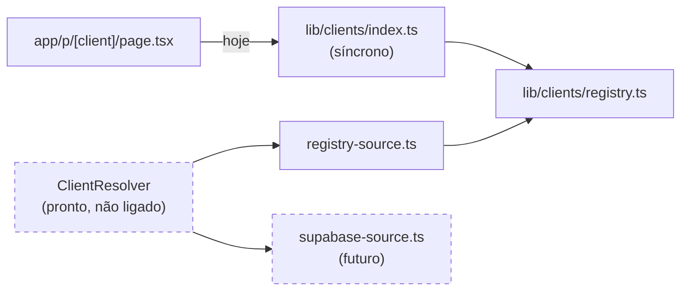
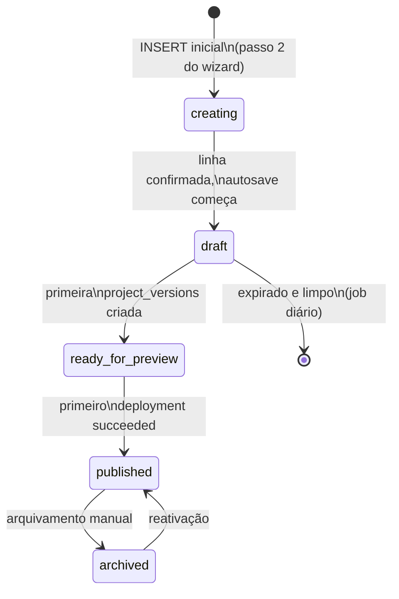
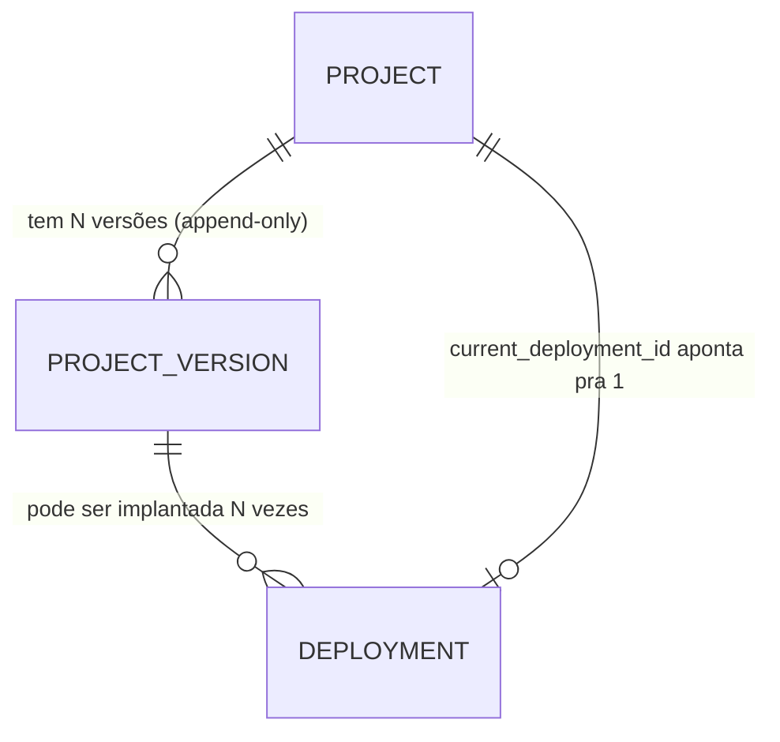
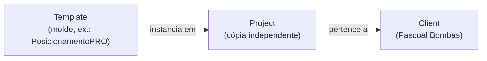
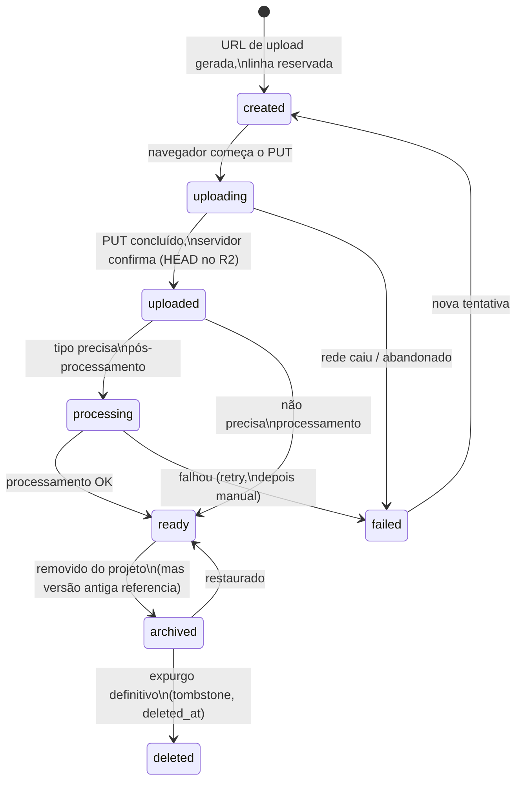
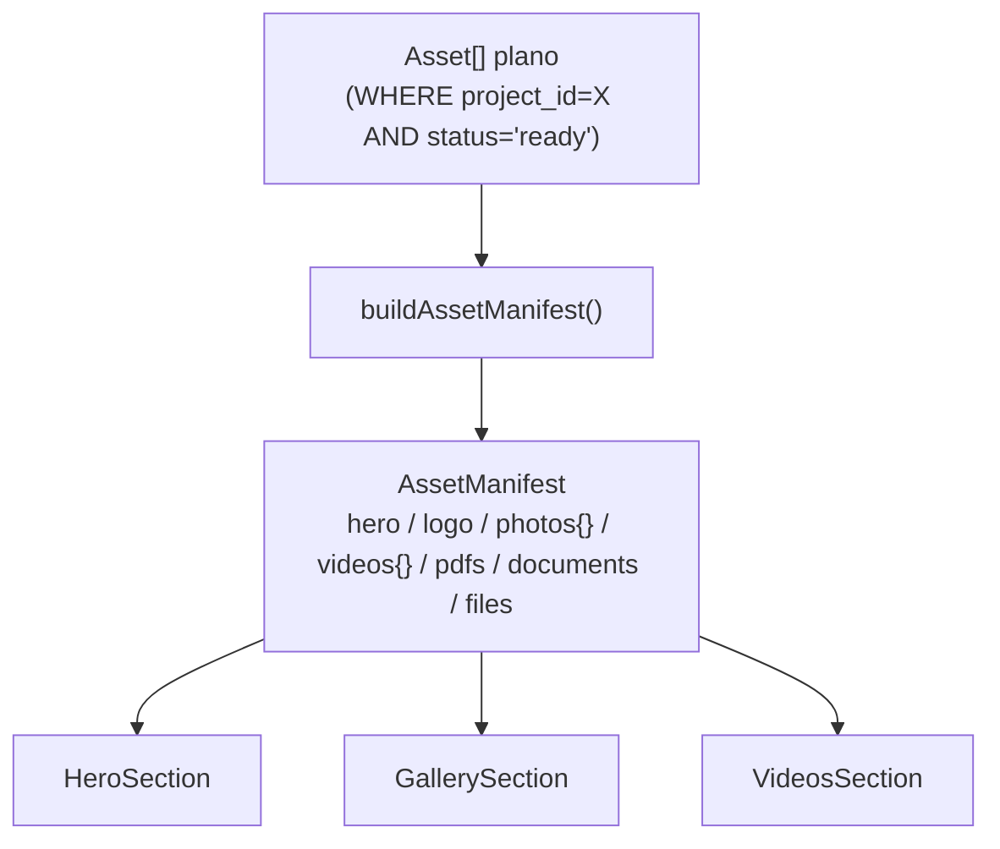
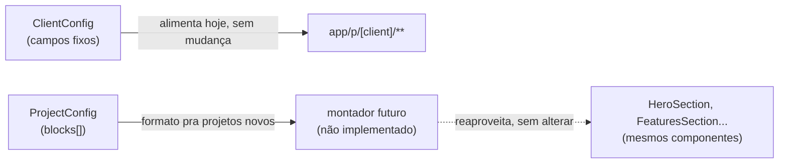
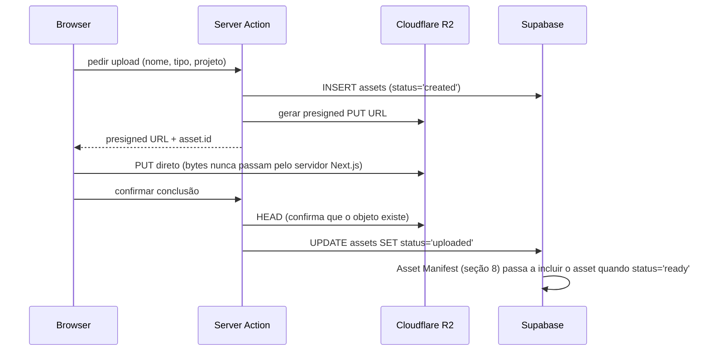
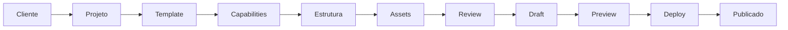
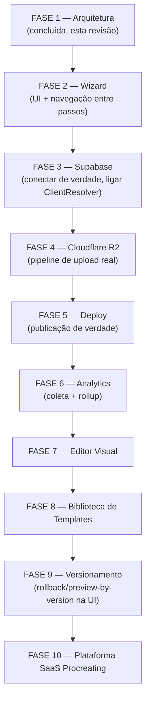

# Arquitetura da plataforma Procreating (Wizard → Draft → Preview → Deploy → Produção)

> **Revisão 4 — versão definitiva desta fase.** Revisão 1 propunha resolução de dados dentro
> do registry e um fluxo todo em memória do navegador. Revisão 2 corrigiu isso com
> `ClientResolver`, Draft persistido, Versionamento e Assets aditivos. Revisão 3 introduziu
> Deployment como entidade própria, Preview como tabela completa, Template versioning, ciclo de
> vida de Assets e uma primeira análise crítica do acoplamento a `ClientConfig`. **Esta revisão
> 4 é a consolidação definitiva**: fecha as 4 decisões que a revisão 3 deixou como
> recomendação (`ProjectConfig`/Blocks, Assets unificado, Deployments, expiração de Draft) e as
> torna código real — `lib/clients/resolver.ts`, `lib/platform/{blocks,capabilities,theme,
> asset-manifest}.ts`, `lib/supabase/types/database.ts` reescrito. Acrescenta Asset Manifest,
> Themes/Design Tokens e Capabilities como conceitos formais, e fecha o Wizard em 11 passos.
> Preview continua **documentado apenas** (pedido explícito) — nenhum tipo `Preview`/`previews`
> foi criado. Nada em `Pascoal`, `Galeria`, `Prospecção`, no template atual ou nas rotas
> públicas mudou — todo o código novo desta revisão vive isolado em `lib/clients/resolver.ts`,
> `lib/clients/sources/registry-source.ts`, `lib/platform/**`, `lib/supabase/**` e nos tipos
> mockados do admin (`lib/admin/projects/**`, `components/admin/dashboard/
> project-status-badge.tsx`).

---

## Mapa geral — o que é código real nesta revisão vs. só documentado

| Seção do pedido | Está implementado (código real, committed) | Está só documentado |
|---|---|---|
| 1. Client Resolver | ✅ `lib/clients/resolver.ts`, `lib/clients/sources/registry-source.ts` | — |
| 2. Draft | Tipos (`ProjectStatus`, `Project.expires_at`) | Política de expiração completa |
| 3. Preview | — (pedido explícito: não implementar) | ✅ Estrutura completa |
| 4. Deployments | Tipos (`Deployment`, `DeploymentStatus`) | Fluxo, rollback, retry |
| 5. Template | Tipos (`Template.version`/`schema_version`) | Relação Template→Instância |
| 6. Versionamento | Tipos (`ProjectVersion`) | Rollback/preview-by-version futuros |
| 7. Assets | ✅ `Asset`/`AssetType`/`AssetStatus` unificados em `database.ts` | Ciclo de vida completo |
| 8. Asset Manifest | ✅ `lib/platform/asset-manifest.ts` (`buildAssetManifest`, função pura e real) | Convenção de `category` |
| 9. Blocks | ✅ `lib/platform/blocks.ts` (`BlockType`, `Block`, `ProjectConfig`) | Montador/adaptador futuro |
| 10. Themes | ✅ `lib/platform/theme.ts` (`ProjectTheme`) | — |
| 11. Design Tokens | ✅ `lib/platform/theme.ts` (`DesignTokens`) | Consumo futuro pelos componentes |
| 12. Capabilities | ✅ `lib/platform/capabilities.ts` (`CAPABILITY_CATALOG`), tipos em `database.ts` | — |
| 13. Eventos | ✅ `Event`/`EventType` em `database.ts` | Separação Events vs. Analytics |
| 14. Analytics | Tipos (`Analytics`, `duration_seconds`) | Arquitetura de rollup/agregação |
| 15. Paginação | — | ✅ Cursor pagination |
| 16. Background Jobs | — | ✅ Lista de jobs + `job_runs` |
| 17. Pipeline de Upload | — | ✅ Fluxo presigned URL |
| 18. Escalabilidade | — | ✅ Tabela 10→5000 clientes |
| 19. Wizard | `PROJECT_WIZARD_STEPS` (11 passos, só dado — pedido explícito: não implementar UI) | ✅ O que acontece em cada passo |
| 20. Roadmap | — | ✅ 10 fases |

---

## 1. Client Resolver

```ts
// lib/clients/resolver.ts
export class ClientResolver implements ClientDataProvider {
  constructor(private readonly sources: ClientDataProvider[]) {}
  async getClientConfig(slug: string) { /* tenta cada source em ordem, primeiro não-null vence */ }
  async getClientVideos(slug: string) { /* idem */ }
  async getClientGalleryFolderDefs(slug: string) { /* idem */ }
  async getRegisteredClientSlugs() { /* união de todas as sources */ }
}
```

`ClientResolver` é a única camada que sabe que existe mais de uma fonte de dados possível
(Registry hoje; Supabase, Cache, API amanhã). É construído com uma **lista ordenada** de
`ClientDataProvider` — cada fonte é tentada em sequência, a primeira que responder não-null
vence. Rotas (`app/p/[client]/**`) e qualquer código futuro nunca falam com Registry ou
Supabase diretamente — falam com o `ClientResolver`, ou (hoje, ainda) com `lib/clients/index.ts`
que por sua vez usa uma única fonte.

**`registry.ts` deixou de ter qualquer responsabilidade de fallback** — essa era a inconsistência
da revisão 2/3 que este pedido corrigiu explicitamente. Em vez de o `ClientResolver` conhecer
`registry.ts` por dentro, existe um adaptador dedicado:

```ts
// lib/clients/sources/registry-source.ts
export const registrySource: ClientDataProvider = {
  getClientConfig: (slug) => getClientEntry(slug)?.config ?? null,
  // ...
};
```

`registry.ts` (arquivo protegido, intocado) não sabe que `ClientResolver` existe. Amanhã, uma
`supabaseSource: ClientDataProvider` nasce do mesmo jeito, e o resolver vira
`new ClientResolver([registrySource, supabaseSource])` — zero mudança em `registry.ts` ou em
qualquer rota pública.

### Por que ainda não está ligado a `lib/clients/index.ts`

`getClientConfig`/`getClientVideos`/etc. em `lib/clients/index.ts` são hoje **síncronos** (leem
de um objeto em memória). `ClientResolver` é assíncrono por natureza (uma fonte futura pode ser
uma query Supabase). Trocar `index.ts` pra usar o resolver tornaria essas funções `Promise`-
retornando, o que exige adicionar `await` em cada call site — e call sites incluem
`app/p/[client]/**`, uma rota pública protegida por regra explícita desta rodada. Essa troca é
mecânica e segura, mas **precisa de aprovação própria**, por tocar (ainda que só com um
`await`) um arquivo de rota pública. Fica marcada como próximo passo natural, não decidida aqui.



---

## 2. Draft — consolidado, sem Draft Session

**Decisão final (revisão 3 recomendou, revisão 4 confirma explicitamente): não usar Draft
Session.** O projeto nasce cedo, no wizard passo 2 (nome + slug confirmados) — não existe uma
entidade efêmera intermediária. Ver a comparação completa A vs. B na revisão 3 (mantida por
referência; a decisão não mudou, só deixou de ser "recomendação" para ser "definitiva").



### Política de expiração (dois níveis, definitiva)

- **Sem nenhuma `project_versions` ainda** (`status = 'draft'` ou `'creating'`):
  `expires_at = created_at + 7 dias`, renovado a cada autosave.
- **Com pelo menos uma versão** (`status = 'ready_for_preview'` em diante, ou qualquer draft que
  já gerou uma versão): `expires_at = agora + 60 dias` de inatividade.
- **Publicado ou arquivado**: `expires_at = null`, nunca expira.
- Job de limpeza diário (seção 16): `DELETE FROM projects WHERE expires_at < now()` — cascade
  cuida de `project_capabilities`/`assets`/`project_versions`/`deployments` órfãos.

### `published_projects` — a VIEW pedida

```sql
create view published_projects as
select * from projects where status in ('published', 'archived');
```

Já modelada em `Database.public.Views.published_projects` (`lib/supabase/types/database.ts`).
Todo dashboard, contagem ("cliente tem N projetos") ou listagem que não deveria enxergar
rascunho consulta essa view por padrão — a tabela `projects` crua fica reservada pra quem
precisa ver rascunhos de propósito (o próprio Wizard, "meus rascunhos" no admin).

---

## 3. Preview — estrutura completa (documentado apenas, sem código)

> Por pedido explícito desta rodada, esta seção **não gerou nenhum tipo ou tabela** —
> `Preview`/`previews` não existe em `lib/supabase/types/database.ts`. O desenho abaixo é o
> mesmo já validado na revisão 3, reafirmado aqui como a estrutura a implementar quando a vez
> chegar.

```sql
create table previews (
  id uuid primary key default gen_random_uuid(),
  project_id uuid not null references projects(id) on delete cascade,
  version_id uuid references project_versions(id),  -- null = sempre a versão corrente
  preview_token text not null unique,
  status text not null default 'active' check (status in ('active', 'revoked', 'expired')),
  expires_at timestamptz not null,
  created_by uuid not null references auth.users(id),
  created_at timestamptz not null default now()
);
```

**Campos exigidos pelo pedido, todos presentes**: `previewToken`, `expiresAt`, `createdBy`,
`createdAt`, `versionId`, `projectId`, `status`.

- **Múltiplos previews por projeto**: natural — `project_id` se repete; um preview "interno"
  (expira em 1 dia) e um "pro cliente" (expira em 14 dias) coexistem.
- **Aprovação do cliente / revisão da equipe**: modelado via `status` (`active`/`revoked`) mais
  metadado futuro (`approved_at`/`approved_by`, não incluído no v1 mínimo acima, mas encaixa sem
  mudança estrutural — só colunas a mais).
- **Histórico**: a tabela em si já é o histórico — nunca se apaga uma linha, só se revoga/expira.
- **Token**: alta entropia (32 bytes, base64url), nunca sequencial, comparação em tempo
  constante, nunca logado em analytics.
- **Renderização**: `app/preview/[id]/page.tsx` (arquivo novo, fora de `app/p/[client]/**`),
  reaproveitando os mesmos componentes de seção — sem tocar a rota pública.

---

## 4. Deployments — entidade própria, separada de Version

```ts
// lib/supabase/types/database.ts
export type DeploymentStatus = "pending" | "in_progress" | "succeeded" | "failed";

export type Deployment = {
  id: string;
  project_id: string;
  version_id: string;
  status: DeploymentStatus;
  triggered_by: string | null;  // null = sistema (retry automático)
  error_message: string | null;
  started_at: string;
  finished_at: string | null;
};
```



`ProjectVersion` = **o quê** (snapshot imutável de conteúdo, `INSERT` quando o config muda).
`Deployment` = **quando/se funcionou** (`INSERT` toda vez que se tenta pôr uma versão no ar —
pode coincidir com a criação da versão ou não). Essa separação é o que permite, sem lógica
especial:

- **Rollback**: novo `Deployment` apontando pra um `version_id` já existente e mais antigo.
- **Múltiplos deploys da mesma versão**: `version_id` se repete livremente entre linhas de
  `deployments` — o histórico mostra "essa versão foi implantada 3 vezes, 2 falharam".
- **Falha e retry**: `status = 'failed'` fica registrado; "tentar de novo" cria um **novo**
  `Deployment` (idempotente), nunca reescreve o antigo. `projects.current_deployment_id` só
  avança quando `status = 'succeeded'`.
- **Histórico completo**: `deployments` é a linha do tempo definitiva de "o que esteve no ar,
  quando" — mais preciso que reconstruir a partir de `created_at` de versões (que só diz quando
  o conteúdo foi escrito, não publicado).

---

## 5. Template — consolidado: Template → Instância → Projeto → Cliente



`Template.blocks: string[]` declara **quais** `BlockType` (seção 9) esse template usa por
padrão. Ao criar um `Project` a partir de um `Template`, o `config` inicial é uma **cópia**
desses blocos com dados reais preenchidos pelo wizard — nunca uma referência viva. A partir
desse instante, o Template deixa de controlar aquele Project: mudar o Template depois (subir
`Template.version`) não afeta nenhum projeto já criado, só instanciações futuras.

```ts
export type Template = {
  id: string; slug: string; name: string; description: string;
  blocks: string[];
  version: number;         // conteúdo/blocos padrão mudou
  schema_version: number;  // a FORMA do config mudou (raro, mais sério)
  created_at: string; updated_at: string;
};
```

`schema_version` existe pra um cenário específico: se o *shape* do config precisar mudar de
verdade (campo obrigatório novo/renomeado), a camada de leitura normaliza config antigo via uma
função `normalizeConfig(config, schemaVersion)` por versão — não uma reescrita de dados em
massa. Reservado, não implementado.

---

## 6. Versionamento — `project_versions`

```ts
export type ProjectVersion = {
  id: string;
  project_id: string;
  config: Record<string, unknown>;
  label: string | null;
  created_by: string;
  created_at: string;
};
```

**Append-only** — nunca há `UPDATE`, só `INSERT`. `Project.current_version_id` aponta pra qual é
a corrente (nullable — `null` até a primeira versão existir, o que também é o gatilho de
`draft → ready_for_preview`). Prepara, sem implementar agora:

- **Rollback**: apontar `current_version_id` (ou, via Deployment, `current_deployment_id`) pra
  uma versão antiga — zero lógica nova, é o mesmo fluxo de qualquer deploy.
- **Preview por versão**: `previews.version_id` (seção 3) já referencia `project_versions.id`.
- **Histórico completo**: `SELECT * FROM project_versions WHERE project_id = $1 ORDER BY
  created_at` já é o diff completo de todo conteúdo que o projeto já teve.

---

## 7. Assets — modelo unificado (mudança definitiva, substitui `videos`/`gallery_files`)

Decisão desta rodada, explicitamente overturning a recomendação "aditivo" da revisão 3: o schema
**nasce** com um único conceito de mídia, sem tabelas por tipo.

```ts
export type AssetType = "PHOTO" | "VIDEO" | "LOGO" | "PDF" | "DOCUMENT" | "ZIP" | "FILE" | "OTHER";
export type AssetStatus = "created" | "uploading" | "uploaded" | "processing" | "ready" | "archived" | "deleted" | "failed";

export type Asset = {
  id: string; project_id: string;
  type: AssetType;
  category: string;               // chave de agrupamento — ver Asset Manifest, seção 8
  label: string; key: string; url: string;
  metadata: Record<string, unknown>;  // específico por tipo (format/duration pra vídeo etc.)
  status: AssetStatus;
  sort_order: number;
  size_bytes: number | null;
  created_by: string; created_at: string;
};
```

**Por que isso não é migração**: nenhum dos tipos antigos (`Video`, `GalleryFolder`,
`GalleryFile`, dentro de `lib/supabase/types/database.ts`) jamais foi lido por código real — são
puro contrato, sem tabela criada, sem dado gravado. Trocar o tipo custa zero. Extensibilidade:
um novo `AssetType` (ex.: `AUDIO`, pra um Curso futuro) é um valor a mais no union — nenhuma
tabela nova, nenhuma migração, nenhum componente a alterar.

### Ciclo de vida



- `created`: reservado no instante em que a presigned URL é gerada — rastro pro job de limpeza
  de órfãos mesmo se o upload nunca acontecer.
- `uploaded`: **nunca confiar só no navegador** — Server Action confirma via `HEAD` no R2.
- `ready`: único estado em que um asset pode aparecer no Asset Manifest (seção 8) e ser
  referenciado por um projeto publicado.
- `archived` (não `deleted` direto): `project_versions` guarda snapshots imutáveis que podem
  referenciar um asset "removido" da versão atual — apagar o arquivo quebraria a integridade de
  uma visualização de versão antiga.
- `deleted`: expurgo real (bytes apagados do R2); linha vira tombstone, não some do banco —
  mantém `events` coerente ("asset X apagado em Y por Z") mesmo depois do arquivo sumir.

**Pascoal nunca entra nessa conversa** — arquivo local, filesystem, fora do alcance de qualquer
schema Supabase, pra sempre.

---

## 8. Asset Manifest — novo conceito, implementado

```ts
// lib/platform/asset-manifest.ts
export type AssetManifest = {
  hero: Asset | null;
  logo: Asset | null;
  ogImage: Asset | null;
  photos: Record<string, Asset[]>;   // categoria (ex.: "equipe") → lista
  videos: { social: Asset[]; acquisition: Asset | null; presentation: Asset | null };
  pdfs: Asset[]; documents: Asset[]; files: Asset[];
};

export function buildAssetManifest(assets: Asset[]): AssetManifest { /* pura, real, sem I/O */ }
```

**O contrato central**: componentes nunca conhecem a organização física do bucket R2 (prefixo,
convenção de pasta, nome de chave) — sempre consomem o Manifest, já agrupado por categoria de
uso. `buildAssetManifest` é a única função que sabe interpretar `Asset.category` (uma string
livre: `"hero"`, `"logo"`, `"og_image"`, `"gallery:<pasta>"`, `"social"`, `"acquisition"`,
`"presentation"`, ou nada — cai no `type` pra PDF/DOCUMENT/outros) e produzir a árvore agrupada.



Filtra por `status === "ready"` e ordena por `sort_order` antes de agrupar — nenhum asset
`archived`/`processing`/`failed` chega a um componente. É a mesma função que, no futuro, alimenta
tanto a renderização em produção quanto o preview (seção 3) — o Manifest é agnóstico a quem o
consome.

---

## 9. Blocks — `ProjectConfig`, desacoplado de `ClientConfig`

```ts
// lib/platform/blocks.ts
export type BlockType = "hero" | "gallery" | "videos" | "cta" | "downloads" | "infrastructure"
  | "timeline" | "faq" | "team" | "testimonials" | "prospection" | "traffic" | "custom";

export type Block = { [K in BlockType]: { type: K; data: BlockDataByType[K] } }[BlockType];

export type ProjectConfig = {
  metadata: { title: string; description: string; ogImage?: string };
  theme: { accentColor: string };
  blocks: Block[];  // ordem da lista = ordem de exibição
};
```

**`ClientConfig` (`lib/clients/types.ts`) não muda, não é renomeado, não é depreciado** — continua
alimentando a Pascoal por tempo indeterminado, campos fixos nomeados (`hero`, `features`,
`videosSection`, `gallery`, `prospeccao`, `footer`), exatamente como hoje. `ProjectConfig` é o
formato que **projetos novos** (Supabase-backed) gravam em `Project.config`/
`ProjectVersion.config` a partir de agora.

Um Template declara `blocks: string[]` (seção 5) — quais `BlockType` usa. Cada Project instanciado
copia esses blocos com dados reais. Cada `*BlockData` cobre um caso do que hoje é fixo
(`HeroBlockData`, `VideosBlockData`, `TimelineBlockData`, `FaqBlockData`, `TeamBlockData`,
`TestimonialsBlockData`, `ProspectionBlockData`, `TrafficBlockData`, `CtaBlockData`,
`DownloadsBlockData`, `InfrastructureBlockData`) mais `CustomBlockData` pra qualquer coisa fora do
catálogo padrão — a válvula de escape que evita que todo produto novo precise de um `BlockType`
próprio antes de existir demanda real.



**Componentes renderizam blocos, nunca campos fixos** — quando (e se) o montador for
implementado, ele interpreta a lista `blocks` e invoca o componente certo por `type`; os
componentes React existentes (`HeroSection` etc.) não mudam, ganham um adaptador por cima.

**A Pascoal continua no formato atual — só arquitetura nova nasce em cima de blocks.** Nenhuma
migração de dado existente foi feita ou é necessária.

---

## 10. Themes — `ProjectTheme`

```ts
// lib/platform/theme.ts
export type ProjectTheme = {
  tokens: DesignTokens;
  typography: { fontDisplay: string; fontSans: string; fontMono: string };
  spacing: { radius: string };
  buttons: { style: "solid" | "outline" | "ghost"; radius: string };
  icons: { set: string };
  animations: { enabled: boolean };
};
```

Theme é completamente separado da lógica do Project — não é um campo dentro de `ProjectConfig`
por acidente, é um tipo próprio, pensado pra eventualmente virar seu próprio registro/tabela se
a plataforma precisar de temas reutilizáveis entre projetos (ex.: "tema Procreating padrão" vs.
"tema personalizado do cliente X"). **Zero alteração em `app/globals.css` ou nos componentes
públicos** — a Pascoal continua com seu único token de cor (`--client-accent`) exatamente como
está.

---

## 11. Design Tokens

```ts
export type DesignTokens = {
  primary: string; secondary: string; accent: string;
  background: string; surface: string; border: string;
  danger: string; warning: string; success: string; info: string;
};
```

Os 10 tokens pedidos, prontos. **Regra pra qualquer componente novo que vier a consumir isto**:
nunca cor literal (`#d4af6a`) — sempre um token. Nenhum componente público consome isso hoje; é
o vocabulário que um futuro sistema de theming usaria. `ProjectTheme.tokens` (seção 10) é onde
esses 10 valores vivem por projeto.

---

## 12. Capabilities — evolução de "produtos vendidos"

```ts
export type CapabilityKey = "gallery" | "photos" | "videos" | "downloads" | "prospection"
  | "traffic" | "analytics" | "members_area" | "landing" | "password_protection" | "custom_modules";

export type ProjectCapability = {
  id: string; project_id: string; key: CapabilityKey; enabled: boolean;
  config: Record<string, unknown>;  // específico por capability
  created_at: string;
};
```

```ts
// lib/platform/capabilities.ts
export const CAPABILITY_CATALOG: CapabilityDefinition[] = [ /* 11 entradas, key+label+description */ ];
```

As 4 "produtos vendidos" do PosicionamentoPRO (Vídeos, Fotos, Prospecção Ativa, Tráfego Pago) se
generalizam pra 11 capabilities, cobrindo produtos futuros (Área de Membros, Landing, Proteção
por Senha genérica, Módulos Personalizados). Um `Template` consulta o catálogo pra saber quais
capabilities pode oferecer; um `Project` ativa só as contratadas
(`ProjectCapability.enabled`). **Regra de implementação**: componentes checam
`capabilities` do projeto — nunca `if (product === "videos")` espalhado pelo código.

---

## 13. Eventos — `events`, separado de Analytics

```ts
export type EventType = "project_created" | "project_updated" | "deploy_performed"
  | "preview_created" | "upload_started" | "upload_completed" | "password_changed"
  | "project_published" | "project_archived";

export type Event = {
  id: string; project_id: string | null; client_id: string | null;
  actor_id: string | null;  // null = ação do sistema
  type: EventType; metadata: Record<string, unknown>; created_at: string;
};
```

| | `Event` | `Analytics` |
|---|---|---|
| **Quem gera** | Time/admin (ação deliberada) | Visitante público (comportamento) |
| **Volume** | Baixo (dezenas/projeto/mês) | Alto (milhares/projeto/mês) |
| **Sempre sabe quem** | Sim (`actor_id`, nullable só pra sistema) | Não (`visitor_id` é hash anônimo) |
| **Propósito** | Auditoria, "o que aconteceu com este projeto" | Métrica de produto, "como visitantes usam isto" |

Nenhuma sobreposição de responsabilidade: um deploy gera **um** `Event` (`deploy_performed`);
uma visita à página gera **um** `Analytics` (`page_view`). Nunca o mesmo fato em duas tabelas.

---

## 14. Analytics — arquitetura (sem implementação)

```ts
export type AnalyticsEventType = "page_view" | "gallery_unlock" | "prospeccao_unlock";
export type AnalyticsDevice = "desktop" | "mobile" | "tablet";

export type Analytics = {
  id: string; project_id: string; event_type: AnalyticsEventType;
  path: string; visitor_id: string | null; device: AnalyticsDevice | null;
  referrer: string | null; duration_seconds: number | null; created_at: string;
};
```

Cobre visitantes (`visitor_id`, hash anônimo — nunca IP/PII direto), origem (`referrer`),
dispositivo (`device`), tempo médio (`duration_seconds`, populado por um futuro evento
`page_leave`), páginas (`path`). Campos ainda não modelados, propositalmente adiados até haver
demanda real: campanhas/UTM (encaixam em `metadata jsonb` sem mudança de schema), heatmaps
(produto totalmente diferente — provedor terceiro tipo Clarity é mais barato que construir),
downloads (já é a tabela `Download` separada, referenciando `Asset.id`).

**Estratégia pra milhares de clientes — rollup obrigatório, não opcional**:

```sql
create table project_daily_stats (
  project_id uuid not null references projects(id),
  day date not null,
  page_views int not null default 0,
  unique_visitors int not null default 0,
  gallery_unlocks int not null default 0,
  downloads int not null default 0,
  primary key (project_id, day)
);
```

Um job noturno (seção 16) agrega `analytics`/`downloads` do dia em `project_daily_stats`.
Dashboards **sempre** leem do rollup, nunca somam a tabela bruta em tempo real — acima de
algumas centenas de projetos ativos, um `COUNT(*) ... GROUP BY` direto em `analytics` deixa de
ser viável em latência de página.

---

## 15. Paginação — Cursor, não Offset

```ts
async function getGalleryPage(folderCategory: string, cursor: string | null, limit = 50) {
  // cursor decodifica pra (sort_order, id) do último item da página anterior
  // WHERE project_id=$1 AND category=$2 AND (sort_order, id) > ($cursorSortOrder, $cursorId)
  // ORDER BY sort_order, id LIMIT $limit
}
```

Toda listagem futura (galeria paginada, lista de projetos, lista de eventos, lista de
deployments) usa keyset/cursor — comparação de tupla `(sort_order|created_at, id)` — nunca
`OFFSET n`. Cursor não degrada com `n` grande (Postgres não pula n linhas) e é estável mesmo com
inserções/reordenações entre páginas; `OFFSET` pode pular ou repetir itens nesse cenário. A
galeria da Pascoal (`GalleryFolder.photos`, array completo, ~20-30 fotos) **não muda** — cursor é
só para o caminho novo Supabase-backed, quando volume justificar.

---

## 16. Background Jobs

Processos que nunca devem acontecer dentro do ciclo de uma requisição HTTP:

- Thumbnail de vídeo, compressão de vídeo, otimização/resize de imagem em lote.
- Deploy (o trabalho de "publicar" pode envolver mais que um `UPDATE`, ver seção 17/18).
- Agregação de analytics (`project_daily_stats`, seção 14).
- Limpeza de drafts expirados (seção 2), expiração de previews (seção 3), limpeza de assets
  órfãos travados em `created`/`uploading` (seção 7).

```sql
create table job_runs (
  id uuid primary key default gen_random_uuid(),
  job_name text not null,
  status text not null check (status in ('running', 'succeeded', 'failed')),
  started_at timestamptz not null default now(),
  finished_at timestamptz, error_message text, metadata jsonb not null default '{}'
);
```

Jobs são **consumidores** das tabelas já desenhadas (`assets.status`, `projects.expires_at`,
`analytics`) — não exigem mudança em schema central. Gatilho: **Vercel Cron**
(`vercel.json` + Route Handler), sem provedor de infra novo. Evolução em degraus: cron simples
primeiro; fila de verdade (Cloudflare Queues, mesmo provedor do R2) só quando volume pedir
(seção 18).

---

## 17. Pipeline de Upload — nunca pelo servidor



Browser → Presigned URL → Cloudflare R2 → Validação (`HEAD`) → Registro no banco (`assets`) →
Asset Manifest → Projeto. O servidor Next.js nunca vê os bytes — só coordena (gera URL, confirma
depois). Isso é o que torna vídeos de centenas de MB viáveis sem tocar limite de payload de
function serverless.

---

## 18. Escalabilidade — 10 a 5000 clientes

| Volume | Gargalo principal | Mitigação |
|---|---|---|
| **10 clientes** | Nenhum | Schema atual, sem índice extra, sem cache — roda em qualquer plano gratuito. |
| **100 clientes, ~5k assets** | Nenhum real ainda | Índices básicos (`project_id`, `status`) já cobrem. Dashboard soma direto de `analytics` ainda é viável. |
| **500 clientes, ~50k assets** | Dashboard somando `analytics` bruto começa a doer | `project_daily_stats` (seção 14) passa a ser necessário, não opcional. Cursor pagination (seção 15) em qualquer listagem de assets. |
| **1000 clientes, ~100k photos, 10k vídeos** | R2: custo de egress se servido sem CDN; queries `assets WHERE project_id` sem índice composto | CDN na frente do R2 (Cloudflare já é o provedor — CDN é nativo, não é integração nova). Índice composto `(project_id, status, sort_order)` em `assets`. Background jobs (seção 16) passam de cron simples pra fila real se thumbnail/compressão virar volume relevante. |
| **5000 clientes, ~1M assets** | Postgres: tabela `assets`/`analytics` na casa de dezenas de milhões de linhas; `job_runs`/rollup diário processando volume real; conexões concorrentes ao Supabase | Particionamento de `analytics`/`assets` por data ou por faixa de `project_id` (Postgres declarative partitioning) se necessário — decisão adiada até haver sinal real de necessidade, não especulativa agora. Connection pooling (Supabase já oferece via PgBouncer). Rollups diários viram a única fonte pra qualquer dashboard — nunca mais uma soma direta. Fila de verdade (Cloudflare Queues) para todo background job, não só os pesados. |

**Providers/custos**: R2 (armazenamento + egress via CDN, sem taxa de egress do R2 em si — a
vantagem principal sobre S3 pra esse volume de mídia); Supabase (Postgres gerenciado + Auth,
plano escala com conexões/storage, não com "número de clientes" por si); Vercel (hosting, escala
com requests/build minutes, não com número de projetos servidos estaticamente).

**Limitações reconhecidas nesta arquitetura**: nenhuma solução de busca full-text/fuzzy foi
desenhada (não pedida); nenhuma estratégia de multi-região foi desenhada (não pedida, provável
não-necessária pro perfil de cliente atual — negócios locais brasileiros). Ambas ficam como
"evolução futura", não como lacuna da fase atual.

---

## 19. Wizard — fluxo revisado, 11 passos (não implementar UI ainda)

```ts
// lib/admin/projects/wizard.ts — já commitado, só dado
export const PROJECT_WIZARD_STEPS = [
  { key: "client", label: "Cliente" },
  { key: "project", label: "Projeto" },
  { key: "template", label: "Template" },
  { key: "capabilities", label: "Capabilities" },
  { key: "structure", label: "Estrutura" },
  { key: "assets", label: "Assets" },
  { key: "review", label: "Review" },
  { key: "draft", label: "Draft" },
  { key: "preview", label: "Preview" },
  { key: "deploy", label: "Deploy" },
  { key: "published", label: "Publicado" },
];
```



1. **Cliente** — escolhe um `Client` existente ou cria um inline (entidade simples: nome).
2. **Projeto** — nome + slug (auto-gerado, editável). Aqui nasce o `Project` de verdade
   (`status='creating'` → `'draft'` ao confirmar) — reserva atômica do slug via constraint
   `unique`, sem depender de nenhuma etapa posterior (seção 2).
3. **Template** — escolhe um `Template`; a escolha determina `blocks` disponíveis (seção 9) e
   quais capabilities o catálogo (seção 12) oferece pros passos seguintes.
4. **Capabilities** — ativa `ProjectCapability` (ex.: Vídeos, Galeria, Prospecção) dentre as que
   o Template permite; cada uma pode ter config própria (ex.: quantidade de vídeos).
5. **Estrutura** — Padrão (mostra os blocks que o Template gera automaticamente, na ordem
   default) ou Personalizado (placeholder "editor visual futuro" — sem editor de verdade ainda).
6. **Assets** — upload real via pipeline presigned (seção 17); cada arquivo vira um `Asset`
   `status='created'` → `'uploading'` → `'uploaded'` ao longo deste passo, categorizado
   (`Asset.category`) conforme o bloco/slot que preenche.
7. **Review** — resumo de tudo (Capabilities ativas, blocks configurados, Assets enviados) antes
   de confirmar — nenhuma escrita nova acontece aqui, só leitura do que já foi persistido.
8. **Draft** — ao confirmar o Review, gera a primeira `ProjectVersion` (snapshot do `config`
   atual) — é o gatilho que muda `status: 'draft' → 'ready_for_preview'` e estende
   `expires_at` pra 60 dias (seção 2).
9. **Preview** — gera um `previews` (seção 3, quando implementado) apontando pra essa versão;
   time/cliente revisam via link com token antes de publicar.
10. **Deploy** — cria um `Deployment` (`status='pending' → 'in_progress'`) apontando pra essa
    `ProjectVersion`; sucesso marca `'succeeded'` e atualiza `current_deployment_id`.
11. **Publicado** — `Deployment.status='succeeded'` dispara `status: '... → 'published'`,
    `expires_at=null`; um `Event` (`project_published`) é registrado (seção 13); o projeto passa
    a aparecer em `published_projects` (seção 2).

---

## 20. Roadmap definitivo



---

## Revisão crítica final — antes de iniciar o Wizard

### Acoplamentos e limitações identificados nesta rodada

1. **`ClientResolver` pronto, mas não ligado** (seção 1) — é uma dívida deliberada, não um
   descuido: ligá-lo exige tocar `app/p/[client]/**` (adicionar `await`), uma rota protegida por
   regra explícita. **Recomendação**: pedido próprio e isolado, só pra essa troca, antes da
   FASE 3 — não misturar com trabalho de Wizard.
2. **`Asset.category` é uma string livre, sem enum** — flexível (novo agrupamento não exige
   migração), mas sem validação em tempo de compilação; um typo (`"galery:equipe"`) silenciosamente
   cai em `manifest.files` em vez de `manifest.photos`. **Recomendação**: quando a implementação
   real do upload existir, validar `category` contra uma lista de prefixos conhecidos na Server
   Action de upload (não no tipo — o tipo precisa continuar aberto pra `gallery:<qualquer-pasta>`).
3. **`ProjectCapability.config`/`Asset.metadata`/`Event.metadata` são todos `Record<string,
   unknown>`** — necessário pra generalidade (cada capability/tipo/evento tem shape diferente),
   mas significa zero checagem de tipo no conteúdo real até existir uma implementação que os
   preencha. Risco baixo hoje (nada escreve neles ainda); vira risco real na FASE 2 se o Wizard
   escrever neles sem uma camada de validação (ex.: Zod) por `CapabilityKey`/`AssetType`/
   `EventType`. **Recomendação**: schemas de validação por chave, introduzidos junto com a
   implementação real do Wizard, não antes (não há o que validar ainda).
4. **`ProjectConfig.theme` (seção 9, `{ accentColor: string }`) e `ProjectTheme` (seção 10,
   `DesignTokens` completo) são dois formatos de tema diferentes, intencionalmente não
   unificados nesta rodada** — `ProjectConfig.theme` é o mínimo que o Wizard provavelmente
   precisa pro v1 (uma cor, como a Pascoal já usa); `ProjectTheme` é a forma completa pra quando
   houver demanda de theming avançado. Deixar os dois coexistirem sem migração automática entre
   eles é uma decisão consciente — forçar unificação agora seria especular sobre uso que ainda
   não existe. **Não é uma inconsistência a corrigir, é um degrau deliberado.**
5. **`published_projects` é uma `View`, não um objeto com métodos** — no client Supabase real,
   ler dessa view tem exatamente a mesma API que ler de `projects` (`from("published_projects")`)
   porque `Database.public.Views` segue o mesmo formato de `Tables`. Nenhum código precisa saber
   a diferença. Confirmado, sem ação necessária.
6. **Nenhum novo acoplamento com `ClientConfig`/Pascoal foi introduzido** — reconfirmado nesta
   rodada por grep: nada em `lib/platform/**`, `lib/clients/resolver.ts`,
   `lib/clients/sources/registry-source.ts` ou `lib/supabase/**` é importado por
   `app/p/[client]/**`, `data/pascoal/**`, ou qualquer componente de
   `components/landing|gallery|prospeccao/**`. O isolamento pedido nas REGRAS desta rodada está
   intacto.

### Riscos herdados das revisões anteriores, ainda válidos

- Falha parcial em `deployments` (Postgres grava, R2 falha ou vice-versa) — sem atomicidade
  cross-sistema real; mitigado por status visível + retry idempotente, sem fila/saga (aceito,
  volume não justifica saga).
- Preview sem extração da montagem de página de `app/p/[client]/page.tsx` — duplicação
  deliberada entre rota pública e preview, pra não tocar a rota pública nesta fase.

### Decisões arquiteturais desta revisão (resumo)

| Decisão | Estado |
|---|---|
| `ClientResolver` sem fallback no Registry | ✅ Implementado, não ligado ao `index.ts` |
| Draft sem Draft Session, Project nasce cedo | ✅ Confirmado, expiração em 2 níveis documentada |
| Preview como tabela completa | Documentado apenas (pedido explícito) |
| Deployment separado de Version | ✅ Implementado (tipos) |
| Assets unificado (`Asset` único) | ✅ Implementado, substitui `Video`/`GalleryFolder`/`GalleryFile` |
| Asset Manifest | ✅ Implementado (`buildAssetManifest`, função pura e testável) |
| Blocks / `ProjectConfig` desacoplado de `ClientConfig` | ✅ Implementado, zero migração de `ClientConfig` |
| Themes / Design Tokens | ✅ Implementado, não consumido por nenhum componente ainda |
| Capabilities (evolução de "produtos vendidos") | ✅ Implementado (catálogo de 11) |
| Eventos separados de Analytics | ✅ Implementado (tipos) |
| Cursor pagination | Documentado, não implementado (sem consumidor real ainda) |
| Background Jobs | Documentado (`job_runs` esboçado, não criado) |
| Wizard em 11 passos | ✅ Dado pronto (`PROJECT_WIZARD_STEPS`), UI não implementada (pedido explícito) |

### Recomendações finais, em ordem de prioridade

1. **Antes da FASE 2 (Wizard UI)**: nenhuma decisão de schema/formato pendente — as 4 decisões
   que a revisão 3 apontou como obrigatórias antes da primeira linha de código do Wizard
   (`ProjectConfig`/blocks, `deployments`/`previews` como tabelas próprias, Draft com expiração
   em 2 níveis, Assets unificado) estão todas fechadas nesta revisão. **O Wizard pode começar a
   ser implementado sem risco de retrabalho estrutural.**
2. Implementar `previews` como tabela real (seção 3) só quando o passo 9 do Wizard for
   implementado de fato — não antes, para não criar tipo sem consumidor.
3. Resolver o `ClientResolver` não-ligado (achado 1 acima) como um pedido isolado, focado só
   nisso, antes ou em paralelo à FASE 3 — não durante a implementação do Wizard, pra não
   misturar duas mudanças de risco diferente no mesmo PR.
4. Adiar validação de `category`/`metadata`/`config` livres (achados 2 e 3) até a implementação
   real do Wizard escrever neles — introduzir Zod (ou equivalente) nesse momento, não antes.

**Esta é a versão definitiva da arquitetura da plataforma antes do desenvolvimento do Wizard.**
