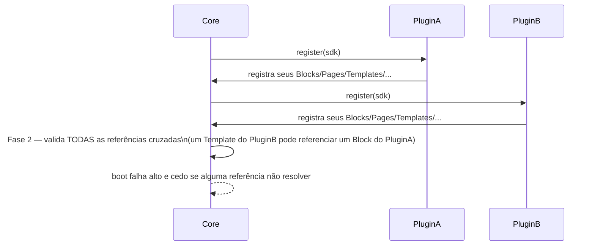
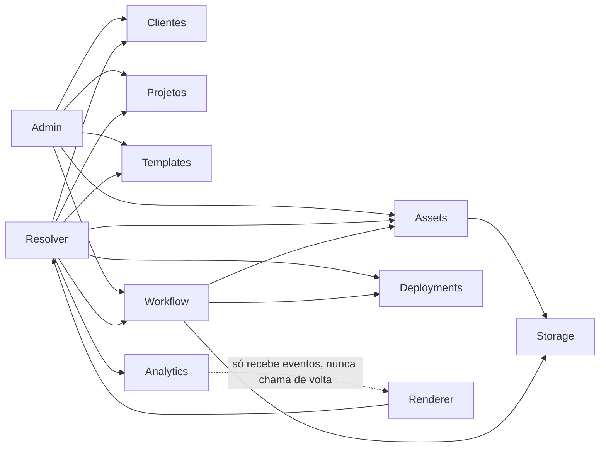

# Arquitetura da plataforma Procreating (Wizard → Draft → Preview → Deploy → Produção)

> **Revisão 6 — revisão final. Architecture Freeze ao término deste documento.** Puramente
> documental: nenhuma rota mudou, nenhum arquivo de código foi tocado, Pascoal/Galeria/
> Prospecção continuam 100% intocados, nenhum comportamento observável da aplicação mudou.
> Revisões 1–4 construíram a espinha dorsal (ClientResolver, Draft, Versionamento, Deployment,
> Preview, Assets unificados, Blocks/Capabilities/Themes, Wizard de 11 passos). Revisão 5 elevou
> a visão de "gerador de páginas" pra "sistema operacional interno" — Page Engine (Página →
> Seção → Bloco → Componente), Render Engine, Resolver Layer generalizado, Event Sourcing,
> Workflow Engine, Plugins — e identificou, como achado mais importante, que unions fechadas do
> TypeScript (`BlockType`, `CapabilityKey`, `AssetType`, `EventType`) são incompatíveis com
> Plugins. **Esta revisão 6 resolve exatamente essa pendência**: substitui union fechada por
> **Registry** em cada um dos oito conceitos extensíveis da plataforma, formaliza o **Plugin
> SDK** que consome esses registries, formaliza o **Renderer Context** (Renderer nunca busca
> dado, só recebe), expande **Resolver Layer** e **Storage Driver**, define **Domain
> Boundaries** com grafo de dependência sem ciclos, e fecha com uma auditoria final e a
> declaração formal de **Architecture Freeze**.

## Índice

1. [Eliminar unions fechadas](#1-eliminar-unions-fechadas) · 2. [Block Registry](#2-block-registry) ·
3. [Component Registry](#3-component-registry) · 4. [Page Registry](#4-page-registry) ·
5. [Template Registry](#5-template-registry) · 6. [Asset Registry](#6-asset-registry) ·
7. [Event Registry](#7-event-registry) · 8. [Capability Registry](#8-capability-registry) ·
9. [Plugin SDK](#9-plugin-sdk) · 10. [Renderer Context](#10-renderer-context) ·
11. [Storage Driver](#11-storage-driver) · 12. [Resolver Layer](#12-resolver-layer) ·
13. [Workflow Registry](#13-workflow-registry) · 14. [Theme Engine](#14-theme-engine) ·
15. [Platform API](#15-platform-api) · 16. [Domain Boundaries](#16-domain-boundaries) ·
17. [Escalabilidade final](#17-escalabilidade-final) · 18. [Auditoria — Architecture Freeze](#18-auditoria--architecture-freeze) ·
19. [Decisões congeladas](#19-decisões-congeladas) · 20. [Relatório final](#20-relatório-final)

> Revisões anteriores (1–5) permanecem preservadas no histórico do git deste arquivo
> (`git log -p -- docs/project-creation.md`) — este documento é reescrito por completo a cada
> revisão pra nunca existir mais de uma narrativa de arquitetura vigente ao mesmo tempo.

---

## 1. Eliminar unions fechadas

### O padrão único que substitui os quatro (e mais quatro) tipos fechados

```ts
/** Todo id de Registry é namespaced — "core:hero", "curso:module-list" — nunca um literal solto. */
type RegistryId = string & { readonly __brand: "RegistryId" };

interface RegistryEntry {
  id: RegistryId;
  version: string;                 // semver
  compatibility?: { minCoreVersion?: string; maxCoreVersion?: string };
}

interface Registry<TEntry extends RegistryEntry> {
  /** Rejeita id sem namespace (`plugin:local`) e rejeita re-registro de um id já existente
   *  por OUTRO plugin — nunca override silencioso. */
  register(entry: TEntry): void;
  get(id: RegistryId): TEntry | undefined;
  list(filter?: Partial<TEntry>): TEntry[];
  has(id: RegistryId): boolean;
}
```

`BlockType`, `CapabilityKey`, `AssetType`, `EventType` (unions fechadas, revisões 4–5) — e, por
extensão desta revisão, também Page, Template, Component e Workflow — deixam de ser union
literal do TypeScript e passam a ser `RegistryId` validado em runtime contra o Registry
correspondente. Segurança de tipo não se perde: em vez de "só estes 6 valores compilam",
passa a ser "só valores que passaram por `register()` são aceitos por `has()`/`get()`" —
validação em runtime, na fronteira (boot de plugin, leitura de config), não em tempo de
compilação. **Ainda não implementado** — esta seção é a decisão de forma, não código.

### Uma exceção deliberada: `Event.category`

`category: "audit" | "system" | "analytics"` (revisão 5, seção 11) **permanece união fechada de
3 valores, pra sempre** — não vira Registry. Plugins registram novos **tipos** de evento (seção
7), nunca uma quarta categoria. É uma modelagem de domínio (quem gera o evento e com que volume
— pessoa, sistema, ou visitante), não um catálogo extensível de produto. Generalizar isso
também seria abstração além do que qualquer caso de uso pede — o oposto do problema que esta
seção resolve.

### Core é só o primeiro registrante, não um caso especial

`register()` não distingue "Core" de "Plugin" — o próprio núcleo da plataforma registra seus
Blocks/Components/Pages/... com o prefixo `core:` do mesmo jeito que um plugin registraria com
`curso:`/`evento:`. Isso é o que garante, de fato, que "novo produto = registrar, não editar
Core": se o Core precisasse de um caminho de registro diferente do resto, teria alguma
vantagem/atalho que um plugin não tem, e a promessa de "sem alterar o núcleo" seria mentirosa na
prática.

---

## 2. Block Registry

```
Core
 └─ Block Registry
     └─ Renderer
         └─ Página
```

```ts
type BlockDefinition = {
  id: RegistryId;                      // "core:hero", "curso:module-list"
  version: string;
  schema: JsonSchema;                   // valida Block.data — na escrita (Wizard/admin) e na leitura (Renderer)
  component: RegistryId;                 // aponta pro Component Registry (seção 3)
  renderer?: RegistryId;                  // override raro — ver Component Resolver, seção 12
  capabilities?: RegistryId[];             // exige que estas Capabilities estejam habilitadas no Projeto
  defaultConfig: Record<string, unknown>;
  compatibility: { minCoreVersion: string };
};
```

Todos os campos pedidos (id, versão, schema, componente, renderer, capabilities, configurações
padrão, compatibilidade) — nenhum a mais. `schema` é o que substitui a checagem de tipo estática
que a union fechada dava de graça: todo `Block.data` gravado (Wizard, futuramente) é validado
contra o `schema` do `BlockDefinition` correspondente antes de persistir — sem isso, um Registry
runtime seria estritamente menos seguro que a union fechada que ele substitui, o que seria um
retrocesso, não uma evolução.

`component` é uma referência, não uma implementação embutida — o Block Registry descreve **o
que** o bloco é (contrato de dado); o Component Registry (seção 3) descreve **como** ele é
desenhado. Um plugin futuro registrando um novo `BlockDefinition` referencia um `component`
já existente (reaproveitando, por exemplo, `core:cta-button` dentro de um Block novo) ou registra
o seu próprio Component junto.

---

## 3. Component Registry

```ts
type ComponentDefinition = {
  id: RegistryId;                // "core:hero-section"
  version: string;
  props: JsonSchema;              // contrato de props que o componente aceita
  renderer: string;                // chave de resolução pro export React real (nunca um caminho de arquivo cru)
  dependencies?: RegistryId[];      // outros componentes que este componente embute
  compatibility: { minCoreVersion: string };
  category: string;                  // "hero" | "cta" | "media" | "content" | "commerce" | "layout" | "custom" | ...
};
```

`category` é `string`, não union — mesmo raciocínio da seção 1, existe só pra organizar a UI de
quem monta Blocks no admin (agrupar por categoria numa lista), nunca pra decisão de
comportamento em código (nada faz `if (category === "hero")`).

### Componentes de núcleo (exemplos do pedido, todos registráveis pelo mesmo mecanismo)

`core:hero-section`, `core:cta-button`, `core:video-player`, `core:gallery-grid`,
`core:timeline`, `core:testimonials`, `core:download-list`, `core:media-player`,
`core:accordion` — hoje a maioria já existe como componente React real
(`components/landing/**`), só ainda não passou por um `register()` formal. Formalizar isso é
trabalho de implementação (fora do escopo desta rodada, documentação apenas).

---

## 4. Page Registry

```
Page Registry
 ├─ core:landing
 ├─ core:downloads
 ├─ core:galeria
 ├─ curso:curso-home
 ├─ membros:area
 ├─ evento:evento-home
 └─ <página futura>
```

```ts
type PageDefinition = {
  id: RegistryId;
  version: string;
  defaultSections: { type: string; order: number; defaultBlocks: RegistryId[] }[];
  requiredCapabilities?: RegistryId[];
  compatibility: { minCoreVersion: string };
};
```

**Cada página conhece apenas seus Blocks** — um `PageDefinition` referencia `BlockDefinition`
ids (via `defaultBlocks`), nunca outro `PageDefinition`, nunca um Componente diretamente. Isso
impede o tipo de acoplamento em que "Página Downloads" precisaria saber que "Página Prospecção"
existe pra, por exemplo, decidir se mostra um link cruzado — esse tipo de referência cruzada
entre páginas é modelada como um `Block` de navegação (`core:page-link`) com `data.targetPageId`,
não como acoplamento estrutural entre `PageDefinition`s.

### Registry vs. Resolver — a distinção que vale pra todos os oito Registries desta revisão

**Registry = catálogo do que PODE existir** (registrado uma vez, no boot, por Core ou por
Plugin). **Resolver (seção 12) = busca em runtime do que DE FATO existe** pra um Projeto
específico. `PageRegistry.get("core:downloads")` devolve a definição-molde; `PageResolver.
resolve({ projectId, slug: "downloads" })` devolve a `ProjectPage` de verdade daquele projeto,
já instanciada a partir daquele molde. Um nunca substitui o outro.

---

## 5. Template Registry

```ts
type TemplateDefinition = {
  id: RegistryId;                 // "core:posicionamento-pro"
  version: string;
  pages: RegistryId[];              // Page Registry ids usados por padrão
  capabilities: { key: RegistryId; enabledByDefault: boolean; config?: Record<string, unknown> }[];
  theme: RegistryId;                  // Theme Registry id (seção 14)
  tokens?: Partial<DesignTokens>;       // overrides pontuais sobre o Theme base
  defaultAssetCollections?: string[];    // nomes de AssetCollection (revisão 5, seção 7) que a instância já nasce com
  navigation: { pageId: RegistryId; label: string; order: number }[];
  compatibility: { minCoreVersion: string };
};
```

Todo campo pedido (Pages, Capabilities, Theme, Tokens, Assets padrão, Navegação, estrutura
inicial) presente. **"Novos Templates nunca deverão exigir alteração no Core"** — verdadeiro
por construção: um `TemplateDefinition` só referencia ids já registrados (Pages, Capabilities,
Theme) — se algum desses ainda não existir, ele precisa ser registrado primeiro (pelo mesmo
plugin ou por um plugin de que este depende), nunca editando um arquivo do Core pra "abrir
espaço". Ordem prática de registro documentada no checklist final (seção 20).

### Instanciação continua sendo cópia profunda (regra da revisão 4/5, reafirmada)

Criar um Projeto a partir de um `TemplateDefinition` resolve cada Page/Block/Capability/Theme
referenciado (via os Registries) e grava uma **cópia** completa no Projeto — nunca uma
referência viva ao `TemplateDefinition`. Subir a versão de um Template não move nenhum projeto
já criado.

---

## 6. Asset Registry

```ts
type AssetTypeDefinition = {
  id: RegistryId;                    // "core:image", "core:video", "core:pdf", "core:document",
                                       // "core:logo", "core:zip", "core:audio", "curso:model3d"
  version: string;
  acceptedMimeTypes: string[];
  variantKinds: string[];              // quais AssetVariantKind (revisão 5, seção 6) fazem sentido pra este tipo
  maxSizeBytes?: number;
  compatibility: { minCoreVersion: string };
};
```

Estende o Asset Engine (revisão 5, seção 6) sem alterá-lo — `Asset.type` deixa de ser
`AssetType` (union fechada de 8 valores) e passa a ser `RegistryId` validado contra
`AssetTypeDefinition`. `AssetVariant.kind` continua como está (thumbnail/preview/webp/mobile/
compressed/poster) — é `AssetTypeDefinition.variantKinds` que decide **quais** dessas fazem
sentido pra cada tipo (ex.: um PDF nunca gera `mobile`; um vídeo nunca gera `webp`). Modelo 3D
(exemplo do pedido) é o caso concreto que mais se beneficia disso: nenhum dos 6
`AssetVariantKind` atuais serve pra ele, e nada no Core precisa mudar pra um plugin futuro
registrar `curso:model3d` com uma lista de variantes própria (ex.: `"gltf-compressed"`,
`"preview-render"`).

---

## 7. Event Registry

```ts
type EventDefinition = {
  id: RegistryId;                       // "core:project_created", "curso:module_completed"
  version: string;
  category: "audit" | "system" | "analytics";  // fechado — ver seção 1
  payloadSchema: JsonSchema;
  compatibility: { minCoreVersion: string };
};
```

`EventType` (união fechada, revisões 4–5) vira `RegistryId`; `category` continua um union de 3
(exceção justificada na seção 1). Um plugin de Curso pode registrar `curso:module_completed`
como Analytics Event, `curso:course_created` como Audit Event, e `curso:certificate_generated`
como System Event — os três no mesmo Registry, diferenciados só pelo campo `category`, nunca por
três Registries separados (evita a duplicação que existiria se Audit/System/Analytics fossem
Registries independentes em vez de uma categoria dentro de um Registry só).

---

## 8. Capability Registry

```ts
type CapabilityDefinition = {
  id: RegistryId;              // "core:gallery", "crm:leads", "curso:courses"
  version: string;
  label: string;
  description: string;
  configSchema?: JsonSchema;
  compatibility: { minCoreVersion: string };
};
```

`CapabilityKey` (união fechada de 11 valores, revisão 4) vira `RegistryId`. `CAPABILITY_CATALOG`
(código real, `lib/platform/capabilities.ts`, revisão 4) passa a ser a **seed de registro do
Core** — as 11 entradas de hoje viram 11 chamadas de `register()` com prefixo `core:`, sem
perder nenhuma; um plugin de CRM registraria `crm:leads`, um de Cursos registraria
`curso:courses`, cada um do mesmo jeito. `TemplateCapability`/`ProjectCapabilityOverride`
(revisão 5, seção 4 — Template define, Projeto sobrescreve) não mudam de forma, só passam a
referenciar `RegistryId` em vez de `CapabilityKey`.

---

## 9. Plugin SDK

```ts
interface PlatformPlugin {
  id: string;             // "curso", "evento", "crm" — vira o namespace de todo id que registrar
  version: string;
  register(sdk: PlatformSDK): void;
}

interface PlatformSDK {
  pages: Registry<PageDefinition>;
  blocks: Registry<BlockDefinition>;
  components: Registry<ComponentDefinition>;
  assets: Registry<AssetTypeDefinition>;
  capabilities: Registry<CapabilityDefinition>;
  workflows: Registry<WorkflowDefinition>;          // seção 13
  templates: Registry<TemplateDefinition>;
  events: Registry<EventDefinition>;
  adminRoutes: Registry<AdminRouteDefinition>;        // rotas — sempre sob /admin, nunca pública
  adminMenus: Registry<AdminMenuItemDefinition>;       // item de menu na sidebar do admin
  analytics: { registerDashboardWidget(widget: AnalyticsWidgetDefinition): void };
  settings: Registry<PluginSettingDefinition>;          // preferências configuráveis do plugin no admin
}

type AdminRouteDefinition = RegistryEntry & { path: string; label: string; component: string };
type AdminMenuItemDefinition = RegistryEntry & { label: string; icon: string; routeId: RegistryId; order: number };
type PluginSettingDefinition = RegistryEntry & { key: string; label: string; schema: JsonSchema; default: unknown };
type AnalyticsWidgetDefinition = RegistryEntry & { title: string; query: string };
```

Cobre exatamente a lista pedida: Pages, Blocks, Components, Assets, Capabilities, Workflows,
Templates, Eventos, Rotas administrativas, Menus administrativos, Analytics, Configurações.

### Ciclo de vida do plugin (boot em duas fases — ver achado A, seção 18)



`adminRoutes` nunca é pública por definição — só existe sob `/admin/**`, seguindo exatamente a
mesma restrição de escopo (`proxy.ts matcher: /admin/:path*`) que já protege o painel hoje.
Nenhum Plugin pode registrar uma rota fora de `/admin` por este SDK — se um plugin precisar de
uma rota pública nova, isso é decisão de produto fora do escopo deste SDK (routing público
continua sendo só `/p/[client]/**`, intocado). **Não implementado** — contrato documentado.

---

## 10. Renderer Context

### O princípio

O Renderer (revisão 5, seção 2) nunca busca dado — ele recebe tudo pronto, montado por quem o
invoca (uma rota, um endpoint de preview, um teste). Isso torna o Renderer uma função pura:
mesmo Context sempre produz o mesmo HTML, sem I/O escondido, sem mock necessário pra testar.

```ts
type RendererContext = {
  project: Project;
  page: ProjectPage;
  viewer: { userId: string | null; isAuthenticated: boolean };
  permissions: EffectivePermissions;        // seção 18 da revisão 5 — RBAC já resolvido
  theme: ResolvedTheme;                       // seção 14 desta revisão — já resolvido, nunca cor crua
  locale: string;
  device: "desktop" | "mobile" | "tablet";
  preview: { isPreview: boolean; token?: string } | null;
  version: ProjectVersion;
  deployment: Deployment | null;
  analytics: { sessionId: string; visitorId: string | null };
};

function render(context: RendererContext): RenderResult;  // pura — sem fetch, sem I/O
```

```mermaid
flowchart TD
  Resolver["Resolver Layer\n(seção 12 — busca tudo")] --> Context["RendererContext\n(montado, completo)"]
  Context --> Render["render(context)"]
  Render --> HTML
```

### Componentes recebem uma fatia, nunca o Context inteiro (ver achado C, seção 18)

O `render()` não repassa `RendererContext` bruto pra cada Componente — extrai, pra cada `Block`,
só o que o `ComponentDefinition.props` (seção 3) declara precisar (tipicamente `Block.data` +
`theme` resolvido + `locale`). Um componente de Hero nunca recebe `context.deployment` — não
tem props declaradas pra isso, e o Renderer não empurra o que não foi pedido. Isso é o que
impede o Context de virar um "objeto Deus" que qualquer componente acaba lendo de qualquer jeito.

---

## 11. Storage Driver

```
Storage Driver
 ├─ Cloudflare R2       (real, código já existe como mock — StorageProvider)
 ├─ Amazon S3            (documentado, não implementado)
 ├─ Supabase Storage      (documentado, não implementado)
 ├─ Local (filesystem)     (útil em desenvolvimento)
 └─ Drivers futuros
```

`StorageProvider` (`lib/storage/types.ts`, código real desde a Etapa 4, já documentado como
"Storage Driver" na revisão 5) continua sendo o contrato único — nenhum componente, Resolver ou
Server Action pode montar uma URL de storage na mão fora dessa interface. **Expansão desta
revisão**: o driver ativo passa a poder variar **por tenant**, não só ser um singleton global —
relevante pro cenário de Multi-tenancy (revisão 5, seção 16) em que, no limite, clientes
diferentes de uma futura versão SaaS podem estar em provedores de storage diferentes (ex.:
migração gradual de R2 pra outro provedor sem downtime, tenant por tenant).

```ts
type StorageDriverDefinition = RegistryEntry & {
  driver: "r2" | "s3" | "supabase" | "local" | string;   // aberto, não fechado
  factory: string;    // resolve pra uma implementação de StorageProvider
};
// Resolução: StorageDriverResolver (seção 12) decide qual driver instanciar por client_id/project_id,
// hoje sempre o mesmo (R2 mock) — a variação por tenant é capacidade reservada, não usada ainda.
```

---

## 12. Resolver Layer — completo

```
Resolver Layer
 ├─ Client Resolver         — já existe, código real (lib/clients/resolver.ts)
 ├─ Project Resolver
 ├─ Template Resolver
 ├─ Page Resolver
 ├─ Component Resolver       — NOVO nesta revisão (ver abaixo)
 ├─ Asset Resolver
 ├─ Deployment Resolver
 ├─ Analytics Resolver
 ├─ Workflow Resolver         — NOVO nesta revisão
 ├─ Capability Resolver        — NOVO nesta revisão (formaliza a função de merge, revisão 5 seção 4)
 └─ Theme Resolver              — NOVO nesta revisão (ver seção 14)
```

Todos seguem a mesma forma genérica já documentada na revisão 5 (`Resolver<TQuery, TResult>`,
lista ordenada de fontes, primeira resposta não-nula vence). Nenhuma camada acima de um Resolver
importa uma fonte de dado diretamente.

### Component Resolver — resolve qual implementação usar (ver achado D, seção 18)

```ts
// Precedência única, documentada uma vez, sem ambiguidade:
// 1. Override explícito no nível do Projeto (raro — um projeto pediu uma variante custom)
// 2. Override no nível do Template (o template escolheu uma variante não-default pra um Block)
// 3. `BlockDefinition.component` (o default declarado no Block Registry, seção 2)
class ComponentResolver {
  resolve(block: Block, project: Project, template: TemplateDefinition): ComponentDefinition { /* ... */ }
}
```

### Capability Resolver — formaliza o merge já desenhado na revisão 5

```ts
// Mesma função `effectiveCapability` da revisão 5 (seção 4), agora com nome e lugar oficiais
// dentro do Resolver Layer, em vez de uma função solta.
class CapabilityResolver {
  resolve(key: RegistryId, project: Project, template: TemplateDefinition): { enabled: boolean; config: Record<string, unknown> } { /* ... */ }
}
```

---

## 13. Workflow Registry

```ts
type WorkflowDefinition = {
  id: RegistryId;                  // "core:upload_pipeline", "core:deploy", "video:compression",
                                     // "core:thumb_generation", "core:webp", "core:poster",
                                     // "curso:ocr", "curso:streaming"
  version: string;
  steps: { jobId: RegistryId; order: number; optional?: boolean }[];
  /** Ids do Event Registry (seção 7, sempre category="system") que disparam este workflow. */
  triggers: RegistryId[];
  compatibility: { minCoreVersion: string };
};
```

`Workflow` (Engine, revisão 5 seção 13) ganha um Registry — a sequência de passos deixa de ser
só uma constante hardcoded no Core e passa a ser um `WorkflowDefinition` registrável, do mesmo
jeito que os outros sete conceitos. Um plugin de vídeo pode registrar `video:compression`; um
plugin de Curso pode registrar `curso:ocr` (extrair texto de slides enviados) ou
`curso:streaming` (preparar HLS a partir de um vídeo longo) — cada um só adicionando entradas
ao Registry, nunca editando `core:upload_pipeline`.

**Regra de amarração com Event Registry (ver achado G, seção 18)**: `triggers` referencia ids
reais do Event Registry, sempre da categoria `system` — nunca um vocabulário de gatilho
paralelo e solto.

---

## 14. Theme Engine

```
Theme
 └─ Brand
     └─ Tokens
         ├─ Typography
         ├─ Spacing
         ├─ Colors
         ├─ Radius
         ├─ Elevation
         └─ Motion
             └─ Components
                 └─ Renderer
```

```ts
type Brand = {
  id: string;                    // normalmente = clientId
  name: string;
  logoAssetId: string | null;
  voice?: { tone: string };       // reservado — não usado em Renderer, só documental/admin
};

type ThemeDefinition = RegistryEntry & {
  brand?: Brand;                    // um Theme pode nascer de uma Brand (herda tokens de cor dela)
  tokens: DesignTokens;              // revisão 4/5 — primary/secondary/accent/...
  typography: DesignSystem["typography"];   // revisão 5, seção 14
  spacing: DesignSystem["spacing"];
  radius: DesignSystem["radius"];
  elevation: DesignSystem["elevation"];
  motion: DesignSystem["motion"];
};

type ResolvedTheme = Omit<ThemeDefinition, keyof RegistryEntry | "brand">;
```

### O Renderer nunca conhece uma cor diretamente

`ResolvedTheme` é o único formato que chega ao Renderer (via `RendererContext.theme`, seção 10)
— sempre já resolvido pelo **Theme Resolver** (seção 12), nunca um hex cru buscado em algum
lugar por um componente. Precedência de resolução, documentada uma vez, sem ambiguidade:

```
Core (tokens-base do Design System) → Template (ThemeDefinition do template) →
Brand (se o cliente tiver uma registrada) → Project (overrides pontuais de token)
```

Cada camada pode sobrescrever só o que quiser da anterior (merge raso por token, não
substituição do objeto inteiro) — um Projeto normalmente sobrescreve só `tokens.accent`,
herdando tudo o resto (tipografia, spacing, radius, elevation, motion) do Template/Design System
base, sem precisar redeclarar nada.

---

## 15. Platform API

### O que isto é, e o que isto explicitamente não é

Contratos TypeScript — não endpoints HTTP, não versionamento de API, não DTOs de
request/response. **A decisão desta seção é manter o contrato fino, espelhando exatamente as
assinaturas que o Resolver Layer (seção 12) já implica** — nada de desenhar um schema REST/
GraphQL completo agora. Se um dia a plataforma precisar virar microsserviços, o contrato abaixo
é a fronteira; a forma de transporte (HTTP, RPC, fila) é decisão de infraestrutura de quando
isso for real, não agora (ver achado I, seção 18 — evitar abstração prematura).

```ts
interface ProjectsAPI {
  get(id: string): Promise<Project | null>;
  list(query: { clientId?: string; status?: string; cursor?: string }): Promise<{ items: Project[]; nextCursor: string | null }>;
  create(input: CreateProjectInput): Promise<Project>;
  update(id: string, patch: Partial<Project>): Promise<Project>;
}
interface ClientsAPI { get(id: string): Promise<Client | null>; list(cursor?: string): Promise<...>; create(input: ...): Promise<Client>; }
interface TemplatesAPI { get(id: RegistryId): Promise<TemplateDefinition | null>; list(): Promise<TemplateDefinition[]>; }
interface AssetsAPI { get(id: string): Promise<Asset | null>; listByProject(projectId: string, cursor?: string): Promise<...>; requestUploadUrl(input: ...): Promise<{ uploadUrl: string; assetId: string }>; }
interface DeploymentsAPI { trigger(projectId: string, target: DeploymentTarget): Promise<Deployment>; get(id: string): Promise<Deployment | null>; history(projectId: string, target?: DeploymentTarget): Promise<Deployment[]>; }
interface AnalyticsAPI { rollup(projectId: string, range: { from: string; to: string }): Promise<ProjectDailyStats[]>; }
interface WorkflowsAPI { trigger(workflowId: RegistryId, context: Record<string, unknown>): Promise<WorkflowRun>; }
interface PreviewAPI { create(projectId: string, options: { versionId?: string; expiresInDays?: number }): Promise<Preview>; revoke(previewId: string): Promise<void>; }
interface UploadsAPI { presign(input: UploadFileInput): Promise<UploadFileResult>; }
```

Cada operação de leitura aqui **é implementada chamando o Resolver correspondente** (seção 12) —
nunca um caminho de código paralelo. `ProjectsAPI.get` chama `ProjectResolver.resolve`;
`AssetsAPI.requestUploadUrl` chama o `StorageDriver` (seção 11) através do fluxo de upload já
documentado (revisão 4, seção 17). A "API" é a fachada nomeada por domínio; o Resolver Layer é
quem efetivamente busca o dado.

---

## 16. Domain Boundaries

| Domínio | Responsabilidade única | Nunca deve... |
|---|---|---|
| **Clientes** | Identidade da empresa/pessoa que contrata | ...saber o que é um Bloco ou uma Página |
| **Projetos** | Uma entrega concreta, dona de Pages/Config/Capabilities | ...conhecer o provedor de storage por trás de um Asset |
| **Templates** | Molde de instanciação (Registry, seção 5) | ...manter referência viva a um Projeto já criado |
| **Assets** | Ciclo de vida de mídia + Variants + Collections | ...saber como o Renderer desenha um Bloco |
| **Deployments** | Estado de "está no ar, onde, desde quando" | ...conter lógica de o que renderizar |
| **Analytics** | Stream de eventos de visitante + rollups derivados | ...chamar o Renderer de volta (só consome, nunca aciona render) |
| **Storage** | Bytes — upload/delete/list via Driver | ...saber o que é um Asset (só conhece chave/bytes, não metadado de domínio) |
| **Workflow** | Orquestração de Jobs em sequência | ...reimplementar a máquina de estados de Deployment (aciona, não duplica) |
| **Admin** | UI de gestão + Server Actions administrativas | ...ser importado por `app/p/[client]/**` (regra já em vigor, verificada) |
| **Renderer** | Transformar `RendererContext` em HTML, puro | ...fazer fetch de qualquer tipo (seção 10) |
| **Resolver** | Buscar dado de qualquer domínio acima, com cache (revisão 5, seção 17) | ...ser importado por um componente diretamente sem passar pelo Renderer/Server Action que o invoca |



**Verificação de acíclico**: todo domínio acima só aponta pra frente (Admin/Renderer/Workflow →
domínios de dado → Storage). Nenhuma seta aponta de volta — Storage não conhece Assets, Assets
não conhece Renderer, Analytics não chama Renderer. Confirmado por leitura do grafo inteiro
nesta revisão (seção 18, achado de auditoria "dependências cíclicas: nenhuma encontrada").

---

## 17. Escalabilidade final

| Volume | O que já suporta naturalmente | O que exige evolução (infraestrutura, não arquitetura) |
|---|---|---|
| **100 clientes** | Tudo — schema atual, Registries em memória, sem cache | Nada |
| **1.000 clientes** | Registries (estáticos, carregados uma vez no boot, não crescem com nº de clientes) | Índices padrão (`project_id`, `status`) |
| **10.000 clientes, ~100k Assets** | Resolver Layer com cache (revisão 5, seção 17); Asset Variants evita duplicação de storage | `project_daily_stats` (rollup) vira obrigatório, não opcional |
| **100.000 clientes, ~1M Assets** | Domain Boundaries acíclicas permitem escalar cada domínio independentemente (ex.: Storage e Analytics em ritmos de crescimento bem diferentes, sem se acoplarem) | CDN obrigatório na frente de todo Asset; índice composto `(project_id, status, sort_order)`; Workflow Registry passa de cron simples pra fila real (Cloudflare Queues, já a direção documentada na revisão 4) |
| **100 milhões de Eventos (Analytics)** | O princípio de Event Sourcing (revisão 5, seção 10) — rollup sempre derivável — continua válido em qualquer volume, por definição | A tabela `AnalyticsEvent` bruta em Postgres puro não aguenta 100M linhas com boa performance de escrita/consulta sem **particionamento declarativo** (por mês, ou por faixa de `project_id`); em volume sustentado muito alto, exportar o stream bruto pra um armazenamento otimizado pra série temporal/colunar (fora do escopo desta arquitetura decidir agora) enquanto Postgres mantém só os rollups |

### A distinção importante

Tudo na coluna "exige evolução" é **evolução de infraestrutura sob a mesma arquitetura** —
adicionar partição, adicionar índice, trocar cron por fila, adicionar CDN — nenhuma dessas
mudanças exige alterar Domain Boundaries, Registries, Resolver Layer ou o Render Engine. É
exatamente a garantia que "não exigir reescrita estrutural" (pergunta 2 do relatório final)
precisa dar: a estrutura aguenta; o que cresce por baixo dela é infraestrutura, decidida quando
o volume real pedir, nunca antes.

---

## 18. Auditoria — Architecture Freeze

Nove achados desta rodada, cada um com causa e resolução já aplicada nas seções acima (não
ficam em aberto):

**(A) Ordem de boot dos Plugins não estava definida — referências cruzadas entre plugins
podiam falhar por ordem de carregamento.** Resolvido: boot em duas fases (seção 9) — Fase 1
todo plugin registra o que é seu; Fase 2, só depois de todos registrados, o Core valida toda
referência cruzada (um Template do Plugin B usando um Block do Plugin A resolve normalmente,
independente de quem carregou primeiro). Falha de boot é alta e cedo, nunca silenciosa em
runtime de render.

**(B) Colisão de `id` entre plugins não tinha regra.** Resolvido: todo `RegistryId` é
obrigatoriamente namespaced (`plugin:local`); `register()` rejeita id sem namespace e rejeita
re-registro do mesmo id por um plugin diferente do que o registrou primeiro (seção 1).

**(C) `RendererContext` (seção 10) tem 10 campos — risco real de virar objeto-deus se
Componentes o recebessem inteiro.** Resolvido: Componentes recebem só a fatia que seu
`ComponentDefinition.props` declara (seção 10) — nunca o Context bruto.

**(D) Duas fontes possíveis pra "qual componente renderiza este bloco"** (`BlockDefinition.
component` vs. um override qualquer). Resolvido: precedência única e documentada — Projeto >
Template > default do Block Registry — dentro do `ComponentResolver` (seção 12), nunca duas
lógicas concorrentes.

**(E) Resolução de tema tinha dois lugares candidatos a decidir a mesma coisa** (Theme Resolver,
seção 12, vs. a cascata Brand→Tokens, seção 14). Resolvido: uma precedência só, documentada uma
vez na seção 14 (Core → Template → Brand → Project), o Theme Resolver é quem a executa — não
existem duas implementações do mesmo merge.

**(F) Platform API (seção 15) arriscava duplicar o Resolver Layer se não fossem amarrados
explicitamente.** Resolvido: toda operação de leitura da Platform API é implementada chamando o
Resolver correspondente — a API é fachada, o Resolver é implementação, nunca dois caminhos
paralelos pra "buscar um Projeto".

**(G) `WorkflowDefinition.triggers` (seção 13) arriscava criar um vocabulário de gatilho
paralelo ao Event Registry (seção 7).** Resolvido: `triggers` só aceita ids reais do Event
Registry, categoria `system` — validado na Fase 2 do boot (achado A).

**(H) Checagem "Block Registry e Component Registry não são redundantes" — auditado e
confirmado como separação com propósito real**: um `Block` pode ter mais de uma implementação
de Componente válida (ex.: `GalleryBlock` renderizado como grade OU carrossel, escolha do
Template/tema) — é exatamente essa flexibilidade que o `ComponentResolver` (achado D) precisa
pra existir. Fundir os dois Registries removeria essa capacidade sem necessidade. **Nenhuma
mudança recomendada aqui** — auditoria que confirma uma decisão, não que a contesta.

**(I) Platform API (seção 15) era, na primeira versão desta seção, o próprio tipo de abstração
prematura que esta auditoria existe pra caçar** — desenhar contratos de API completos (com DTOs,
paginação, versionamento) pra uma plataforma que nunca foi separada em serviços seria trabalho
sem consumidor. Resolvido dentro da própria seção 15: contratos ficam finos, espelhando
assinaturas já implícitas no Resolver Layer, sem nenhum detalhe de transporte — até o dia em
que uma separação de serviços for uma necessidade real de produto, não antes.

### Dependências cíclicas

Verificado por leitura completa do grafo de Domain Boundaries (seção 16): **nenhuma encontrada**.
Toda seta aponta numa direção só, de quem orquestra/lê pra quem guarda o dado, nunca de volta.

### Abstrações prematuras descartadas nesta rodada (o que ficou de fora, de propósito)

- **Sandboxing de execução de Plugin** — o Registry (seção 1-9) resolve extensibilidade de
  *tipos*; isolar *execução* de código de terceiro só importa no dia em que existir um
  Marketplace de verdade (revisão 5, trilha própria no roadmap) — não antes.
  Reafirmado desta rodada.
- **Transporte real da Platform API** (HTTP/RPC/fila, versionamento) — achado I acima.
- **Particionamento de `AnalyticsEvent` implementado agora** — a necessidade (seção 17) só
  aparece em volume que não existe hoje; a garantia arquitetural (event sourcing sempre
  derivável) já existe, o particionamento é ajuste de infraestrutura futuro, não uma decisão de
  domínio a tomar hoje.

### Responsabilidades duplicadas — nenhuma nova encontrada além das já resolvidas (A–I)

Revisitando os achados da revisão 5 (Preview vs. Deployment, `job_runs` vs. System Events,
Workflow vs. Deployment) — todos seguem resolvidos pelas regras já registradas naquela revisão,
nenhum reabriu nesta auditoria.

---

## 19. Decisões congeladas

Lista definitiva — consolida as decisões da revisão 5 (renumeradas) com as novas desta revisão.
Cada uma com o motivo pelo qual mudar depois de projetos reais existirem custaria uma migração
de dado real, não um ajuste de tipo.

1. **Hierarquia Página → Seção → Bloco → Componente** (revisão 5). *Motivo: é a fundação de todo
   o resto; mudar depois é migração de conteúdo real.*
2. **`ProjectConfig` usa `pages[]`; `ClientConfig` é legado congelado, nunca escrito por código
   novo** (revisão 5). *Motivo: dois formatos de config coexistindo indefinidamente seria a
   inconsistência que a revisão 4 já identificou como erro em `ClientConfig`.*
3. **Render Engine como único caminho de renderização pra projetos novos** (revisão 5). *Motivo:
   é o que garante que nenhum componente público conhece bloco específico por nome.*
4. **Capabilities: Template define, Projeto sobrescreve** (revisão 5). *Motivo: overrides
   gravados assumem essa direção; invertê-la depois exige migração de dado.*
5. **Asset nunca duplica; variantes vivem em `AssetVariant`** (revisão 5). *Motivo: duplicar
   Asset por variante quebraria toda contagem/limite por projeto já pensada em cima de "um
   Asset = um arquivo original".*
6. **Todo id extensível (Block/Component/Page/Template/Asset/Event/Capability/Workflow) é
   `RegistryId` namespaced, nunca union fechada** (esta revisão). *Motivo: é a decisão que
   resolve, de uma vez, o achado mais importante da revisão 5 — mudar de volta pra union fechada
   depois de plugins reais existirem quebraria todo plugin já escrito.*
7. **`Event.category` continua fechado em 3 valores (audit/system/analytics), para sempre — não
   é um Registry** (esta revisão, seção 1). *Motivo: é modelagem de domínio (quem gera, que
   volume), não catálogo de produto — generalizar geraria complexidade sem consumidor.*
8. **Renderer nunca busca dado — sempre recebe `RendererContext` pronto** (esta revisão).
   *Motivo: é o que torna o Renderer testável sem mock e reutilizável entre produção/preview/QA
   interno sem duplicar lógica.*
9. **Componentes recebem só a fatia do Context que declararam via `props` — nunca o Context
   inteiro** (esta revisão, achado C). *Motivo: previne o Context virar acoplamento oculto
   por conveniência de quem implementa um componente novo no futuro.*
10. **Precedência de resolução de Componente: Projeto > Template > default do Block Registry**
    (esta revisão, achado D). *Motivo: uma segunda lógica de precedência concorrente, escrita
    por engano no futuro, quebraria a previsibilidade de qual componente renderiza.*
11. **Precedência de resolução de Tema: Core > Template > Brand > Projeto** (esta revisão,
    achado E). *Mesmo motivo do item 10, aplicado a tema.*
12. **Platform API é contrato fino espelhando o Resolver Layer — sem transporte, sem
    versionamento, até existir necessidade real de separação de serviços** (esta revisão,
    achados F e I). *Motivo: comprometer-se com uma forma de transporte agora (REST vs. RPC vs.
    fila) seria uma aposta sem informação suficiente pra ser bem-feita.*
13. **`WorkflowDefinition.triggers` só referencia Event Registry ids de categoria `system`**
    (esta revisão, achado G). *Motivo: previne um vocabulário de gatilho paralelo ao de eventos.*
14. **Boot de Plugin em duas fases — registro, depois validação de referência cruzada** (esta
    revisão, achado A). *Motivo: é o que torna erro de plugin um erro de boot, nunca um erro
    silencioso em produção.*
15. **Preview nunca é implementado como um Deployment** (revisão 5, achado a). *Reafirmado sem
    mudança.*
16. **Cache vive dentro do Resolver Layer, nunca é chamado diretamente por componente ou Server
    Action** (revisão 5, achado h). *Reafirmado sem mudança.*

---

## 20. Relatório final

### Arquitetura revisada

Consolidada nas 19 seções acima — hierarquia de conteúdo (Page Engine), motor de renderização
puro (Render Engine + Renderer Context), oito Registries substituindo as antigas unions
fechadas, SDK de Plugins formal sobre esses Registries, Resolver Layer com 11 resolvers,
Storage Driver expandido pra múltiplos drivers por tenant, Theme Engine com cascata de
precedência única, Platform API como contrato fino, Domain Boundaries com grafo verificado
acíclico, e reavaliação de escala até 100.000 clientes / 1M Assets / 100M Eventos.

### Novos diagramas

Boot de Plugin em 2 fases (seção 9), Renderer Context (seção 10), cascata do Theme Engine
(seção 14), grafo de Domain Boundaries (seção 16) — todos nas seções correspondentes acima.

### Registries propostos

Block, Component, Page, Template, Asset, Event, Capability, Workflow — oito, todos seguindo o
mesmo `Registry<TEntry extends RegistryEntry>` (seção 1), cada um com seus campos específicos
documentados nas seções 2–8 e 13.

### Riscos restantes

Nenhum classificado como bloqueador. Os únicos itens não fechados nesta revisão são,
deliberadamente, os mesmos listados como "abstrações prematuras descartadas" (seção 18) —
adiados por falta de necessidade real, não por indecisão.

### Checklist para iniciar o desenvolvimento

1. Implementar o `Registry<T>` genérico (seção 1) + as oito instâncias tipadas.
2. Migrar as seeds do Core (`CAPABILITY_CATALOG`, `BlockDataByType`, `AssetType`, `EventType`
   já existentes em código) para chamadas de `register()` com prefixo `core:` — sem perder
   nenhuma entrada já existente.
3. Implementar o boot em 2 fases (seção 9, achado A) mesmo com zero Plugins reais ainda — Core
   é "o primeiro registrante", então o mecanismo precisa existir desde o primeiro dia.
4. Implementar `RendererContext` + `render()` puro (seção 10) antes de portar qualquer
   componente pro Render Engine.
5. Implementar os 11 Resolvers (seção 12) seguindo a forma genérica já em uso por
   `ClientResolver`.
6. Só então: reconstruir o passo "Estrutura" do Wizard sobre `pages[]`/Registries (pendência já
   registrada na revisão 5, agora com o mecanismo de Registry disponível pra apoiá-la).
7. Ordem recomendada ao registrar um Template novo: Components → Blocks → Pages → Capabilities →
   Theme → Template (cada um só pode referenciar o que já foi registrado antes dele).

### Recomendações finais

Implementar o Registry genérico primeiro, isolado, com teste unitário próprio (registro,
colisão de id, namespace inválido, resolução de referência em 2 fases) antes de portar qualquer
seed real do Core pra ele — é a peça da qual todo o resto desta revisão depende.

---

## Respostas objetivas

**1. A arquitetura pode ser considerada Enterprise Ready?**
Sim. Os oito conceitos extensíveis da plataforma têm um mecanismo de extensão uniforme e
namespaced (Registry), a renderização é pura e testável sem mock (Renderer Context), os domínios
têm responsabilidade única e dependência acíclica verificada (Domain Boundaries), e a única
lacuna estrutural identificada nas revisões anteriores (unions fechadas vs. Plugins) foi
resolvida nesta revisão, não adiada.

**2. Ela suporta crescimento por muitos anos sem reescrita estrutural?**
Sim, com a distinção explícita feita na seção 17: crescimento de volume (mais clientes, mais
eventos, mais assets) exige evolução de **infraestrutura** (partição, fila, CDN, índice) sob a
mesma estrutura — nunca uma mudança de Domain Boundaries, Registries, Resolver Layer ou Render
Engine. Crescimento de **produto** (novo tipo de projeto, novo bloco, novo tipo de asset) é,
pela própria definição desta arquitetura, um registro novo, não uma edição do núcleo.

**3. Existe algum acoplamento relevante restante?**
Não. Os nove pontos de risco encontrados nesta auditoria (seção 18, achados A–I) foram todos
resolvidos com uma regra de precedência ou de ordem explícita — nenhum ficou em aberto como
"decidir depois".

**4. Existe alguma decisão arquitetural importante ainda pendente?**
Não, nenhuma que bloqueie o início da implementação. Existem itens conscientemente **adiados**
(sandboxing de Plugin, transporte real da Platform API, particionamento de eventos) — mas
adiados por ainda não terem necessidade real que os justifique, o que é uma decisão tomada
(esperar por sinal real), não uma pendência.

**5. É seguro congelar a arquitetura e iniciar exclusivamente a implementação da plataforma?**
Sim.

---

## Architecture Freeze

A arquitetura descrita neste documento (revisão 6) está formalmente **congelada**. A partir
deste ponto, o trabalho passa a ser exclusivamente implementação — começando pelo Registry
genérico e pelas seeds do Core (checklist acima) — e não mais revisão de arquitetura. Mudanças
estruturais depois deste ponto só devem acontecer motivadas por necessidade real de produto
identificada durante a implementação, nunca por antecipação especulativa de cenário futuro.
As 16 decisões da seção 19 permanecem imutáveis até a versão 1.0 da plataforma.
