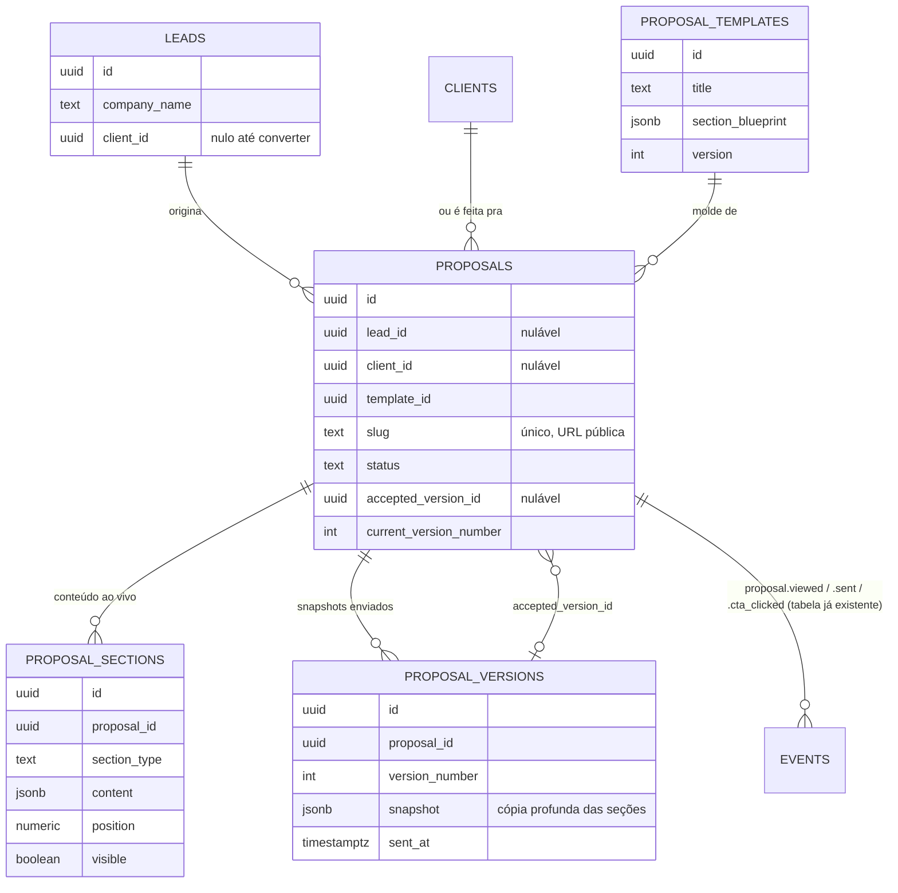
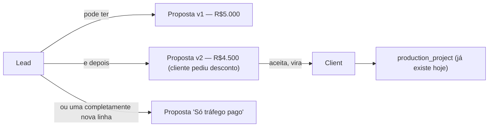
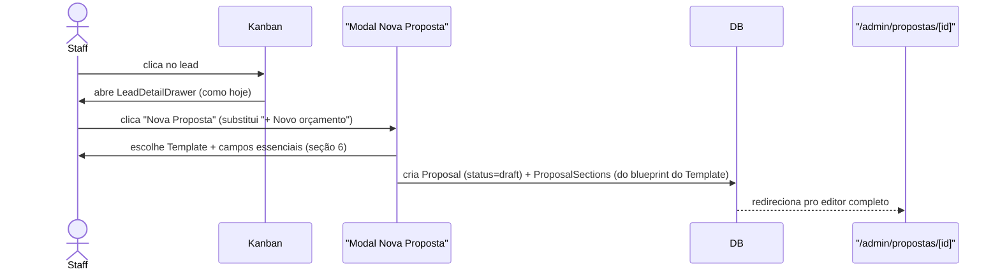
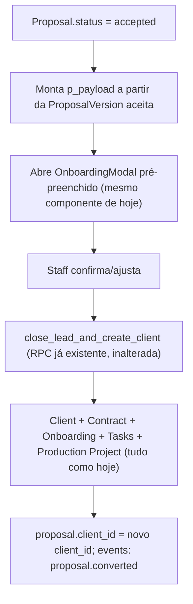
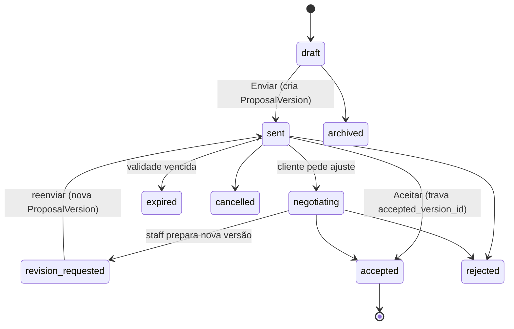
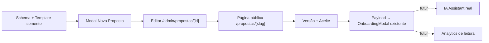

# Sistema de Propostas do Procreating OS — arquitetura e projeção

> **Status: planejamento, aguardando aprovação. Nenhum código, migration, deploy ou commit foi feito.**
> Documento vive em `docs/` (mesma convenção de `docs/architecture.md`, `docs/client-portal-fase-b-plano.md`), não commitado.

---

## 1–6. Estado atual encontrado (auditoria)

### 1.1 Como o Comercial funciona hoje

`lib/comercial/**` (12 arquivos) + `components/comercial/**` (21 componentes). Módulo real, conectado ao Supabase, sem mock. Entidades principais: `leads`, `pipeline_stages`, `strategies`, `prospecting_lists`, `quotes`/`quote_items`, `service_catalog`.

### 1.2 Como o Kanban funciona hoje

`components/comercial/pipeline-board.tsx` — colunas = `pipeline_stages` (ordenadas por `sort_order`), cards = `leads`. Drag-and-drop chama `moveLeadStageAction`. **Achado real, corrige a premissa do pedido**: mover um lead pro estágio `is_won` **não** é um drag normal — `moveLeadStageAction` recusa explicitamente esse destino ("Fechar negócio precisa do modal de onboarding"). Só chegar em `is_won` abre `OnboardingModal`, que no sucesso chama a RPC `close_lead_and_create_client`.

### 1.3 Como o Lead funciona hoje

Tabela `leads`: `company_name`, `contact_name`, `role_title`, `whatsapp`, `email`, `source`, `strategy_id`, `potential_value`, `owner_id`, `stage_id`, `last_contact_at`, `next_contact_at`, `notes`, `client_id` (nulo até converter), `list_id`, `cnpj_cpf`, `city`, `state`, `website`, `instagram`, `linkedin`, `campaign`, `tags[]`, `lead_score`, `contact_attempts`. `LeadWithRelations` (`lib/comercial/types.ts`) resolve `stage`/`strategy`/`list` prontos.

**Clicar num card do Kanban abre `LeadDetailDrawer`** (`components/comercial/lead-detail-drawer.tsx`) — um `Sheet` lateral com: campos editáveis do lead, histórico de eventos (`events`, `entity_type='lead'`), 3 ações rápidas (Continuar/Agendar reunião/Desqualificar), e uma seção **"Orçamentos"**.

### 1.4 Como o "Novo orçamento" funciona hoje

Dentro do drawer, botão "+ Novo" abre `QuoteBuilderDialog` (`components/comercial/quote-builder-dialog.tsx`). Cria uma linha em `quotes` (`lead_id`, `client_id` nulo/não-usado hoje, `title`, `status` — `rascunho|enviado|aceito|recusado` —, `notes`) + `quote_items` (`service_name`, `description`, `quantity`, `unit_price`). Itens novos entram automaticamente no `service_catalog` pra reaproveitar depois. **Não gera nenhuma página pública, não tem link, não aciona conversão.** É uma calculadora de preço interna, isolada do fechamento real do negócio.

### 1.5 Conversão real (Lead → Cliente) hoje

`close_lead_and_create_client(p_lead_id, p_payload)` — `SECURITY DEFINER`, uma transação só, dono `postgres`. Recebe um `jsonb` com `client{name}`, `onboarding{legal_name, trade_name, cnpj, cpf, address, billing_info, objective, target_audience, offer, positioning, channels, goals, commercial_notes, representative_*}`, `contacts[]`, `contract{type, start_date, end_date, due_day, monthly_value, total_value, auto_renew, payment_terms, special_conditions}`, `scope_items[]`. Faz, atomicamente: cria `clients` (slug único gerado), `client_onboarding`, `client_contacts[]`, `contracts`, `contract_scope_items[]`, `revenue[]` (projetada mês a mês se recorrente), 3 `tasks` de onboarding, 1 `production_projects`, marca `leads.client_id`/`stage_id=won`, e grava **7 eventos diferentes** em `events` (`lead_converted`, `client_created`, `contract_created`, `scope_created`, `task_generated`, `project_created`, `onboarding_completed`). Isto é o motor de conversão real — robusto, testado, em produção. **Não deve ser reescrito.**

### 1.6 A proposta da Elenita — como foi construída

`https://procreating.vercel.app/clients/elenita/public/proposta` → `app/clients/[client]/public/proposta/page.tsx`.

**100% estática, 100% hardcoded por cliente, zero Supabase.** Mesmo padrão de `workspace-registry.ts`/`presentation-registry.ts` (já auditados numa rodada anterior): um *switchboard* (`lib/clients/proposal-registry.ts`) mapeia `slug → ProposalContent`, hoje só `{ elenita: elenitaProposal }`. O conteúdo mora em `content/clients/elenita/proposal.ts` (147 linhas), tipado por `lib/clients/proposal-types.ts` (`ProposalContent`). Renderiza 7 seções fixas via `components/proposal/**` (11 componentes): `Hero`, `Pillars`, `Roadmap`, `TvProgram`, `Acquisition`, `Budget`, `Closing`, mais `ScrollProgress` (barra de progresso de leitura) e microinterações (`ProposalTypingHeadline`, `ProposalHeroAtmosphere`). Sem autenticação, `robots: noindex`, sem CTA comercial (comentário no código: "pensada pra apresentação AO VIVO"), preço único sem tabela de upsell.

**Achado crítico para a nova arquitetura**: `ProposalContent` **não é um schema genérico** — tem campos específicos da narrativa da Elenita (`tvProgram` — ela tem um programa de TV; não faz sentido pra Pascoal/Kawhen/Maria). Reaproveitar isto como está seria reaproveitar "a proposta da Elenita, tipada", não um sistema de propostas. **O que É reaproveitável**: o padrão arquitetural (switchboard + content tipado + árvore de componentes própria), a estética/hierarquia visual, e a maioria dos componentes de seção como *inspiração de layout* — não o schema de dados.

---

## 7–9. Diagramas

### Diagrama de entidades (novo, proposto)



### Diagrama de relacionamento — por que Lead 1:N Proposal



**Recomendação**: `Lead → N Proposals` (não 1:1). Um lead real recebe reformulações de escopo/preço que não são a "mesma proposta editada" no sentido comercial — são propostas concorrentes/alternativas que o vendedor quer poder comparar lado a lado (uma delas vira a aceita). Dentro de uma *mesma* Proposal, ajustes de preço numa negociação viram `ProposalVersion` (seção 14) — a diferença entre "nova Proposal" e "nova Version" é intencional, ver seção 13.

`Proposal.client_id` nulável e independente de `lead_id` (mesmo padrão já existente em `quotes.client_id`, hoje não usado pelo código mas já modelado) — permite o caso "novos leads" (via `lead_id`) e "qualquer cliente futuro" (via `client_id`, ex.: upsell pra Pascoal, que já é cliente e não tem lead ativo).

---

## 10–13. Fluxos

### 10.1 Fluxo Lead → Proposal



### 10.2 Fluxo Proposal → Client (aceite → conversão)

**Reaproveita `close_lead_and_create_client` — não reescreve.** A Proposal aceita monta o MESMO formato de `p_payload` que o `OnboardingModal` já monta hoje (contract/onboarding/contacts/scope_items), pré-preenchido a partir do conteúdo da Proposal (seção "Investimento" → `contract`, dados do lead já capturados → `onboarding`/`contacts`). O `OnboardingModal` continua existindo e sendo o formulário de confirmação final — só passa a abrir **pré-preenchido** quando vem de uma Proposal aceita, em vez de vazio.



### 10.3 Fluxo Proposal → Project

Não existe "Proposal → Project" direto — é sempre Proposal → Client (via conversão acima) → `production_projects` (já criado automaticamente dentro da própria RPC, como já acontece hoje). Nenhuma mudança na arquitetura de `production_projects`.

---

## 11–14. Modelos

### 11.1 `ProposalVersion` (§14)

Snapshot imutável — `jsonb` com cópia profunda de todas as seções no momento do "Enviar" (mesmo princípio já congelado em `docs/project-creation.md`: *"Instanciação continua sendo cópia profunda... nunca uma referência viva"*, aplicado aqui a versões de proposta em vez de templates→projetos). `sent_at`, `created_by`. Editar a proposta depois de enviada **nunca** altera uma `ProposalVersion` já existente — mexe no estado "ao vivo" (`ProposalSections`); mandar de novo cria a `ProposalVersion` seguinte. Quando `Proposal.status = accepted`, `Proposal.accepted_version_id` é travado — a página pública passa a renderizar o snapshot congelado, não mais o estado ao vivo (única forma de garantir "não sobrescrever a versão aceita", exigência explícita do pedido).

### 11.2 `ProposalTemplate` (§9)

```
proposal_templates
├── title              ("Proposta Estratégica Procreating")
├── description
├── accent_color
├── section_blueprint  (jsonb — lista ordenada de {section_type, default_content})
└── version            (int — existe a coluna, sem workflow de histórico completo nesta fase,
                         mesmo espírito de templates.version do Page-Builder: existe, não é
                         hiper-explorado até haver necessidade real)
```

A proposta da Elenita **não é migrada** — a página estática dela continua existindo, intocada (exigência explícita). O primeiro `ProposalTemplate` é uma **nova entrada**, inspirada visualmente nela (mesma hierarquia/tipografia/seções), povoada como semente de dados — não uma migração do arquivo `content/clients/elenita/proposal.ts`.

**Versionamento de Template**: não nesta fase. Editar um Template não deve retroagir em Propostas já criadas dele — isso já é garantido pela cópia profunda na criação (mesma regra do Page-Builder). Se no futuro for preciso saber "esta Proposal foi feita com Template v1 ou v2", a coluna `version` (int simples) já existe pronta; workflow de branching de template fica pra quando houver um caso de uso real.

### 11.3 `ProposalSection`/`ProposalBlock` (§8/§15)

**Recomendação: `ProposalSection`, não `ProposalBlock`, e não o Block/Component Registry do Page-Builder.** O pedido é explícito — *"NÃO crie uma arquitetura paralela se o sistema atual já possui um conceito equivalente"* — mas o Block Registry do Page-Builder é sobre **congelado**, e mesmo se não fosse, seria over-engineering real aqui: aquele sistema existe pra suportar Plugins de terceiros registrando componentes React arbitrários (`docs/project-creation.md`, Revisão 6) — Proposal precisa de ~8 tipos de seção fixos, conhecidos, sem plugin nenhum. Reaproveitar aquele Registry seria a "solução paralela desnecessária" que o próprio pedido pede pra evitar, só que invertido (importaria complexidade em vez de duplicar).

```
proposal_sections
├── proposal_id
├── section_type   (enum fechado: hero | context | diagnosis | strategy | services |
│                    deliverables | investment | conditions | testimonial | cta | footer | custom)
├── content        (jsonb — shape documentado por section_type, não um schema genérico solto)
├── position       (numeric fracionário — REAPROVEITA o mesmo padrão de posição de
│                    lib/tasks/position.ts, criado nesta mesma sessão pro Task Intelligence)
└── visible        (boolean — ocultar sem apagar)
```

Cada seção pode: editar (formulário específico pro `section_type`), reordenar (drag-and-drop — reaproveita o **mesmo mecanismo** já implementado pro Task Intelligence: posição fracionária, `computePositionBetween`), ocultar (`visible=false`), duplicar (copia a linha com nova `position`), remover, adicionar (novo `section_type` da lista fechada).

---

## 15–18. Fluxos de publicação, preview, aceite, link público

### 15.1 Publicação

`Proposal.status` sai de `draft` só quando staff clica "Enviar" — nesse momento: (1) cria a `ProposalVersion` (snapshot), (2) `status → sent`, (3) evento `proposal.sent`. **Nenhuma proposta em `draft` é acessível pela URL pública** — o SELECT que serve a página pública sempre filtra `status <> 'draft'` no mesmo `WHERE`, mesmo princípio defensivo já usado em `get_client_portal_profile()` (Fase A do Portal, resolvida na mesma sessão): nunca dois passos separados (resolver, depois checar permissão) — sempre uma query só que já embute a condição.

### 15.2 Preview

**Rota administrativa** (`/admin/propostas/[id]/preview`, autenticada, dentro do gate de staff já existente) reaproveita os MESMOS componentes visuais da página pública — nunca duas árvores de renderização divergentes. Preview funciona mesmo em `draft` (staff só, nunca exposto).

### 15.3 Link público (§11)

`/propostas/[slug]` — fora de `/admin` e fora de `/clients/**` (namespace novo, deliberado — não é o mesmo domínio do Client Portal nem do site estático de clientes; ver seção "Compatibilidade" abaixo). `slug` único e legível (`elenita-2026`), sem necessidade de login (o lead não tem conta no ERP — diferente do Client Portal, que autentica uma relação contínua). Segurança = o filtro de `status` do item 15.1, não obscuridade do slug sozinha — mas o slug não precisa (nem deve) ser sequencial/previsível (`gen_random_uuid()` curto ou slug+sufixo aleatório).

**Não implementado nesta fase, documentado como extensão futura simples**: campo opcional `access_token` pra "link privado" (§11 pede análise) — mesma tabela, mesma query, só mais uma condição no `WHERE` quando presente. Não é uma segunda arquitetura, é uma coluna a mais.

### 15.4 Fluxo de aceite

Botão "Aceitar" **na própria página pública** (sem exigir login) grava: `status → accepted`, `accepted_version_id = <version atual>`, evento `proposal.accepted` (`events`, com IP/UA se quisermos, mesmo padrão de `analytics`/`downloads` já existente pro site público). Dispara a notificação pro time (e-mail/Slack — fora de escopo desta fase, mas a arquitetura de eventos já dá o gancho). **Rejeitar** é simétrico (`status → rejected`), também sem exigir login — mesmo raciocínio do Client Portal: uma ação de baixo risco, sem necessidade de conta.

---

## 20–21. Link público / analytics — arquitetura

### 20 — Segurança (também cobre §19)

| Cenário | Regra |
|---|---|
| `/propostas/[slug]` de uma Proposal em `draft` | 404 — nunca renderiza, nunca revela que existe |
| `/propostas/[slug]` de uma Proposal `archived`/`cancelled` | 404 (staff "despublicou") |
| `/admin/propostas/[id]` | Atrás do gate de staff já existente (`proxy.ts` + `lib/admin/auth`) — zero mudança de infraestrutura de auth |
| Valores/condições comerciais | Só na versão pública já explicitamente publicada — nunca vazam via preview sem auth |
| Aceitar/Rejeitar pela página pública | Sem login (mesmo espírito de `time_block`/eventos anônimos já existentes pro site) — mas só grava no `proposal_id` do próprio slug acessado, nunca um ID arbitrário passado pelo cliente |

### 21 — Analytics/tracking (§12)

**Reaproveita a tabela `events` já existente — não cria um segundo sistema.** Mesmo padrão de `entity_type`/`entity_id`/`type`/`metadata` já usado por Comercial (`lead_converted`, `contract_created`...) e por Client Portal (`focus_session.started`...). Eventos novos: `proposal.viewed`, `proposal.section_viewed` (metadata: `section_type`), `proposal.cta_clicked`, `proposal.sent`, `proposal.accepted`, `proposal.rejected`. `entity_type='proposal'`.

Contadores de leitura rápida (quantas vezes aberta, quanto tempo) **não substituem** os eventos — são colunas denormalizadas em `proposals` (`view_count`, `first_viewed_at`, `last_viewed_at`) atualizadas junto do INSERT do evento, mesmo padrão já usado em `leads.contact_attempts` (contador simples ao lado do histórico detalhado). Dispositivo/origem de acesso vêm do mesmo mecanismo já usado por `public.analytics` (visitante do site público, projeto Page-Builder) — reaproveitar a FORMA, não a tabela (analytics do Page-Builder é sobre projeto de site, não sobre proposta comercial; entidades diferentes, mesmo padrão de coleta).

**Não implementado nesta fase** (pedido explícito): dashboard de analytics, funil de leitura por seção, heatmap. Só a estrutura (eventos + contadores) fica pronta.

---

## 22. Arquitetura de IA Assistant (§7)

Mesma forma já estabelecida nesta mesma sessão pro Task Intelligence (`lib/tasks/intelligence.ts` — interface + implementação trocável, ver código real já em produção):

```ts
interface ProposalAssistant {
  suggestDraft(context: ProposalCommercialContext): Promise<ProposalDraftSuggestion>;
}
// ProposalDraftSuggestion: { headline, introduction, diagnosis, strategySummary,
//                            servicesDescription, ctaText } — tudo string, tudo editável,
//                            nada gravado sem confirmação humana (mesmo requisito do pedido).
```

**Achado real relevante**: `.env.example` já documenta *"Anthropic (Claude API) — terreno preparado... Decisão já tomada (Anthropic/Claude API), mas o orquestrador de IA em si não foi escrito ainda"* — ou seja, o projeto **já decidiu** o provider, só não implementou nada ainda em lugar nenhum do sistema. `ProposalAssistant` seria o primeiro consumidor real dessa decisão. Implementação v1 recomendada: `ClaudeProposalAssistant` atrás da interface (nunca chamado direto de componente — sempre via Server Action, mesmo padrão de toda IA/dado sensível já documentado no projeto: *"IA com acesso a dado sensível sem controle de permissão real seria construir em cima de uma base que ainda falta"*, `.env.example`). `NullProposalAssistant` (sem-op) como default até a chave ser realmente ativada — o sistema de propostas funciona 100% sem IA (preenchimento manual), a IA é estritamente um acelerador opcional.

Fluxo (mesmo do pedido, §7): Dados comerciais → Contexto → `ProposalAssistant.suggestDraft()` → Draft nas `ProposalSections` (ainda `content` editável) → Editor humano revisa/ajusta → Preview → Publicação (§15.1).

---

## 23. Campos do modal "Nova Proposta"

| Campo | Classificação | Origem |
|---|---|---|
| Nome do lead/empresa | **automático** | já vem de `leads.company_name`/`contact_name` (lead já existe, veio do Kanban) |
| Segmento, contato, e-mail, telefone, origem | **automático** | já em `leads` |
| Template | **obrigatório** | select — só 1 opção no início ("Proposta Estratégica Procreating") |
| Problema principal / objetivo / momento atual | **opcional** | vira insumo pro IA Assistant (§7), texto livre |
| Posicionamento / estratégia / serviços | **derivado** | pré-preenchido do Template escolhido, editável depois no editor completo — **não** neste modal (mantém "modal enxuto", ver §6 do pedido) |
| Valor / recorrência / setup | **opcional aqui, obrigatório antes de Enviar** | pode nascer vazio, editor completo bloqueia "Enviar" sem isso |
| Título/subtítulo/headline da proposta | **gerado por IA** (se contexto preenchido) ou **opcional** manual | |
| CTA, validade | **automático com default editável** | template já define um CTA padrão; validade default "+7 dias" |

**Recomendação de UX (§15 do pedido)**: modal **enxuto** (só o que a tabela acima marca como obrigatório/opcional aqui — nome/template/contexto livre em 1 campo de texto pro Assistant) → cria a Proposal em `draft` já com as `ProposalSections` do blueprint → **redireciona direto pra `/admin/propostas/[id]`**, a página completa. Não um modal gigante com 40 campos. Mesmo padrão já usado 3 vezes neste projeto (Nova venda → OnboardingModal; Nova tarefa em lote → editor de lista; aqui). Modal = "o que já sei + qual molde"; página = "todo o resto".

---

## 24–26. UX do editor / dentro do Lead / Kanban

### 24 — UX do editor (§8)

`/admin/propostas/[id]` — árvore de seções (Hero/Contexto/Diagnóstico/Estratégia/Serviços/Entregáveis/Investimento/Condições/CTA/Footer), cada uma expansível com formulário próprio pro `section_type`, drag-handle + reordenar (mesmo componente de drag-and-drop do Task Intelligence, generalizado), toggle visível/oculto, duplicar, remover, "+ Adicionar seção" (lista fechada de tipos disponíveis). Botão "Preview" (abre §15.2) e "Enviar" (dispara §15.1) sempre visíveis. **Design**: segue o Admin UI do Procreating OS (mesmo shell, mesma paleta) — nunca tenta imitar visualmente a proposta pública (separação explícita pedida em §17).

### 25 — UX dentro do Lead (§16)

Seção "Propostas" no `LeadDetailDrawer` **substitui** a seção "Orçamentos" atual — mesmo lugar, mesmo padrão visual (`StatusDot`, cards), conteúdo novo:

```
┌──────────────────────────────┐
│ Proposta Estratégica          │
│ R$ 5.000/mês                  │
│ Enviada há 2 dias · Vista 3x  │
│ [Abrir]  [Pública]  [•••]     │
└──────────────────────────────┘
```
`•••` → Duplicar / Nova versão / Arquivar / Copiar link. "+ Nova" no topo abre o modal (§23).

### 26 — Integração com o Kanban (§15 do pedido, decisão)

**Recomendação: modal inicial enxuto + página completa — não página completa direto.** Motivo: o clique no Kanban hoje já abre o drawer (não a página); manter esse primeiro passo leve preserva a velocidade do fluxo comercial (olhar vários leads rápido) sem forçar navegação pesada a cada clique. A página completa só entra quando a intenção já é clara ("vou criar/editar uma proposta de verdade"). Mesmo racional já aplicado 2x nesta sessão (Task Intelligence: entrada rápida → depois abre o que for pesado só quando preciso).

---

## 27. Estados da proposta (§10)

**Recomendação — 9 estados, sem "viewed" como estado**: `draft`, `sent`, `negotiating`, `revision_requested`, `accepted`, `rejected`, `expired`, `archived`, `cancelled`.

Duas correções sobre a sugestão original do pedido:

1. **Colapsar `editing`/`ready` em `draft`** — antes do primeiro envio, "editando" e "pronto" não são estados externamente distintos (ninguém fora do ERP vê essa diferença, e um checklist de "pronto pra enviar" pode ser uma validação de UI, não precisa de mais uma coluna de estado).
2. **"Viewed" não é um estado, é um fato observado** — uma proposta pode estar `sent` E ter sido vista 3 vezes E estar em `negotiating`, tudo ao mesmo tempo; forçar isso num enum de estado único perde informação. Vira evento (`proposal.viewed`) + contador denormalizado (`view_count`), não status.

`archived` (staff escondeu, sem decisão do cliente) e `cancelled` (staff decidiu não seguir) são distintos de `rejected` (o CLIENTE recusou) — os três valem a pena manter, como o pedido sugeriu.



---

## 29. Versionamento — resumo consolidado

Já detalhado nas seções 11.1/13. Regra final: `ProposalVersion` = imutável, criada só no "Enviar". `Proposal.accepted_version_id` trava pra sempre no aceite. Página pública renderiza `accepted_version_id` se existir, senão a `ProposalVersion` mais recente enviada, senão (proposta nunca enviada) 404.

---

## 30–32. Escalabilidade / reuso do Template da Elenita / compatibilidade

**Escalabilidade**: mesmo raciocínio já aplicado ao Portal do Cliente e ao Task Intelligence nesta sessão — schema simples, índices óbvios (`proposals.slug` único, `proposals.lead_id`, `proposal_sections.proposal_id`), nada de particionamento ou fila até volume real pedir (dezenas/centenas de propostas, não milhões).

**Reuso do Template da Elenita**: visual/estrutural (seção 11.2), não o arquivo de conteúdo em si — a página dela continua 100% intocada.

**Compatibilidade com a arquitetura atual**:

| Domínio existente | Toca? |
|---|---|
| Page-Builder (`projects`/`templates`/`project_versions`/`deployments`/`assets`) | **Não** — congelado, tabelas novas com nomes deliberadamente diferentes |
| `/clients/[client]/public/proposta` (Elenita) | **Não** — rota, componentes e conteúdo intocados |
| `close_lead_and_create_client` | **Não** — reaproveitada como está, só alimentada por um payload pré-preenchido |
| `quotes`/`quote_items` | **Congelada, não removida** — decisão em aberto (seção final) se o botão "Novo orçamento" desaparece do drawer ou convive por um tempo |
| `events` | Estendida com novos `type` (texto livre, sem migration necessária — mesma tabela) |
| Padrão de posição fracionária (`lib/tasks/position.ts`) | Reaproveitado literalmente pras seções da proposta |
| Padrão `TaskIntelligence`/provider trocável | Reaproveitado pro `ProposalAssistant` |
| Client Portal (Fase A/B) | Nenhuma relação direta — propostas são pré-venda (lead ainda não é cliente), Portal é pós-venda |

---

## 33. Riscos

1. **`ProposalContent` da Elenita não é reaproveitável como schema** — já mitigado na proposta acima (schema novo, genérico, por `section_type`).
2. **Confundir Proposal com Quote** — mitigado mantendo `quotes` intocada e como sistema separado (decisão explícita pendente, ver "o que fica pra depois").
3. **`close_lead_and_create_client` receber um payload malformado vindo da Proposal** — mitigado validando no mesmo formato já usado pelo `OnboardingModal` hoje (reaproveitar a validação existente, não inventar uma nova).
4. **Vazamento de draft via URL pública** — mitigado pelo filtro de `status` no próprio SELECT (seção 20), mesmo padrão já testado exaustivamente na Fase A do Portal.
5. **IA gerando texto sem revisão** — mitigado por design: `ProposalAssistant` só popula `content` de `ProposalSections` em `draft`, nunca envia sozinho.
6. **Depender de decisão de produto ainda não tomada** (quotes convivem ou somem?) — sinalizado explicitamente, não decidido nesta rodada.

---

## 34. Decisões arquiteturais (resumo)

1. `Lead 1:N Proposal` (não 1:1).
2. `ProposalSection` com `content jsonb` por `section_type` fechado — não Block Registry do Page-Builder.
3. `ProposalVersion` = snapshot imutável só no envio; aceite trava `accepted_version_id`.
4. `events` reaproveitada para tracking — sem tabela nova de analytics.
5. Conversão reaproveita `close_lead_and_create_client` — Proposal só alimenta o payload.
6. "Viewed" é evento + contador, não um `status`.
7. `ProposalAssistant` atrás de interface trocável, mirando Claude API (decisão já registrada no projeto, nunca implementada).
8. Modal enxuto → página completa (não página direto, não modal gigante).

## 35–37. O que implementar agora / depois / roadmap

**Agora (se aprovado, próxima rodada)**: schema (`proposal_templates`, `proposals`, `proposal_sections`, `proposal_versions`), 1 template semente inspirado na Elenita, modal "Nova Proposta" substituindo o botão no drawer, editor `/admin/propostas/[id]`, página pública `/propostas/[slug]`, fluxo de envio/versão, aceite → payload pré-preenchido pro `OnboardingModal` existente.

**Depois, explicitamente fora desta rodada**: IA Assistant real (ativar Claude API), dashboard de analytics de leitura, link privado com token, negociação assistida, decisão final sobre o destino de `quotes`.



---

**Decisão pendente da sua parte, antes de eu implementar**: o botão/fluxo de "Novo orçamento" (`quotes`) desaparece do drawer em favor de "Nova Proposta", ou os dois convivem por enquanto (proposta pra apresentação completa, orçamento pra uma cotação rápida informal)?

Nada foi implementado. Aguardando sua revisão.

---

## Addendum — pivô: Elenita virou o template literal (não mais "inspirado")

A Fase 1 (implementada, commit `fa9ce0c`) criou 12 `section_type` genéricos (hero/context/
diagnosis/strategy/services/deliverables/investment/conditions/testimonial/cta/footer/custom),
renderizados por um card escuro genérico "inspirado" na Elenita — nunca os componentes reais
dela. Pedido do usuário nesta rodada: a proposta da Elenita (`/clients/elenita/public/proposta`,
`components/proposal/**`) deve ser o template de verdade, não uma reinvenção.

Como os 12 tipos genéricos nunca tiveram proposta real usando-os (0 `proposals` em produção),
a migration `20260901000000_proposal_elenita_template.sql` trocou o vocabulário por completo por
7 tipos que espelham 1:1 os componentes reais: `hero`, `pillars`, `roadmap`, `tv_program`,
`acquisition`, `budget`, `closing`. A página pública (`components/proposal-public/
proposal-public-view.tsx`) agora importa e renderiza `ProposalHero`/`ProposalPillars`/etc.
diretamente de `components/proposal/**` — mesmo código, não uma cópia.

`proposals` ganhou `brand_name` (nome curto de exibição, ex. "Dra. Elenita Luzardo") e
`accent_color` (cor de destaque por proposta, com fallback pro accent do template) — cada
proposta agora carrega sua própria identidade visual, não só o template.

A Elenita passou a ser uma `Proposal` real no banco (`slug = elenita-luzardo`, `client_id`
apontando pro cliente dela — ela já é cliente ativa, não lead), preenchida com o conteúdo
exato que estava hardcoded em `content/clients/elenita/proposal.ts`. A rota antiga
(`/clients/elenita/public/proposta`) tem redirect 308 permanente pra `/propostas/
elenita-luzardo` (`next.config.mjs`), checado antes do filesystem — não quebra links antigos.

`content/clients/elenita/proposal.ts`, `lib/clients/proposal-registry.ts` e
`app/clients/[client]/public/proposta/page.tsx` ficaram sem uso (o redirect intercepta a única
rota que os alcançava) mas foram deixados intocados — árvore de `/clients/**`, decisão
conservadora de não deletar código de outra sessão/domínio sem necessidade. Candidato a limpeza
futura, não feito agora.
